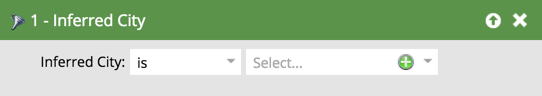

# 필터 유추 {#inferred-filters}

누군가가 웹 사이트를 방문하면 [Munchkin](/help/marketo/product-docs/administration/additional-integrations/add-munchkin-tracking-code-to-your-website.md){target="_blank"}에서 쿠키를 만들어 시스템에 넣습니다. 우리는 특별한 데이터베이스에서 그들의 IP를 찾고 모든 종류의 정보를 추론한다.

>[!NOTE]
>
>유추된 필드 값이 최신 상태를 유지하도록 IP 주소 조회에 사용되는 데이터베이스를 주기적으로 업데이트합니다. 데이터베이스 업데이트로 인해 스마트 목록 필터 정의에 추가해야 할 수 있는 유추된 새 필드 값이 도입될 수 있습니다.
>
>[Marketo Engage 제품 릴리스](/help/marketo/release-notes/release-schedule.md){target="_blank"} 중에 데이터베이스가 업데이트될 수 있습니다. 업데이트가 발생하면 [Marketo Engage 릴리스 정보](/help/marketo/release-notes/current.md){target="_blank"}에 유추된 필드 값의 변경 사항에 대한 설명이 포함됩니다.

스마트 목록에서 이러한 필터를 사용하면 이러한 추론된 정보가 있는 사용자에게 결과가 표시됩니다.

>[!TIP]
>
>웹 활동 보고서에서 이러한 필터를 사용합니다. Sales Rep 의 영역을 사용하여 지난 24 시간 동안 웹 사이트 방문자가 있는 Custom Daily Report 를 구독합니다. 그들은 그것을 좋아할 것입니다!
>
>* 방문한 웹 페이지 - 지난 24시간
>* 유추 상태는 [해당 지역 선택]입니다.

이러한 익명 방문자는 이메일 링크를 클릭하거나 양식을 작성할 때 자동으로 사용자로 변환됩니다. 그러나, 그들은 추론된 모든 정보를 보관한다.

>[!NOTE]
>
>[익명 활동 및 잠재 고객](/help/marketo/product-docs/core-marketo-concepts/smart-lists-and-static-lists/managing-people-in-smart-lists/understanding-anonymous-activity-and-people.md){target="_blank"}에 대해 자세히 알아보세요.
