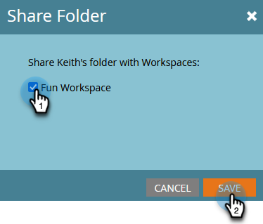

# 작업 영역 간 목록 또는 스마트 목록 참조 {#reference-a-list-or-smart-list-across-workspaces}

목록 및 스마트 목록은 데이터베이스에서 쉽게 재사용할 수 있도록 작업 영역 간에 공유 및 참조될 수 있습니다.

>[!NOTE]
>
>개인 파티션 규칙이 적용됩니다(작업 영역의 스마트 목록 및 정적 목록에는 현재 작업 영역의 _및_ 목록 구성원의 구성원인 사람만 표시됩니다).

## 목록 또는 스마트 목록 공유 {#share-a-list-or-smart-list}

1. **[!UICONTROL Database]**(으)로 이동합니다.

   

1. 캠페인 폴더를 마우스 오른쪽 단추로 클릭합니다. **[!UICONTROL New Folder]**&#x200B;를 선택합니다.

   

   >[!NOTE]
   >
   >Assets은 폴더에 중첩된 작업 영역에서만 공유할 수 있습니다.

1. 폴더 이름을 지정하고 **[!UICONTROL Create]**&#x200B;을(를) 클릭합니다.

   

1. 공유할 목록 또는 스마트 목록을 새 폴더로 끌어다 놓습니다.

   

1. 새 폴더를 마우스 오른쪽 단추로 클릭하고 **[!UICONTROL Share folder]**&#x200B;을(를) 선택합니다.

   

1. 공유할 **[!UICONTROL Workspace]**&#x200B;을(를) 선택하고 **[!UICONTROL Save]**&#x200B;을(를) 클릭합니다.

   

   멋지다! 이제 두 작업 영역에서 이 목록을 사용할 수 있습니다.

   >[!NOTE]
   >
   >마케팅 활동에서는 최상위 폴더만 공유할 수 있습니다. 데이터베이스에서 최상위 수준 폴더와 한 수준 아래를 공유할 수 있습니다.
