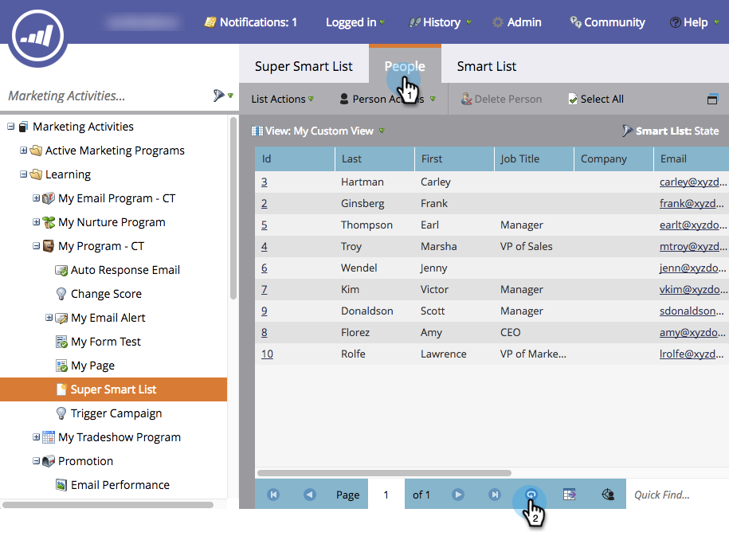
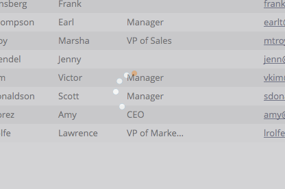

# 목록 또는 스마트 목록 새로 고침 {#refresh-a-list-or-smart-list}

>[!NOTE]
>
>**FYI**
>
>Marketing은 이제 모든 구독 간의 언어를 표준화하므로 구독에 리드/리드 및 docs.markto.com에 있는 사람/사람을 볼 수 있습니다. 이 용어는 같은 것을 의미한다.아티클 지침에는 영향을 주지 않습니다. 다른 변화도 있습니다 [자세한](http://docs.marketo.com/display/DOCS/Updates+to+Marketo+Terminology)내용

스마트한 목록을 실행했는데 몇 분이 지나갔다면 결과가 달라질 수 있습니다. 새로 고침을 통해 확인할 수 있습니다.

## 결과 새로 고침 {#refresh-results}

1. 스마트 목록의 **사람** 탭에서 데이터를 업데이트하려면 새로 고침 아이콘을 클릭합니다.

   

1. 스마트 목록이 다시 실행되고 더 최신 결과 세트가 표시됩니다.

   

>[!TIP]
>
>경우에 따라 스마트 목록을 실행하고 나중에 다시 보면 오른쪽 하단에 있는 사람 카운트 앞에 &quot;정보&quot;라는 단어를 볼 수 있습니다. 숫자가 대략적임을 나타냅니다. 카운트 자체를 클릭하여 새로 고치고 정확한 업데이트된 카운트를 가져옵니다.

>[!NOTE]
>
>**관련 문서**
>
>* [목록 또는 스마트 목록에서 사용자를 Excel로 내보내기](../../../../product-docs/core-marketo-concepts/smart-lists-and-static-lists/managing-people-in-smart-lists/export-people-to-excel-from-a-list-or-smart-list.md)

>

