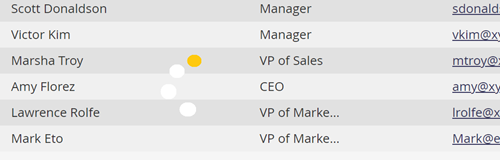

# 목록 또는 스마트 목록 새로 고침 {#refresh-a-list-or-smart-list}

Smart List를 실행하고 몇 분 정도 지난 경우 결과가 지금 달라질 수 있습니다. 확인하려면 새로 고침하십시오.

## 결과 새로 고침 {#refresh-results}

1. 스마트 목록의 **[!UICONTROL People]** 탭에서 데이터를 업데이트하려면 새로 고침 아이콘을 클릭합니다.

   

1. 스마트 목록이 다시 실행되고 최신 결과 집합이 더 표시됩니다.

   

>[!TIP]
>
>경우에 따라 Smart List를 실행하고 나중에 다시 돌아오면 오른쪽 하단에 있는 카운트 앞에 &quot;정보&quot;라는 단어가 표시될 수 있습니다. 이는 숫자가 대략적임을 나타냅니다. 카운트 자체를 클릭하여 새로 고치고 업데이트되고 정확한 카운트를 얻습니다.

>[!MORELIKETHIS]
>
>[목록 또는 스마트 목록에서 Excel로 사람 내보내기](/help/marketo/product-docs/core-marketo-concepts/smart-lists-and-static-lists/managing-people-in-smart-lists/export-people-to-excel-from-a-list-or-smart-list.md){target="_blank"}
