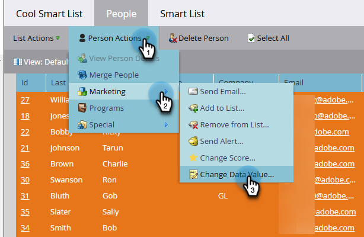

# 스마트 목록에서 단일 플로우 단계 실행 {#run-a-single-flow-step-from-a-smart-list}

일회성 흐름 단계를 실행하려는 경우 전체 스마트 캠페인을 만드는 대신 스마트 목록 내에서 단일 흐름 단계를 사용할 수 있습니다.

>[!PREREQUISITES]
>
>[스마트 목록 만들기](/help/marketo/product-docs/core-marketo-concepts/smart-lists-and-static-lists/creating-a-smart-list/create-a-smart-list.md){target="_blank"}

1. **[!UICONTROL Marketing Activities]**(으)로 이동합니다.

   

1. 목록 또는 사용자가 포함된 스마트 목록을 선택한 다음 **[!UICONTROL People]** 탭으로 이동합니다.

   

   >[!TIP]
   >
   >정적 목록과 스마트 목록 모두에 이 기능이 있습니다.

1. **[!UICONTROL Select All]**&#x200B;을(를) 클릭합니다. **Ctrl/Cmd**&#x200B;을 사용하고 클릭하여 몇 개의 레코드를 수동으로 선택할 수도 있습니다.

   

   >[!NOTE]
   >
   >결과가 여러 페이지에 걸쳐 있는 경우 **[!UICONTROL Select All]**&#x200B;을(를) 클릭하면 모든 페이지의 모든 사용자가 선택됩니다.

1. **[!UICONTROL Person Actions]**&#x200B;에서 선택한 흐름 단계를 선택합니다. 이 예제에서는 [데이터 값 변경](/help/marketo/product-docs/core-marketo-concepts/smart-campaigns/flow-actions/change-data-value.md){target="_blank"}을 사용합니다.

   

1. **[!UICONTROL Attribute]**&#x200B;을(를) 찾아 선택합니다. 이 예제에서는 주 &quot;California&quot;가 있는 모든 사람을 &quot;CA&quot;로 변경합니다.

   

1. 새 값을 입력합니다. **[!UICONTROL Run Now]**&#x200B;를 클릭합니다.

   

1. 많은 수의 사용자에 대한 데이터 값을 변경하는 경우 숫자를 입력하여 변경 내용을 확인해야 할 수 있습니다. **[!UICONTROL Go For It]**&#x200B;를 클릭합니다.

   

멋진 작품이야! 오른쪽 상단 모서리에 단일 흐름 단계의 상태가 표시됩니다.

완료되면 목록을 새로 고치면 업데이트된 정보가 표시됩니다.
