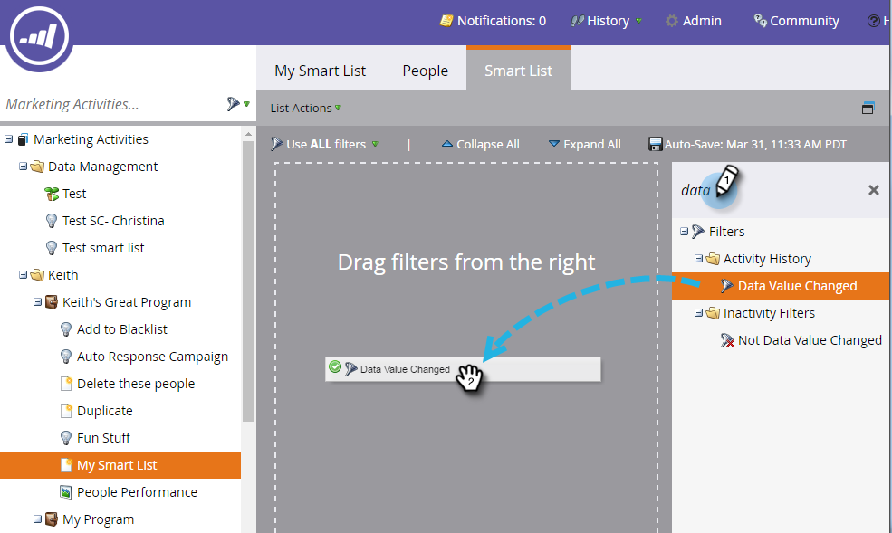

# 스마트 목록 {#use-the-data-value-changed-filter-in-a-smart-list}에서 변경된 데이터 값 필터 사용

값이 지속적으로 변경되고 Marketing 데이터베이스에서 업데이트됩니다. 특정 가치를 찾는 대신 가치가 달라진 사람을 찾는 경우도 있습니다. 방법

>[!PREREQUISITES]
>
>[스마트 목록 만들기](/help/marketo/product-docs/core-marketo-concepts/smart-lists-and-static-lists/creating-a-smart-list/create-a-smart-list.md)

1. **마케팅 활동** 영역으로 이동합니다.

   

1. 스마트 목록을 선택하고 **스마트 목록** 탭을 클릭합니다.

   

1. **변경된 데이터 값** 필터를 찾아 캔버스로 드래그합니다.

   

1. 데이터 값 변경을 찾을 필드에 **특성**&#x200B;을 설정합니다.

   

이 필터는 상태에 대한 변경(모든 변경)이 있는 모든 사람을 찾습니다. 더 화려한 제목을 얻으려면 [스마트 목록 필터](/help/marketo/product-docs/core-marketo-concepts/smart-lists-and-static-lists/using-smart-lists/add-a-constraint-to-a-smart-list-filter.md)에 제한을 추가해 보십시오.
