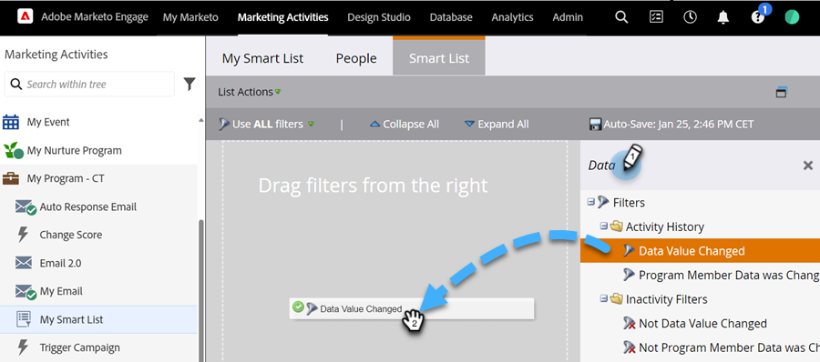
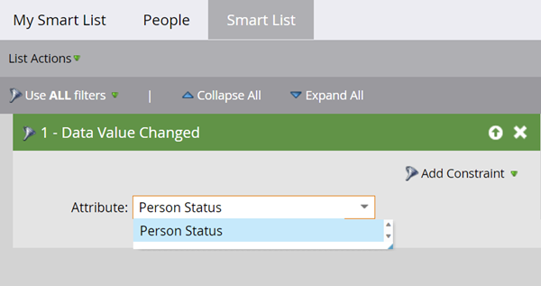

# 스마트 목록에서 데이터 값 변경 필터 사용 {#use-the-data-value-changed-filter-in-a-smart-list}

Marketo 데이터베이스에서 값이 지속적으로 변경되고 업데이트됩니다. 경우에 따라 특정 값을 찾는 대신 값에 변화가 있는 사람을 찾습니다. 방법은 다음과 같습니다.

>[!PREREQUISITES]
>
>[스마트 목록 만들기](/help/marketo/product-docs/core-marketo-concepts/smart-lists-and-static-lists/creating-a-smart-list/create-a-smart-list.md){target="_blank"}

1. **[!UICONTROL Marketing Activities]** 영역으로 이동합니다.

   

1. 스마트 목록을 선택하고 **[!UICONTROL Smart List]** 탭을 클릭합니다.

   

1. **[!UICONTROL Data Value Changed]** 필터를 찾아 캔버스로 끌어서 놓습니다.

   

1. 데이터 값 변경 내용을 검색할 필드로 **[!UICONTROL Attribute]**&#x200B;을(를) 설정합니다.

   

이 필터는 상태가 변경된(모든 변경) 모든 사람을 찾습니다. 좀 더 자세히 알아보려면 [스마트 목록 필터에 제약 조건을 추가](/help/marketo/product-docs/core-marketo-concepts/smart-lists-and-static-lists/using-smart-lists/add-a-constraint-to-a-smart-list-filter.md){target="_blank"}해 보세요.
