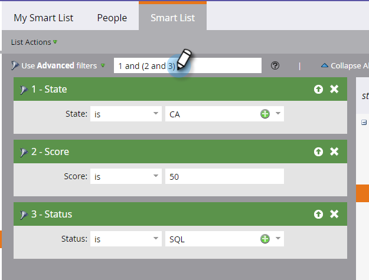

# 고급 스마트 목록 규칙 논리 사용 {#using-advanced-smart-list-rule-logic}

스마트 목록 내의 여러 필터에 스마트 목록 규칙 논리를 적용하여 필요한 사람을 정확히 찾을 수 있습니다. 방법

>[!NOTE]
>
>**사전 요구 사항**
>
>* [스마트 목록에 필터 찾기 및 추가](../../../../product-docs/core-marketo-concepts/smart-lists-and-static-lists/creating-a-smart-list/find-and-add-filters-to-a-smart-list.md)
>* [스마트 목록 필터 정의](../../../../product-docs/core-marketo-concepts/smart-lists-and-static-lists/creating-a-smart-list/define-smart-list-filters.md)

>

>[!NOTE]
>
>고급 필터 로직은 스마트 목록에 3개 이상의 필터가 있는 경우에만 사용할 수 있습니다.

## 스마트 목록에 논리 추가 {#add-logic-to-a-smart-list}

기본적으로 스마트 목록은 **모든** 필터(필터 1 *과* 2 *및* 3)와일치하는 사람을찾습니다. 규칙 논리를 변경하여 정의된 필터(필터 1 **또는** 2 *또는*** 3)의 ANY와 *일치하는* 사람을 찾거나 고급 필터(1및 SafetyFilters 2 *또는 *3)를 사용할 수 있습니다.

이 예에서 점수가 최소 50점 *이상이거나* 상태가 &quot;Sales Qualified&quot;인 사람을 ** 찾고자 한다고 가정해 보겠습니다.

1. 드롭다운 **에서** **고급** **필터** 사용을선택합니다.

   

   >[!NOTE]
   >
   >고급 **** 필터를 사용하면 스마트 목록 멤버 필터를 사용하여 스마트 목록을 만들 필요가 줄어듭니다. 이를 통해 성능을 최적화할 수 있습니다.

1. [ **고급** 필터 **** ] 텍스트 상자에 모든 필터 간의 기본값으로 &quot;and&quot;가 표시됩니다.

   

1. &quot;2 및 3&quot; 주위에 괄호 쌍을 입력합니다.

   

   >[!CAUTION]
   >
   >규칙 논리를 입력할 때는 &quot;or&quot; 앞에 &quot;and&quot;를 사용해야 합니다.

1. &quot;2~3&quot; 사이의 &quot;and&quot;를 &quot;or&quot;으로 변경합니다.

   

## &quot;And&quot; 및 &quot;Or&quot;를 혼합할 때 괄호를 사용합니다. {#use-parentheses-when-mixing-and-and-or}

&quot;and&quot; 및 &quot;or&quot; 논리를 혼합하려면 괄호가 있어야 의도를 알 수 있습니다.

## 필요한 경우 4개 이상의 필터에 중첩 괄호 사용 {#use-nested-parentheses-for-four-or-more-filters-if-needed}

용도에 따라 4개 이상의 필터를 사용할 때 괄호를 중첩해야 할 수도 있습니다.

>[!TIP]
>
>잘못된 규칙을 입력하면 규칙 아래에 빨간색 선이 표시됩니다. 텍스트 위로 스크롤하여 관련 오류 메시지를 확인합니다.

