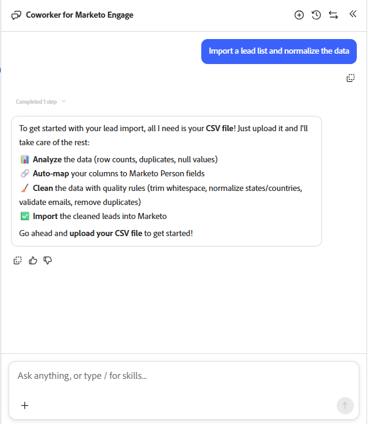

# 리드 가져오기 {#import-leads}

필드 매핑 지원을 통해 리드 목록을 Marketo Engage 데이터베이스로 가져오고 중복 제거합니다.

## 사용 방법 {#how-to-use}

1. 내 Marketo에서 **Marketo Engage용 동료** 타일을 클릭합니다.

   

1. &quot;리드 목록 가져오기 및 데이터 정규화&quot;(또는 샘플 프롬프트로 나열되는 경우 선택)를 입력하고 위쪽 화살표 아이콘을 클릭합니다.

   

1. CSV 파일을 업로드하라는 메시지가 나타나고 이후 단계가 표시됩니다.

   

1. **+** 아이콘을 클릭하고 **파일 업로드**&#x200B;를 선택합니다. CSV 파일을 찾아 업로드합니다.

   

1. 위쪽 화살표 아이콘을 클릭합니다.

   

1. 가운데 콘솔에서 목록을 보려면 **검토**&#x200B;를 클릭하세요.

   

1. 사용 가능한 비즈니스 규칙을 확인하여 목록을 정리합니다. 원하는 항목을 입력하고 위쪽 화살표 아이콘을 클릭합니다.

   

   결과가 중앙 콘솔에 표시됩니다.

   

   원하는 경우 추가 비즈니스 규칙을 입력합니다.

1. 매핑된 필드를 보려면 **매핑** 탭을 클릭하십시오.

1. 필드가 잘못 매핑된 경우 **대상 필드**&#x200B;을(를) 변경하여 여기에서 수정하십시오.

   

1. 목록을 가져올 준비가 되면 **Marketo으로 가져오기** 탭을 클릭합니다.

1. 대상 폴더를 선택하고 이름을 입력합니다. 각 동의 확인란을 선택하고 **가져오기 시작**&#x200B;을 클릭합니다.

   

   가져오기가 완료되면 처리된 리드, 실패한 행 및 경고를 보여주는 확인 요약이 표시됩니다.
