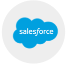

# CRM 동기화 {#crm-sync}

**SFDC 동기화** [SFDC 동기화는 세계 최고의 Salesforce 동기화 기능입니다. 정말 대단합니다.](https://docs.marketo.com/display/DOCS/Salesforce+Sync)     **Microsoft Dynamic Sync** [Microsoft Dynamic Sync Microsoft에서 CRM을 사용하여 재미있는 새로운 기법을 보여 줍니다.](https://docs.marketo.com/display/DOCS/Microsoft+Dynamics+Sync)
