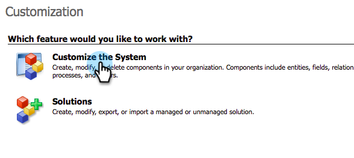
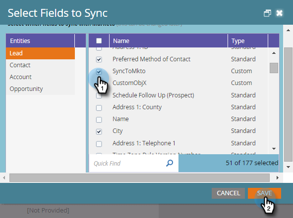

# 사용자 지정 Dynamics 동기화 필터 {#create-a-custom-dynamics-sync-filter} 만들기

Dynamics CRM의 모든 것을 Marketing To에 동기화하지 않으려는 경우 걱정 마! Marketing에서는 동기화 필터를 설정하고 기록의 일부만을 동기화할 수 있습니다.

## 개요 {#overview}

Dynamics 동기화 필터를 설정하려면

1. 모든 개체(리드, 연락처, 계정, 기회 및 기타 사용자 지정 개체)에 대해 Dynamics CRM에서 new_synctokto라는 사용자 정의 두 옵션(부울) 필드를 만듭니다.
1. 이 필드에 예/아니요 값을 지정하거나 비워 둡니다.

>[!NOTE]
>
>데이터베이스나 Marketing이 아니라 Dynamics CRM에서 이러한 변경 작업을 수행해야 합니다.

Marketing To는 자동 백그라운드 동기화 중에 이 필드를 찾고 이 로직을 기반으로 동기화할 레코드를 결정합니다.

| 필드 값 | Marketing Cloud와 동기화하려면 |
|---|---|
| 필드가 없습니다. | 예 |
| 필드가 비어 있음 | 예 |
| 필드에 값이 Yes입니다. | 예 |
| 필드에 값 No가 있음 | 아니요 |

>[!CAUTION]
>
>마케터에게 레코드를 건너뛰도록 하는 유일한 방법은 필드 값을 명시적으로 **No**&#x200B;로 설정하는 것입니다. 필드 값이 비어 있어도 Marketing은 여전히 레코드를 동기화합니다.

>[!PREREQUISITES]
>
>최신 버전의 Marketing To 플러그인(3.0.0.1 이상)을 설치합니다. Marketing > 관리 > Microsoft Dynamics > Marketing To 솔루션 다운로드로 이동합니다.

## SyncToMkto 필드 {#create-synctomkto-field} 만들기

1. Dynamics CRM에 로그인합니다. **설정**&#x200B;을 클릭한 다음 **사용자 지정**&#x200B;을 클릭합니다.

   

1. **시스템 사용자 지정**&#x200B;을 클릭합니다.

   

1. **엔티티** 옆에 있는 을 클릭합니다.

   

1. **리드** 옆의 을 클릭하고 **필드**&#x200B;를 선택합니다. 그런 다음 **새로 만들기**&#x200B;를 클릭합니다.

   

1. **표시 이름** 필드에 **SyncToMkto**&#x200B;를 입력하고 **2개의 옵션**&#x200B;을 **데이터 유형**&#x200B;으로 선택합니다. 그런 다음 **저장 및 닫기**&#x200B;를 클릭합니다.

   

   >[!NOTE]
   >
   >이 필드의 표시 이름을 선택하십시오. 그러나 이름 필드는 정확히 **new_synctomkto**&#x200B;이어야 합니다. 기본 접두사로 **new**&#x200B;을(를) 사용해야 합니다. 기본값을 변경한 경우 여기에서 [사용자 정의 필드 이름](/help/marketo/product-docs/crm-sync/microsoft-dynamics-sync/create-a-custom-dynamics-sync-filter/set-a-default-custom-field-prefix.md)의 기본 접두어를 재설정합니다. 새 필드를 만든 후 다시 변경할 수 있습니다.

   >[!NOTE]
   >
   >비동기 작업 과정이 설정된 경우 레코드는 필드에서 설정한 기본 SyncToMkto 값을 가져오고 작업 흐름 실행이 끝나면 몇 초 후에 올바른 값을 가져옵니다. 기본값이 예로 설정되어 있으면 해당 레코드는 Marketing To에서 만든 후 오래된 상태가 됩니다. 이를 방지하려면 **No**&#x200B;을 기본값으로 사용합니다.

1. 이 프로세스를 반복하여 연락처, 계정, 기회 및 사용자 지정 엔터티 등 동기화를 제한하려는 다른 개체에 대해 **SyncToMkto** 필드를 만듭니다.

## Marketing To {#select-the-filter-in-marketo}의 필터 선택

초기 동기화를 마쳤더라도 Marketing To와 동기화할 필드를 선택한 다음

1. 관리자로 이동하고 **MIcrosoft Dynamics**&#x200B;를 선택합니다.

   

1. 필드 동기화 세부 정보에서 **편집**&#x200B;을 클릭합니다.

   

1. 아래로 스크롤하여 확인합니다. 실제 이름은 new_synctomto여야 하지만 표시 이름은 무엇이든 될 수 있습니다. **저장**&#x200B;을 클릭합니다.

   

좋습니다. 이제 Marketing Cloud에 대한 동기화 필터를 활성화했습니다.

## 동적 작업 과정을 만들어 동기화 필터 값을 자동으로 {#create-a-dynamics-workflow-to-assign-sync-filter-values-automatically} 할당

항상 레코드에 대한 SyncToMkto 필드에 값을 수동으로 할당할 수 있습니다. 하지만 레코드를 만들거나 업데이트할 때 Dynamics Workflow의 강력한 기능을 활용하고 SyncToMkto 필드에 값을 자동으로 할당하면 어떨까요?

>[!NOTE]
>
>데이터베이스 수준에서 이 작업을 수행할 수 없습니다. CRM에서 수동으로 또는 작업 과정을 사용해야 합니다.
>
>Dynamics 워크플로우는 앞으로의 새 레코드에서만 작동하며, 내역 데이터에서는 작동하지 않습니다. 배치 업데이트를 사용하여 기존 레코드 위로 이동합니다.

1. Dynamics CRM으로 이동합니다. **설정**&#x200B;을 클릭한 다음 **프로세스**&#x200B;를 클릭합니다.

   

1. **새로 만들기**&#x200B;를 클릭합니다.

   

1. 워크플로우의 이름을 입력하고 **워크플로우**&#x200B;를 카테고리로 선택하고 **리드**&#x200B;를 엔티티로 선택합니다. 그런 다음 **확인**&#x200B;을 클릭합니다.

   

1. 조직의 환경 설정에 따라 **SyncToMkto** 필드에 true 또는 false 값을 지정하는 규칙을 만듭니다. **저장 및 닫기**&#x200B;를 클릭합니다.

   

   >[!NOTE]
   >
   >**단계 추가**&#x200B;를 클릭하여 검사 조건을 추가한 후 기본 작업을 정의합니다. 그러면 **No**&#x200B;에 동기화할 레코드가 설정됩니다. 그렇지 않으면 동기화됩니다.

1. 워크플로우를 선택하고 **활성화**&#x200B;를 클릭합니다.

   

   >[!TIP]
   >
   >이메일 주소가 있는 사람의 레코드만 동기화하도록 규칙을 설정하려면 [이메일 주소](/help/marketo/product-docs/crm-sync/microsoft-dynamics-sync/create-a-custom-dynamics-sync-filter/custom-sync-filter-rules-for-an-email-address.md)에 대한 사용자 지정 동기화 필터 규칙을 참조하십시오.

## 동기화 필터 세부 정보 {#sync-filter-details}

다음과 같이 몇 가지 구현 세부 사항을 알아 보겠습니다.

1. 동기화 작업 시작

   **SyncToMkto** 값이 **No**&#x200B;에서 **Yes**&#x200B;로 변경되면 Dynamics는 Marketing에 이 레코드 동기화를 즉시 시작하도록 알립니다. 레코드가 이미 있으면 Marketing에서 업데이트합니다. 그렇지 않으면 Marketing에서 레코드를 만듭니다.

   >[!TIP]
   >
   >이 경우 `Create [StartSync]` 작업이 마케팅 로그에 추가됩니다.

1. 동기화 작업 중지

   레코드가 SyncToMkto 값을 Yes에서 No로 변경하면 Marketing에게 이 레코드 동기화를 중지하라는 알림을 받습니다. 하지만 레코드는 삭제되지 않고 대신 업데이트 받기를 중단하고 오래된 상태가 됩니다.

>[!MORELIKETHIS]
>
>* [Microsoft Dynamics 동기화 필터:자격 조건](/help/marketo/product-docs/crm-sync/microsoft-dynamics-sync/create-a-custom-dynamics-sync-filter/microsoft-dynamics-sync-filter-qualify.md)
>* [Microsoft Dynamics 동기화 필터:병합](/help/marketo/product-docs/crm-sync/microsoft-dynamics-sync/create-a-custom-dynamics-sync-filter/microsoft-dynamics-sync-filter-merge.md)
>* [이메일 주소에 대한 사용자 지정 동기화 필터 규칙](/help/marketo/product-docs/crm-sync/microsoft-dynamics-sync/create-a-custom-dynamics-sync-filter/custom-sync-filter-rules-for-an-email-address.md)

