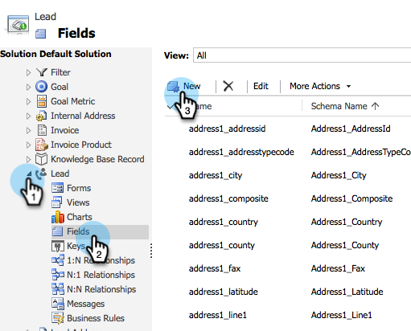

# 사용자 지정 Dynamics 동기화 필터 만들기 {#create-a-custom-dynamics-sync-filter}

Dynamics CRM의 모든 것을 Marketing To에 동기화하지 않으려는 경우 걱정 마! Marketing에서는 동기화 필터를 설정하고 기록의 일부만을 동기화할 수 있습니다.

## 개요 {#overview}

Dynamics 동기화 필터를 설정하려면

1. 모든 개체(리드, 연락처, 계정, 기회 및 기타 사용자 지정 엔티티)에 대해 Dynamics CRM에서 new_synctomto라는 사용자 정의 두 옵션(부울) 필드를 만듭니다.
1. 이 필드에 예/아니요 값을 지정하거나 비워 둡니다.

>[!NOTE]
>
>데이터베이스나 Marketing이 아닌 Dynamics CRM에서 이러한 변경 작업을 수행해야 합니다.

Marketing To는 자동 백그라운드 동기화 중에 이 필드를 찾고 이 로직을 기반으로 동기화할 레코드를 결정합니다.

| 필드 값 | Marketing Cloud와 동기화하시겠습니까? |
|---|---|
| 필드가 없습니다. | 예 |
| 필드가 비어 있습니다. | 예 |
| 필드에 값이 예 있음 | 예 |
| 필드에 값 No가 있음 | 아니요 |

>[!CAUTION]
>
>Marketing에게 레코드를 건너뛸 수 있도록 하는 유일한 방법은 필드 값을 명시적으로 [아니요]로 설정하는 **것입니다**. 필드 값이 비어 있어도 Marketing은 여전히 레코드를 동기화합니다.

>[!PREREQUISITES]
>
>최신 버전의 Marketing To 플러그인(3.0.0.1 이상)을 설치합니다. Marketing > 관리 > Microsoft Dynamics > Marketing Solution 다운로드로 이동합니다.

## SyncToMkto 필드 만들기 {#create-synctomkto-field}

1. Dynamics CRM에 로그인합니다. 설정 **을** 클릭한 다음 사용자 지정을 **클릭합니다**.

   

1. 시스템 **사용자 지정을 클릭합니다**.

   

1. 엔티티  옆의 를 **클릭합니다**.

   

1. **리드 **  옆의 을 클릭하고 필드 **를 선택합니다**. 그런 다음 **새로 만들기를 클릭합니다**.

   

1. [ **표시 이름** ] 필드에 SyncToMkto를 **** 입력하고 **두 가지 옵션** 을 Data Type **으로**&#x200B;선택합니다. 그런 다음 **저장 및 닫기를 클릭합니다**.

   

   >[!NOTE]
   >
   >이 필드의 표시 이름을 선택하십시오. 그러나 이름 필드는 정확히 **new_synctomto여야 합니다**. 기본 접두사로 **new** 를 사용해야 합니다. 기본값을 변경한 경우 여기로 이동하여 사용자 지정 필드 이름에 대한 기본 접두사를 [재설정합니다](create-a-custom-dynamics-sync-filter/set-a-default-custom-field-prefix.md). 새 필드를 만든 후 다시 변경할 수 있습니다.

   >[!NOTE]
   >
   >비동기 작업 과정이 설정된 경우 레코드는 필드에서 설정한 기본 SyncToMkto 값을 가져오고 워크플로가 실행된 후 몇 초 후에 올바른 값을 가져옵니다. 기본값이 예로 설정된 경우 해당 레코드는 Marketing To에서 생성된 다음 오래된 상태가 됩니다. 이를 방지하려면 **아니요를** 기본값으로 사용하십시오.

1. 이 프로세스를 반복하고 연락처, **계정, 기회 및 사용자 지정 개체 등 동기화를** 제한하려는 다른 개체에 대해 SyncToMkto 필드를 만듭니다.

## Marketing에서 필터 선택 {#select-the-filter-in-marketo}

초기 동기화를 완료하더라도 Marketing To와 동기화할 필드를 선택합니다.

1. 관리자로 이동하고 Microsoft **Dynamics를 선택합니다**.

   

1. 필드 **동기화** 세부 정보에서 편집을 클릭합니다.

   

1. 아래로 스크롤하여 확인합니다. 실제 이름은 new_synctomto여야 하지만 표시 이름은 무엇이든 될 수 있습니다. 저장을 **클릭합니다**.

   

좋아요. 이제 Marketing에 대한 동기화 필터를 활성화했습니다.

## 동적 워크플로우를 만들어 동기화 필터 값을 자동으로 지정 {#create-a-dynamics-workflow-to-assign-sync-filter-values-automatically}

항상 레코드의 SyncToMkto 필드에 값을 수동으로 할당할 수 있습니다. 하지만 레코드를 만들거나 업데이트할 때 Dynamics Workflow의 강력한 기능을 활용하고 SyncToMkto 필드에 값을 자동으로 할당하면 어떨까요?

>[!NOTE]
>
>데이터베이스 수준에서 이 작업을 수행할 수 없습니다. CRM에서 수동으로 또는 워크플로우를 사용하여 수행해야 합니다.
>
>Dynamics 워크플로우는 내역 데이터가 아닌 앞으로 생성된 새 레코드에서만 작동합니다. 배치 업데이트를 사용하여 기존 레코드로 이동할 수 있습니다.

1. Dynamics CRM으로 이동합니다. 설정 **을** 클릭한 다음 **프로세스를 클릭합니다**.

   

1. 새로 **만들기를 클릭합니다**.

   

1. 워크플로우의 이름을 입력하고 **워크플로우** 를 카테고리로 선택하고 **리드을 엔티티로** 선택합니다. 그런 다음 **확인을 클릭합니다**.

   

1. 조직의 기본 설정에 따라 SyncToMkto **필드에** true 또는 false 값을 할당하는 규칙을 만듭니다. 저장 **및 닫기를 클릭합니다**.

   

   >[!NOTE]
   >
   >단계 추가를 클릭하여 검사 조건 **을** 추가한 후 기본 작업을 정의합니다. 이렇게 하면 동기화하지 않을 레코드가 **아니요로 설정됩니다**. 그렇지 않으면 동기화됩니다.

1. 워크플로우를 선택하고 활성화를 **클릭합니다**.

   

   >[!TIP]
   >
   >이메일 주소 [가 있는 사람의 레코드만 동기화하도록 규칙을 설정하려면 이메일 주소의 사용자 지정](create-a-custom-dynamics-sync-filter/custom-sync-filter-rules-for-an-email-address.md) 동기화 필터 규칙을 참조하십시오.

## 필터 세부 사항 동기화 {#sync-filter-details}

다음은 고객이 알아야 할 구현 세부 정보입니다.

1. 동기화 작업 시작

   SyncToMkto **값이 [아니요]에서 [예** ]로 **변경되면 Dynamics는 Marketing** 에게 **즉시 이 레코드 동기화를 시작하도록 알립니다**. 레코드가 이미 있으면 Marketing에서 업데이트합니다. 그렇지 않으면 Marketing에서 레코드를 만듭니다.

   >[!TIP]
   >
   >이렇게 **되면 [StartSync]** 만들기 작업이 Marketing Log에 추가됩니다.

1. 동기화 작업 중지

   레코드가 SyncToMkto 값을 Yes에서 No로 변경하면 Marketing에게 이 레코드 동기화를 중지하라는 알림을 받습니다. 하지만 레코드는 삭제되지 않고 대신 업데이트 받기를 중지하고 오래된 상태가 됩니다.

>[!NOTE]
>
>**관련 문서**
>
>* [Microsoft Dynamics 동기화 필터:자격 조건](create-a-custom-dynamics-sync-filter/microsoft-dynamics-sync-filter-qualify.md)
>* [Microsoft Dynamics 동기화 필터:병합](create-a-custom-dynamics-sync-filter/microsoft-dynamics-sync-filter-merge.md)
>* [이메일 주소에 대한 사용자 지정 동기화 필터 규칙](create-a-custom-dynamics-sync-filter/custom-sync-filter-rules-for-an-email-address.md)

>

