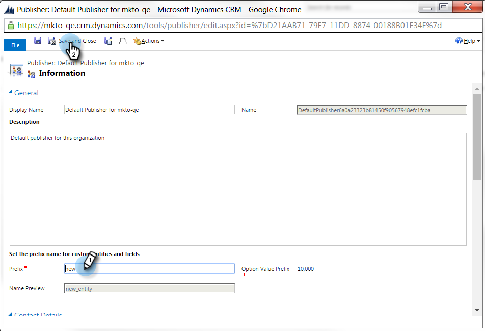
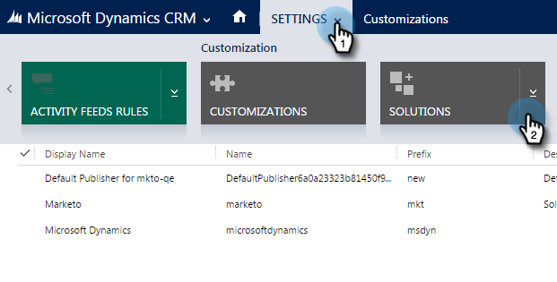

# 기본 사용자 지정 필드 접두사 설정 {#set-a-default-custom-field-prefix}

Marketing to 독점 필드가 올바르게 동기화되려면 사용자 정의 필드에 대한 기본 Microsoft Dynamics 접두사가 **새로운** 접두사여야 합니다. 기본 접두사를 변경하는 방법은 다음과 같습니다.

1. 설정으로 이동하여 사용자 지정을 **선택합니다.**

   ** 

   **

1. 게시자를 **클릭합니다**.

   

1. 목록에서 기본 게시자를 선택합니다.

   

1. 접두사를 **new**&#x200B;로 변경합니다. 저장 **및 닫기를 클릭합니다**.

   

1. 설정 > 솔루션으로 이동하여 사용자 지정을 게시합니다.

   

1. 모든 사용자 지정 **게시를 클릭합니다**.

   

1. 이제 사용자 정의 필드를 만듭니다. 접두사를 완료한 후 원래 접두사로 되돌립니다.

