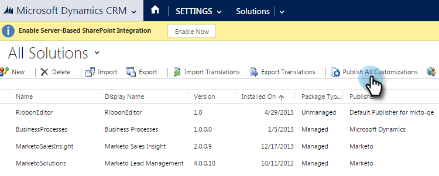

# 기본 사용자 정의 필드 접두사 설정 {#set-a-default-custom-field-prefix}

Marketo 소유 필드를 올바르게 동기화하려면 사용자 지정 필드의 기본 Microsoft Dynamics 접두사가 _new_&#x200B;이어야 합니다. 기본 접두사를 변경하는 방법은 다음과 같습니다.

1. 설정으로 이동하여 **사용자 지정**&#x200B;을 선택하세요.

   

1. **게시자**&#x200B;를 클릭합니다.

   

1. 목록에서 기본 게시자를 선택합니다.

   

1. 접두사를 **new**(으)로 변경합니다. **저장 후 닫기**&#x200B;를 클릭합니다.

   

1. 설정 > 솔루션 으로 이동하여 맞춤화를 게시합니다.

   

1. **모든 사용자 지정 Publish**&#x200B;을 클릭합니다.

   

1. 이제 사용자 정의 필드를 만듭니다. 이를 완료한 후 접두사를 원래 접두사로 되돌립니다.
