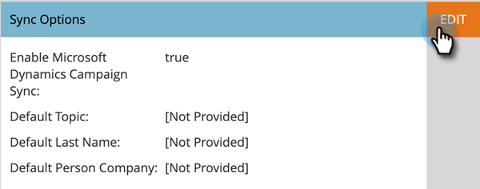

# Campaign 동기화 활성화 {#enable-campaign-sync}

이 옵션을 사용하면 Marketo에서 [!DNL MS Dynamics] 캠페인에 구성원을 추가하고 제거할 수 있습니다.

>[!PREREQUISITES]
>
>Marketo용 [!DNL Dynamics] 플러그인의 최신 버전으로 업데이트하십시오.

>[!NOTE]
>
>**관리자 권한 필요**

1. **[!UICONTROL My Marketo]**&#x200B;에서 **[!UICONTROL Admin]**&#x200B;을(를) 클릭합니다.

   

1. **[!UICONTROL Microsoft Dynamics]**&#x200B;을(를) 클릭합니다.

   

1. **[!UICONTROL Sync Options]**&#x200B;에서 **[!UICONTROL Edit]**&#x200B;을(를) 클릭합니다.

   

1. **[!UICONTROL Enable Microsoft Dynamics Campaign Sync]** 확인란을 선택하고 **[!UICONTROL Save]**&#x200B;을(를) 클릭합니다.

   

여기 있습니다. 동기화에서 [!DNL Microsoft Dynamics]의 데이터를 가져올 시간을 주면 됩니다.

>[!NOTE]
>
>[!DNL Dynamics] 캠페인 동기화 확인란을 재설정하면 이전에 동기화된 모든 캠페인 데이터와 [!DNL Dynamics]의 마케팅 목록과의 연결이 새로 고침됩니다.
