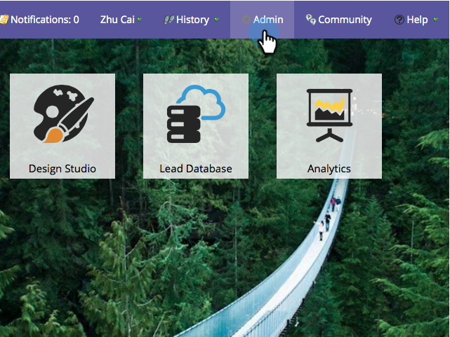

# Microsoft Dynamics 동기화:사용자 지정 엔티티 동기화 {#microsoft-dynamics-sync-custom-entity-sync}

Marketing To에서 Dynamics 데이터를 사용할 수 있도록 초기 사용자 지정 엔티티 동기화를 활성화해야 하는 경우 이 방법을 사용합니다.

>[!NOTE]
>
>**관리자 권한 필요**

>[!NOTE]
>
>**사전 요구 사항**
>
>사용자 지정 개체를 사용하려면 Dynamics의 [리드](microsoft-dynamics-sync-lead-sync.md), [연락처](microsoft-dynamics-sync-contact-sync.md)또는 계정에 연결해야합니다.

>[!CAUTION]
>
>사용자 지정 엔티티에 대한 동기화를 시작하기 전에 초기 동기화가 완료되었는지(이메일을 통해 알림) 확인하십시오.

1. 관리 섹션으로 이동합니다.

   

1. 표준 전역 **동기화를** 일시적으로 비활성화하려면 [동기화 비활성화]를 클릭합니다.

   

1. 사용자 지정 엔티티 동기화를 지원하는 Microsoft Dynamics 버전(2_0_0_2 이후)을 설치합니다. Microsoft [Dynamics용 Marketing To 플러그인 릴리스를 참조하십시오](../../../../product-docs/crm-sync/microsoft-dynamics-sync/marketo-plugin-releases-for-microsoft-dynamics.md).
1. 동기화하려는 모든 개체에 대한 Marketing to Sync 사용자 읽기 액세스 권한을 제공합니다.
1. 데이터베이스 관리에서** Dynamics 엔티티 동기화* 링크를 클릭합니다.

   

1. 사용 가능한 사용자 **지정 엔티티** 목록을 가져오려면 스키마 동기화 링크를 클릭합니다.

   

1. 목록 동기화 후 동기화할 필드와 스마트 목록에서 [제한](../../../../product-docs/core-marketo-concepts/smart-lists-and-static-lists/using-smart-lists/add-a-constraint-to-a-smart-list-filter.md) 및/또는 트리거를 사용할 필드를 선택합니다. 완료되면 [동기화 **활성화]를 클릭합니다**.

   

1. 전역 동기화를 다시 활성화합니다.

   

   >[!NOTE]
   >
   >Marketing은 하나 또는 두 수준 깊이의 표준 엔터티에 연결된 사용자 지정 개체만 지원합니다.

   >[!NOTE]
   >
   >엔티티 이름은 최대*** 33자를 사용할 수 있습니다.*

넌 괜찮아!