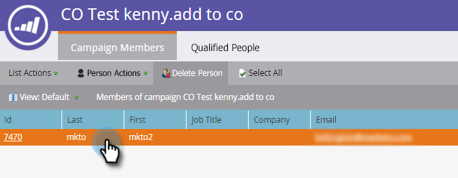

# [!DNL Microsoft Dynamics]에서 연락처 만들기 {#create-a-contact-in-microsoft-dynamics}

1. Dynamics에서 연락처로 만들 Marketo Engage 전용 사용자(Microsoft 유형이 비어 있음)를 선택합니다.

   

1. **[!UICONTROL Person Actions]** 및 **[!DNL Microsoft]**&#x200B;을(를) 클릭하고 **[!UICONTROL Sync Person to Microsoft]**&#x200B;을(를) 선택합니다.

   

1. **[!UICONTROL Sync As]**&#x200B;을(를) 클릭하고 **[!UICONTROL Contact]**&#x200B;을(를) 선택합니다. **[!UICONTROL Run Now]**&#x200B;를 클릭합니다.

   

   >[!NOTE]
   >
   >&quot;[!UICONTROL Sync Person to Microsoft]&quot; 흐름 동작(트리거 캠페인에서만)을 사용하는 경우 리드/연락처가 Dynamics에서 실시간으로 만들어집니다.

1. Marketo은 [!DNL Dynamics]의 잠재 고객 레코드를 [!DNL Dynamics]의 계정과 연결되어 있지 않은 연락처로 한정합니다.

   

1. 이제 스마트 캠페인 필터에서 동기화 형식 제약 조건을 사용할 때 **[!UICONTROL Contact]**&#x200B;을(를) 선택할 수 있습니다.

   
