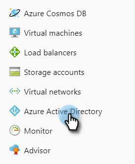
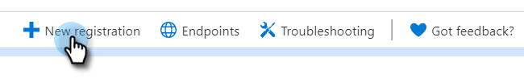
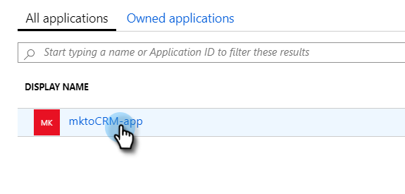

# Azure에 앱을 등록하여 클라이언트 ID/앱 ID {#register-an-app-with-azure-to-acquire-your-client-id-app-id} 획득

Azure Active Directory는 온-프레미스 디렉터리를 클라우드로 확장하여 온-프레미스 ADFS 인증을 통해 MS Dynamics 365 CRM에 대한 지원을 제공합니다.

## 새 앱 등록 {#registering-a-new-app}

1. [관리자 ](http://manage.windowsazure.com/) 권한이 있는 계정을 사용하여 Microsoft Azure 관리 포털에 로그인합니다. 왼쪽 탐색 창에서 **관리** 항목을 확장하고 **Azure AD**&#x200B;을 선택하여 Office 365 관리 센터를 통해 Microsoft Azure 포털에 액세스할 수도 있습니다.

   >[!CAUTION]
   >
   >앱을 등록하려는 계정과 동일한 Office 365 구독의 계정을 사용해야 합니다.

   >[!NOTE]
   >
   >Azure 계정이 없는 경우 [1개](https://azure.microsoft.com/en-us/free/)에 등록할 수 있습니다. 자세한 내용은 Microsoft 설명서를 참조하거나 Microsoft 담당자에게 문의하십시오. Azure 계정을 만든 후 아래 설명된 절차를 사용하여 하나 이상의 앱을 등록할 수 있습니다.
   >
   >
   >Azure 계정이 있지만 Microsoft Dynamics 365의 Office 365 구독을 Azure 구독에서 사용할 수 없는 경우 [다음 지침](https://msdn.microsoft.com/office/office365/howto/setup-development-environment#bk_CreateAzureSubscription)을 따라 두 계정을 연결하십시오.

1. 왼쪽 탐색 창에서 **Azure Active Directory**&#x200B;를 찾아 클릭합니다.

   

1. 관리에서 **앱 등록**&#x200B;을 클릭합니다.

   

1. 페이지 맨 위**새 등록**을 클릭합니다.

   

1. 앱 이름을 입력하고 해당 계정 유형을 선택한 다음 리디렉션 URL을 입력합니다. 그런 다음 페이지 아래쪽에 있는 **등록**&#x200B;을 클릭합니다.

   

1. 이제 **앱 등록** 탭에서 앱이 표시됩니다.

   

## 앱 권한 구성 {#configuring-app-permissions}

1. Active Directory의 **앱 등록** 탭에서 권한을 구성할 앱을 클릭합니다.

   

1. 관리에서 **API 권한**&#x200B;을 클릭합니다.

   

1. **권한 추가** 단추를 클릭합니다.

   

1. **Dynamics CRM**&#x200B;을 선택합니다.

   

1. **조직 사용자로 일반 데이터 서비스에 액세스** 상자를 선택한 다음 **권한 추가.**

   

1. 권한이 성공적으로 추가되면 10초 이상 기다립니다.

   

1. **관리자 동의 허용** 단추를 클릭합니다.

   

1. **예**&#x200B;를 클릭하여 확인합니다.

   

   이제 모든 작업이 끝났습니다.

   

