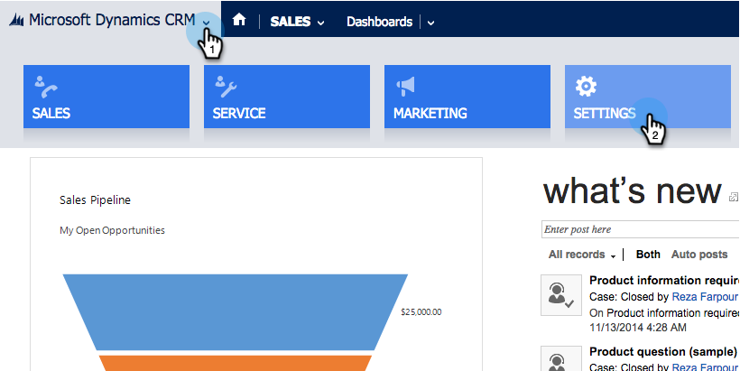
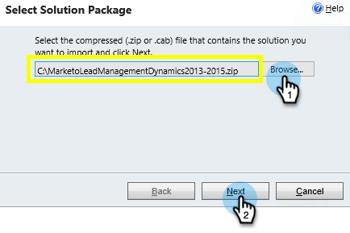
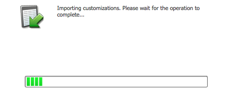

# 1단계/3단계: Dynamics에서 Marketo 솔루션 설치(2013 온-프레미스) {#step-of-install-the-marketo-solution-in-dynamics-on-premises}

Microsoft Dynamics 온-프레미스와 Marketo Engage을 동기화하려면 먼저 Dynamics에 Marketo 솔루션을 설치해야 합니다.

>[!NOTE]
>
>Marketo을 CRM에 동기화한 후에는 인스턴스를 교체하지 않고 새 동기화를 수행할 수 없습니다.

>[!PREREQUISITES]
>
>ADFS(Active Directory Federation Services)가 [Active Directory Federation Services](https://msdn.microsoft.com/en-us/library/bb897402.aspx){target="_blank"} 2.0, 2.1 또는 3.0을 구성한 IFD(인터넷 연결 배포)가 [있어야 합니다. ](https://learn.microsoft.com/en-us/dynamics365/customerengagement/on-premises/deploy/configure-an-internet-facing-deployment){target="_blank"} 참고: 링크를 클릭하면 IFD 문서가 자동으로 다운로드됩니다.
>
>시작하기 전에 [Marketo 솔루션을 다운로드합니다](/help/marketo/product-docs/crm-sync/microsoft-dynamics-sync/sync-setup/download-the-marketo-lead-management-solution.md){target="_blank"}.

>[!NOTE]
>
>**Dynamics 관리자 권한이 필요합니다**.
>
>이 동기화를 수행하려면 CRM 관리자 권한이 필요합니다.

1. Dynamics에 로그인합니다. **[!UICONTROL Microsoft Dynamics CRM]** 드롭다운 메뉴를 클릭하고 **[!UICONTROL Settings]**&#x200B;을(를) 선택합니다.

   

1. **[!UICONTROL Settings]**&#x200B;에서 **[!UICONTROL Solutions]**&#x200B;을(를) 선택합니다.

   

1. **[!UICONTROL Import]**&#x200B;을(를) 클릭합니다.

   

1. **[!UICONTROL Browse]**&#x200B;을(를) 클릭하고 [다운로드한 솔루션](/help/marketo/product-docs/crm-sync/microsoft-dynamics-sync/sync-setup/download-the-marketo-lead-management-solution.md){target="_blank"}을(를) 선택합니다. **[!UICONTROL Next]**&#x200B;을(를) 클릭합니다.

   

1. 솔루션 정보를 보고 **[!UICONTROL View solution package details]**&#x200B;을(를) 클릭합니다.

   

1. 모든 세부 정보를 모두 확인했으면 **[!UICONTROL Close]**&#x200B;을(를) 클릭합니다.

   

1. 솔루션 정보 페이지로 돌아가서 **[!UICONTROL Next]**&#x200B;을(를) 클릭합니다.

   

1. SDK 옵션이 선택되어 있는지 확인합니다. **[!UICONTROL Import]**&#x200B;을(를) 클릭합니다.

   

1. 가져오기가 완료될 때까지 기다립니다.

   >[!TIP]
   >
   >설치 프로세스를 완료하려면 브라우저에서 팝업을 활성화해야 합니다.

   

1. 원하는 경우 로그 파일을 다운로드하고 **[!UICONTROL Close]**&#x200B;을(를) 클릭합니다.

   >[!NOTE]
   >
   >&quot;Marketo 리드 관리가 경고와 함께 완료되었습니다.&quot;라는 메시지가 표시될 수 있습니다. 이는 완전히 예상되었습니다.

   

1. 이제 Marketo Lead Management가 **[!UICONTROL All Solutions]** 페이지에 표시됩니다.

   

1. Marketo 솔루션을 선택하고 **[!UICONTROL Publish all Customizations]**&#x200B;을(를) 클릭합니다.

   

>[!CAUTION]
>
>Marketo SDK 메시징 프로세스를 비활성화하면 설치가 중단됩니다!

>[!MORELIKETHIS]
>
>[3단계 중 2단계: Marketo(2013 온-프레미스)에 대한 동기화 사용자 구성](/help/marketo/product-docs/crm-sync/microsoft-dynamics-sync/sync-setup/connecting-to-legacy-versions/step-2-of-3-configure-2013.md){target="_blank"}
