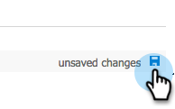

# 2단계/3단계: Marketo에 대한 동기화 사용자 구성(2013 온-프레미스) {#step-of-configure-sync-user-for-marketo-on-premises}

이전 단계를 완료해 주셔서 감사합니다. 계속해서 진행해 보겠습니다.

>[!PREREQUISITES]
>
>[1단계/3단계: Dynamics에서 Marketo 솔루션 설치(2013 온-프레미스)](/help/marketo/product-docs/crm-sync/microsoft-dynamics-sync/sync-setup/connecting-to-legacy-versions/step-1-of-3-install-2013.md){target="_blank"}

## 동기화 사용자 역할 할당 {#assign-sync-user-role}

Marketo 동기화 사용자 역할만 Marketo 동기화 사용자에게 할당합니다. 다른 사용자에게 할당할 필요가 없습니다.

>[!NOTE]
>
>이는 Marketo 플러그인 버전 4.0.0.14 이상에 적용됩니다. 이전 버전의 경우 모든 사용자에게 동기화 사용자 역할이 있어야 합니다. Marketo을 업그레이드하려면 다음을 참조하십시오. [Microsoft Dynamics용 Marketo 솔루션 업그레이드](/help/marketo/product-docs/crm-sync/microsoft-dynamics-sync/sync-setup/update-the-marketo-solution-for-microsoft-dynamics.md){target="_blank"}.

>[!IMPORTANT]
>
>동기화 사용자의 언어 설정 [영어로 설정해야 함](https://portal.dynamics365support.com/knowledgebase/article/KA-01201/en-us){target="_blank"}.

1. 아래 **설정**, 클릭 **관리**.

   

1. 선택 **사용자**.

   

1. 여기에 사용자 목록이 표시됩니다. 전용 Marketo 동기화 사용자를 선택하거나 [AFDS(Active Directory Federation Services)](https://msdn.microsoft.com/en-us/library/bb897402.aspx){target="_blank"} administrator to create a new user that's [dedicated to Marketo](https://blogs.technet.com/b/askpfeplat/archive/2014/04/21/introduction-to-active-directory-federation-services-ad-fs-alternateloginid-feature.aspx){target="_blank"}.

   

1. 동기화 사용자를 선택합니다. 클릭  및 선택 **[!UICONTROL 역할 관리]**.

   

1. 확인 **[!UICONTROL Marketo 동기화 사용자]** 및 클릭 **[!UICONTROL 확인]**.

   

   >[!TIP]
   >
   >역할이 표시되지 않으면 다음으로 돌아가기 [1/3단계](/help/marketo/product-docs/crm-sync/microsoft-dynamics-sync/sync-setup/connecting-to-legacy-versions/step-1-of-3-install-2013.md){target="_blank"} 솔루션을 가져옵니다.

   >[!NOTE]
   >
   >동기화 사용자가 CRM을 업데이트하면 _아님_ Marketo에 다시 동기화됩니다.

## Marketo 솔루션 구성 {#configure-marketo-solution}

거의 완료되었습니다! 다음 문서로 이동하기 전에 마지막으로 구성한 부분이 몇 개 있습니다.

1. 아래 **[!UICONTROL 설정]**, 클릭 **[!UICONTROL Marketo 구성]**.

   

   >[!NOTE]
   >
   >&quot;Marketo 구성&quot;이 누락된 경우 페이지를 새로 고침해 보십시오. 문제가 지속되면, [Marketo 솔루션 게시](/help/marketo/product-docs/crm-sync/microsoft-dynamics-sync/sync-setup/connecting-to-legacy-versions/step-1-of-3-install-2013.md) 다시 로그아웃했다가 다시 로그인하십시오.

1. 클릭 **[!UICONTROL 기본값]**.

   

1. 다음을 클릭합니다. **[!UICONTROL Marketo 사용자]** 을(를) 필드에 추가하고 동기화 사용자를 선택합니다.

   

1. 클릭  오른쪽 하단에 있는 을 클릭하여 변경 내용을 저장합니다.

   

1. 클릭 **[!UICONTROL 모든 사용자 지정 게시]**.

   

## 3단계로 진행하기 전에 {#before-proceeding-to-step}

* 동기화하는 레코드 수를 제한하려면 [사용자 지정 동기화 필터 설정](/help/marketo/product-docs/crm-sync/microsoft-dynamics-sync/create-a-custom-dynamics-sync-filter.md){target="_blank"} 지금.
* 실행 [Microsoft Dynamics 동기화 확인](/help/marketo/product-docs/crm-sync/microsoft-dynamics-sync/sync-setup/validate-microsoft-dynamics-sync.md){target="_blank"} 프로세스. 초기 설정이 올바르게 수행되었는지 확인합니다.
* Microsoft Dynamics CRM에서 Marketo 동기화 사용자에 로그인합니다.

좋습니다!

>[!MORELIKETHIS]
>
>[3단계/3단계: Marketo 및 Dynamics 연결(2013 온프레미스)](/help/marketo/product-docs/crm-sync/microsoft-dynamics-sync/sync-setup/connecting-to-legacy-versions/step-3-of-3-connect-2013.md){target="_blank"}
