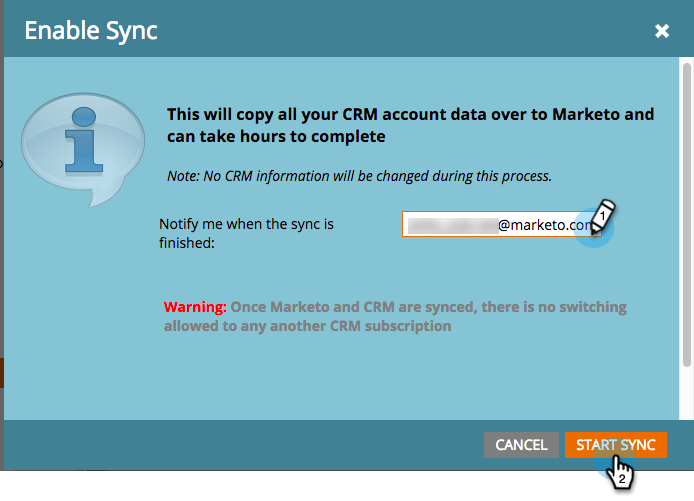

# 3단계 중 3단계: Microsoft Dynamics와 Marketo 연결(2011 온프레미스) {#step-of-connect-microsoft-dynamics-with-marketo-on-premises}

좋아! 솔루션을 설치하고 동기화 사용자를 구성했습니다. 이제 Marketo과 Dynamics를 연결해야 합니다.

>[!PREREQUISITES]
>
>* [3단계 중 1단계: Marketo 솔루션 설치(2011 온프레미스)](/help/marketo/product-docs/crm-sync/microsoft-dynamics-sync/sync-setup/connecting-to-legacy-versions/step-1-of-3-install-2011.md)
>* [3단계 중 2단계: Dynamics에서 Marketo 동기화 사용자 설정(2011 온프레미스)](/help/marketo/product-docs/crm-sync/microsoft-dynamics-sync/sync-setup/connecting-to-legacy-versions/step-2-of-3-set-up-2011.md)

>[!NOTE]
>
>**관리 권한 필요**

## Dynamics 동기화 사용자 정보 입력 {#enter-dynamics-sync-user-information}

1. Marketo에 로그인하고 **관리**.

   

1. 클릭 **CRM**.

   

1. 클릭 **Microsoft**.

   

1. 클릭 **편집** in **1단계: 자격 증명을 입력합니다.**

   

   >[!CAUTION]
   >
   >제출 후 후속 스키마 변경 사항을 되돌릴 수 없으므로 자격 증명이 올바른지 확인하십시오. 잘못된 자격 증명이 저장된 경우 새 Marketo 구독을 받아야 합니다.

1. 을(를) 입력합니다. **사용자 이름**, **암호** 및 CRM **URL** 을 클릭한 다음 **저장**.

   

   >[!NOTE]
   >
   >* Marketo의 사용자 이름은 CRM에서 동기화 사용자의 사용자 이름과 일치해야 합니다. 형식은 다음과 같습니다 `user@domain.com` 또는 DOMAIN\user.
   >* URL을 모르면 [여기에서 찾는 방법 알아보기](/help/marketo/product-docs/crm-sync/microsoft-dynamics-sync/sync-setup/view-the-organization-service-url.md).

## 동기화할 필드 선택 {#select-fields-to-sync}

이제 동기화할 필드를 선택해야 합니다.

1. 클릭 **편집** in **2단계: 동기화할 필드를 선택합니다.**

   

1. 동기화할 미리 선택된 필드가 있습니다. 원하는 경우 더 추가하고 **저장**.

   

   >[!NOTE]
   >
   >Marketo은 동기화할 필드에 대한 참조를 저장합니다. Dynamics에서 필드를 삭제하는 경우 [동기화 사용 안 함](/help/marketo/product-docs/crm-sync/salesforce-sync/enable-disable-the-salesforce-sync.md). 그런 다음 를 편집하고 저장하여 Marketo에서 스키마를 새로 고칩니다 [동기화할 필드 선택](/help/marketo/product-docs/crm-sync/microsoft-dynamics-sync/microsoft-dynamics-sync-details/microsoft-dynamics-sync-field-sync/editing-fields-to-sync-before-deleting-them-in-dynamics.md).

## 사용자 지정 필터에 대한 필드 동기화 {#sync-fields-for-a-custom-filter}

사용자 지정 필터를 만든 경우 로 이동하여 Marketo과 동기화할 새 필드를 선택하십시오.

1. Admin으로 이동하여 를 선택합니다 **Microsoft Dynamics**.

   

1. 클릭 **편집** 필드 동기화 세부 정보

   

1. 아래로 스크롤하여 필드를 확인합니다. 실제 이름은 new_synctokto여야 하지만 표시 이름은 무엇이든 될 수 있습니다. 클릭 **저장**.

   

## 동기화 활성화 {#enable-sync}

1. 클릭 **편집** in **3단계: 동기화 활성화**.

   

   >[!CAUTION]
   >
   >Marketo은 Microsoft Dynamics 동기화에 대해 자동으로 중복 제거를 수행하지 않거나 수동으로 사람 또는 리드를 입력할 때 자동으로 중복 제거를 수행하지 않습니다.

1. 팝업에서 모든 내용을 읽고 이메일을 입력한 다음 **동기화 시작**.

   

1. 첫 번째 동기화는 몇 시간이 걸릴 수 있습니다. 완료되면 이메일 알림을 받게 됩니다.

   

   탁월한 작업!
