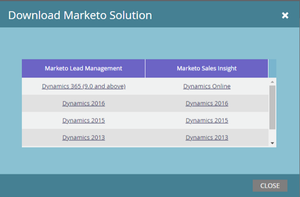

# Marketo 리드 관리 솔루션 다운로드 {#download-the-marketo-lead-management-solution}

>[!NOTE]
>
>**관리자 권한 필요**

동기화를 시작하려면 [!DNL Microsoft Dynamics] 계정에 Marketo 솔루션을 다운로드하고 설치해야 합니다.

>[!CAUTION]
>
>업그레이드를 수행하려면 최신 Marketo 솔루션을 _이전_&#x200B;에 다운로드해야 합니다.

>[!NOTE]
>
>Marketo은 현재 Java 7과 호환되는 SSL 인증서만 지원합니다.

1. **[!UICONTROL Admin]** 영역으로 이동합니다.

   

1. **[!UICONTROL CRM]**&#x200B;을(를) 클릭합니다.

   

1. **[!DNL Microsoft]**&#x200B;를 선택합니다.

   

1. **[!UICONTROL Download Marketo Solution]**&#x200B;를 선택합니다.

   

1. [!DNL Microsoft Dynamics] 버전에 적합한 솔루션을 선택하십시오.

   

멋지다! 이제 솔루션의 zip 파일이 장치에 다운로드됩니다.
