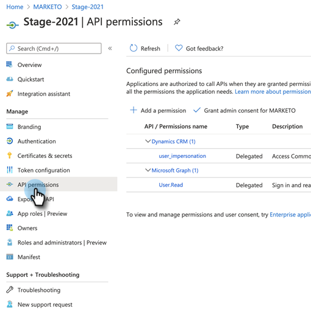
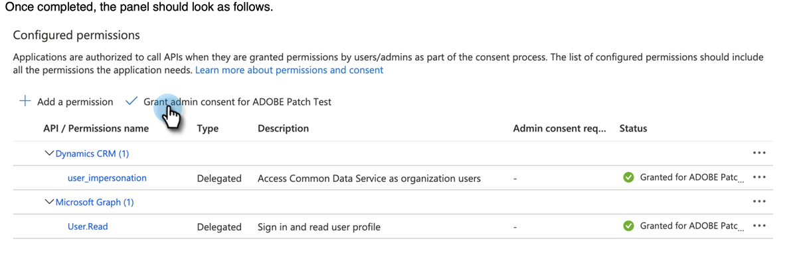

# 클라이언트 Id 및 앱 등록에 동의 부여 {#grant-consent-for-client-id-and-app-registration}

필요한 동의/권한을 부여하는 방법을 배우려면 아래 단계를 따르십시오.

## 동기화 사용자에 대해 위임된 사용자 권한 부여 {#grant-delegated-user-permissions-for-the-sync-user}

1. 클린 텍스트 프로그램(Windows용 메모장, Mac용 텍스트 편집)을 사용하여 아래 텍스트를 붙여넣고 client_id, redirect_uri 및 state 값을 대체하여 인증용 URI(Uniform Resource Identifier)를 생성합니다.

   ```
   https://login.microsoftonline.com/common/oauth2/authorize?
   client_id='xxxxxx-xxxx-xxxx-xxxx-xxxxxxxx'
   &response_type='code'
   &redirect_uri='https://www.<ourdomain>.com'
   &response_mode='query'
   &state='SOME_UNIQUE_UID'
   client_id value should be the client_id generated in App Registration process
   redirect_uri value should be same as value entered at the time of App registration-> Redirect URIs
   state value can be any ID (e.g.,12345)
   ```

   <table> 
    <colgroup> 
     <col> 
     <col> 
    </colgroup> 
    <tbody> 
     <tr> 
      <td><strong>client_id 값</strong></td> 
      <td>는 앱 등록 프로세스에서 생성된 client_id여야 합니다.</td> 
     </tr> 
     <tr> 
      <td><strong>redirect_uri 값</strong></td> 
      <td>은(는) 앱 등록 &gt; 리디렉션 URI 시 입력한 값과 동일해야 합니다.</td> 
     </tr> 
     <tr> 
      <td><strong>상태 값</strong></td> 
      <td>은 모든 ID일 수 있습니다(예: 12345).</td> 
     </tr> 
    </tbody> 
   </table>

   최종 URL은 다음과 같아야 합니다. `https://login.microsoftonline.com/common/oauth2/authorize?client_id=xxxxxx-xxxx-xxxx-xxxx-xxxxxxxx&response_type=code&redirect_uri=https://www.marketo.com&response_mode=query&state=12345`

1. 브라우저에서 만든 URI를 엽니다.

   

1. 권한을 부여할 동기화 사용자로 로그인합니다.

   

   >[!NOTE]
   >
   >다른 탭에서 관리자로 Azure에 이미 로그인한 경우 다른 브라우저 또는 시크릿 모드를 사용하여 동기화 사용자로 로그인해야 합니다.

1. 클릭 **[!UICONTROL Accept]**.

   

## 모든 사용자에 대한 동의 부여 {#grant-consent-for-all-users}

관리자는 테넌트의 모든 사용자를 대신하여 애플리케이션의 위임된 권한에 동의할 수도 있습니다. 관리자 동의는 테넌트의 모든 사용자에 대해 동의 대화 상자가 표시되지 않도록 하며, 관리자 역할이 있는 사용자가 Azure 포털에서 수행할 수 있습니다. 어떤 관리자 역할을 수행할 수 있는지 알아봅니다 [여기서 위임된 권한에 동의](https://docs.microsoft.com/en-us/azure/active-directory/roles/permissions-reference).

1. Azure 포털에서 애플리케이션 홈 페이지로 이동합니다.

1. 관리에서 **[!UICONTROL API 권한]**.

   

1. 다음을 클릭합니다. **[!UICONTROL 관리자 동의 부여]** (테넌트용) 버튼.

   

1. 클릭 **[!UICONTROL 예]** 확인할 수 있습니다.

   
