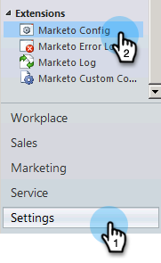

# 3단계 중 2단계:Dynamics에서 Marketing To Sync 사용자 설정(2011 온-프레미스) {#step-of-set-up-marketo-sync-user-in-dynamics-on-premises}

이전 단계를 완성하는 데 훌륭한 일을 계속하자.

>[!PREREQUISITES]
>
>* [3단계 중 1단계:Marketing Solution(2011 온프레미스) 설치](step-1-of-3-install.md)

>

## 동기화 사용자 역할 할당 {#assign-sync-user-role}

Marketing to Sync 사용자 역할만 Marketing to 동기화 사용자에게 할당합니다. 다른 사용자에게 할당할 필요는 없습니다.

>[!NOTE]
>
>이는 Marketing to 플러그인 버전 4.0.0.14 이상에 적용됩니다. 이전 버전의 경우 모든 사용자는 동기화 사용자 역할이 있어야 합니다. Marketing to를 업그레이드하려면 Microsoft Dynamics [용 Marketing Solution 업그레이드를 참조하십시오](../../../../../product-docs/crm-sync/microsoft-dynamics-sync/sync-setup/download-the-marketo-lead-management-solution/upgrade-the-marketo-solution-for-microsoft-dynamics.md).

1. 왼쪽 하단 메뉴에서 **설정을 선택합니다**.

   

1. 트리에서 **관리를 선택합니다**.

   

1. 사용자를 **선택합니다**.

   

1. 여기에 사용자 목록이 표시됩니다. 전용 Marketing to를 선택하여 사용자를 동기화하거나 AFDS( [Active Directory Federation Services)](https://msdn.microsoft.com/en-us/library/bb897402.aspx) 관리자에게 연락하여 Marketing To 전용 사용자를 새로 만듭니다. 역할 **관리를 클릭합니다**.

   

1. Marketing **to Sync 사용자** 를 선택하고 **확인을 클릭합니다**.

   

   >[!TIP]
   >
   >해당 역할이 표시되지 않으면 3 [단계 중 1단계로 돌아가서 솔루션을](step-1-of-3-install.md) 가져옵니다.

   >[!NOTE]
   >
   >동기화 사용자가 CRM에서 만든 모든 업데이트는 Marketing To로 다시 동기화되지 **않습니다** .

## 마케팅 솔루션 구성 {#configure-marketo-solution}

거의 완료되었습니다. 다음 아티클로 이동하기 전에 몇 가지 구성 요소가 있습니다.

1. 설정을 **선택합니다**. 그런 다음 트리에서 **Marketing Config **를 선택합니다.

   

   >[!NOTE]
   >
   >Marketing To 구성이 없는 경우 페이지를 새로 고쳐 보십시오. 문제가 지속되면 Marketing [To 솔루션을 다시](step-1-of-3-install.md) 게시하거나 로그아웃했다가 다시 로그인하십시오.

1. 기본값 **을 클릭합니다**.

   

1. 클릭 

   

1. 팝업에서 동기화 사용자를 선택합니다. 그런 다음 **확인을 클릭합니다**.

   

1. 저장을 **클릭하여** 변경 사항을 저장합니다.

   

1. 모든 사용자 지정 **게시를 클릭합니다**.

   

## 3단계로 이동하기 전 {#before-proceeding-to-step}

    * 동기화되는 레코드 수를 제한하려면 지금 [사용자 정의 동기화 필터 설정](../../../../../product-docs/crm-sync/microsoft-dynamics-sync/create-a-custom-dynamics-sync-filter.md)을 참조하십시오.
    * [Microsoft Dynamics 동기화 유효성 검사](../../../../../product-docs/crm-sync/microsoft-dynamics-sync/sync-setup/validate-microsoft-dynamics-sync.md) 프로세스를 실행합니다. 초기 설정이 올바르게 수행되었는지 확인합니다.
    * Microsoft Dynamics CRM에서 Marketing to Sync 사용자에 로그인합니다.

잘했어!

>[!NOTE]
>
>**관련 문서**
>
>[3단계 중 3단계:Microsoft Dynamics와 Marketing(2011 온-프레미스) 연결](step-3-of-3-connect.md)

