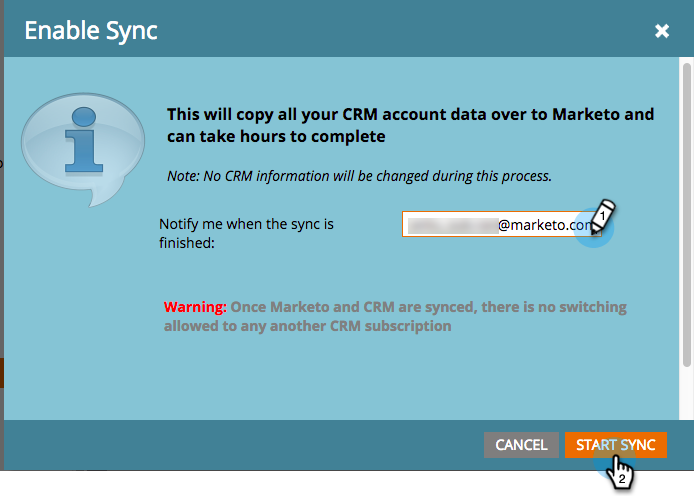

# 3단계 중 3단계:Connect Marketing 및 Dynamics(2013 온-프레미스) {#step-of-connect-marketo-and-dynamics-on-premises}

좋아! 솔루션을 설치하고 동기화 사용자를 구성했습니다. Adobe Marketing Cloud와 Dynamics를 연계해야 합니다.

>[!PREREQUISITES]
>
>* [3단계 중 1단계:Dynamics에서 Marketing To 솔루션 설치(2013 온프레미스)](/help/marketo/product-docs/crm-sync/microsoft-dynamics-sync/sync-setup/microsoft-dynamics-2013-on-premises/step-1-of-3-install.md)
>* [3단계 중 2단계:Marketing용 동기화 사용자 구성(2013 온-프레미스)](/help/marketo/product-docs/crm-sync/microsoft-dynamics-sync/sync-setup/microsoft-dynamics-2013-on-premises/step-2-of-3-configure.md)

>[!NOTE]
>
>**관리자 권한 필요**

## Dynamics 동기화 사용자 정보 {#enter-dynamics-sync-user-information} 입력

1. Marketing에 로그인하고 **관리**&#x200B;를 클릭합니다.

   

1. **CRM**&#x200B;을 클릭합니다.

   

1. **Microsoft**&#x200B;를 선택합니다.

   

1. **1단계에서**&#x200B;편집&#x200B;**을 클릭합니다.자격 증명**&#x200B;을 입력합니다.

   

   >[!CAUTION]
   >
   >제출 후 스키마 변경 내용을 되돌릴 수 없으므로 자격 증명이 올바른지 확인하십시오. 잘못된 자격 증명이 저장되면 새 Marketing To 구독을 구해야 합니다.

1. **사용자 이름**, **암호** 및 Microsoft Dynamics **URL**&#x200B;을 입력한 다음 **저장**&#x200B;을 클릭합니다.

   

   >[!NOTE]
   >
   >Marketing의 사용자 이름은 CRM의 동기화 사용자의 사용자 이름과 일치해야 합니다. 형식은 user@domain.com 또는 DOMAIN\user일 수 있습니다.

   >[!TIP]
   >
   >URL을 모르십니까? 여기에서 [Dynamics 조직 서비스 URL](/help/marketo/product-docs/crm-sync/microsoft-dynamics-sync/sync-setup/view-the-organization-service-url.md)을 찾는 방법을 보여 드리겠습니다.

## 동기화할 필드 선택 {#select-fields-to-sync}

이제 동기화할 필드를 선택해야 합니다.

1. **2단계에서**&#x200B;편집&#x200B;**을 클릭합니다.동기화할 필드**&#x200B;를 선택합니다.

   

1. Marketing To에 동기화하려는 필드를 선택하여 미리 선택합니다. **저장**&#x200B;을 클릭합니다.

   

## 사용자 지정 필터 {#sync-fields-for-a-custom-filter}에 대한 필드 동기화

사용자 정의 필터를 만든 경우 해당 위치로 이동하여 Marketing To와 동기화할 새 필드를 선택하십시오.

1. 관리로 이동하고 **Microsoft Dynamics**&#x200B;을 선택합니다.

   

1. 필드 동기화 세부 정보에서 **편집**&#x200B;을 클릭합니다.

   

1. 아래로 스크롤하여 확인합니다. 실제 이름은 new_synctomto여야 하지만 표시 이름은 무엇이든 될 수 있습니다. **저장**&#x200B;을 클릭합니다.

   

## {#enable-sync} 동기화 사용

1. **단계 3:동기화**&#x200B;을(를) 활성화합니다.****

   

   >[!CAUTION]
   >
   >Microsoft Dynamics 동기화 또는 수동으로 인물 또는 리드를 입력할 때 Marketing To는 자동으로 중복 제거 기능을 제공하지 않습니다.

1. 팝업에서 모든 내용을 읽고 전자 메일을 입력한 다음 **동기화 시작**&#x200B;을 클릭합니다.

   

1. 첫 번째 동기화에는 몇 시간이 걸릴 수 있습니다. 완료되면 이메일 알림을 수신하게 됩니다.

   

탁월한 작업! Marketing To와 Microsoft Dynamics 간의 양방향 동기화 기능을 활용하여 Marketing To Sales Insight를 구매했다면 다음과 같은 이점을 얻을 수 있습니다.

>[!MORELIKETHIS]
>
>[Microsoft Dynamics 2013에서 Marketing To Sales Insight 설치 및 구성](/help/marketo/product-docs/marketo-sales-insight/msi-for-microsoft-dynamics/installing/install-and-configure-marketo-sales-insight-in-microsoft-dynamics-2013.md)
