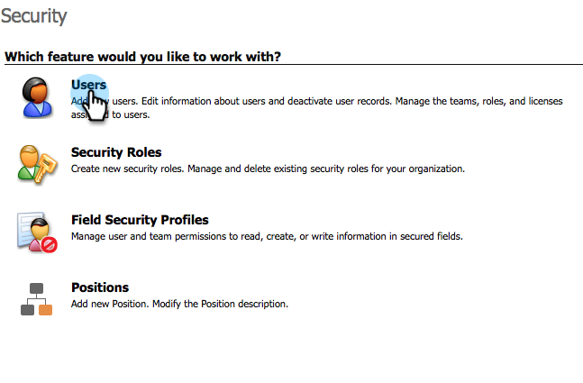
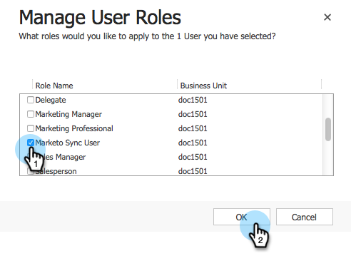

# 3단계 중 2단계

<!--Install Marketo for Dynamics 2015 On-Prem and 2016 365 On-Prem Step 2 of 3-->

이전 단계를 완료하는 데 성공했습니다. 계속 이 과정을 진행합시다.

>[!PREREQUISITES]
>
>* [Dynamics 2015 On-Prem 및 2016 365 On-Prem용 Marketing To 설치 1/3](step-1-of-3-install.md)

>

## 동기화 사용자 역할 할당 {#assign-sync-user-role}

Marketing to Sync 사용자 역할을 Marketing Cloud에 할당하여 사용자를 동기화합니다. 다른 사용자에게 할당할 필요는 없습니다.

>[!NOTE]
>
>이것은 Marketing 버전 4.0.0.14 이상에만 적용됩니다. 이전 버전의 경우 모든 사용자는 동기화된 사용자 역할이 있어야 합니다. 마케팅을 업그레이드하려면 [Microsoft Dynamics용 Marketing Solution 업그레이드](../../../../../product-docs/crm-sync/microsoft-dynamics-sync/sync-setup/upgrade-the-marketo-solution-for-microsoft-dynamics.md)를 참조하십시오.

1. **설정**&#x200B;에서 **보안**&#x200B;을 클릭합니다.

   

1. **사용자**&#x200B;를 클릭합니다.

   

1. 여기에 사용자 목록이 표시됩니다. 전용 Marketing to Sync 사용자를 선택하거나 [Active Directory Federation Services](https://msdn.microsoft.com/en-us/library/bb897402.aspx)(ADFS) 관리자에게 문의하여 Marketing용 전용 사용자를 만듭니다.

   

1. 동기화 사용자를 선택합니다. **역할 관리**&#x200B;를 클릭합니다.

   

   Marketing to Sync User를 선택하고 확인을 클릭합니다.

   

   >[!TIP]
   >
   >역할이 표시되지 않으면 [단계 1/3](step-1-of-3-install.md)으로 돌아가서 솔루션을 가져옵니다.

   >[!NOTE]
   >
   >동기화 사용자가 CRM에서 수행한 모든 업데이트는 Marketing To에 다시 동기화되지 **않습니다.**

## 마케팅 솔루션 {#configure-marketo-solution} 구성

거의 완료되었습니다! 다음 아티클로 이동하기 전에 몇 개의 마지막 구성 요소가 있습니다.

1. **설정**&#x200B;에서 **마케팅 구성**&#x200B;을 클릭합니다.

   

   >[!NOTE]
   >
   >Marketing To 구성이 없는 경우 페이지를 새로 고쳐 보십시오. 문제가 지속되면 [Marketing To 솔루션](https://docs.marketo.com/pages/viewpage.action?pageId=3571822#publish-customizations)을(를) 게시하거나 로그아웃했다가 다시 로그인하십시오.

1. **기본값**&#x200B;을 클릭합니다.

   

1. **마케팅 사용자** 필드를 클릭하고 동기화 사용자를 선택합니다.

   

1. 오른쪽 하단에 있는 저장 아이콘을 클릭합니다.

   

1. **모든 사용자 지정 게시**&#x200B;를 클릭합니다.

   

## 3단계로 진행하기 전 {#before-proceeding-to-step}

* 동기화하려는 레코드 수를 제한하려면 지금 [사용자 지정 동기화 필터](../../../../../product-docs/crm-sync/microsoft-dynamics-sync/create-a-custom-dynamics-sync-filter.md)를 설정합니다.
* [Microsoft Dynamics 동기화 유효성 검사](../../../../../product-docs/crm-sync/microsoft-dynamics-sync/sync-setup/validate-microsoft-dynamics-sync.md) 프로세스를 실행합니다. 초기 설정이 올바르게 수행되었는지 확인합니다.
* Microsoft Dynamics CRM에서 Marketing to Sync 사용자에 로그인합니다.

>[!NOTE]
>
>**관련 문서**
>
>[Dynamics 2015 On-Prem 및 2016 365 On-Prem 3을 위한 Market 설치](step-3-of-3-connect.md)
