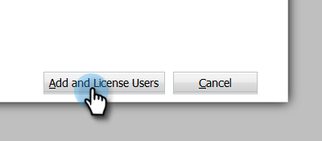
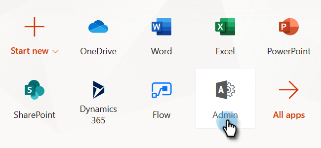
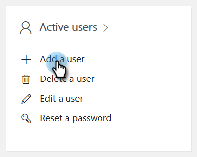
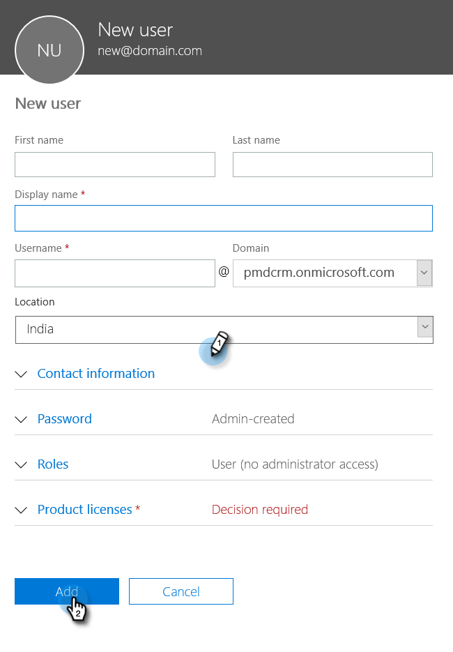
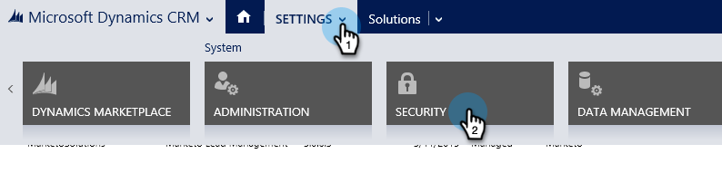
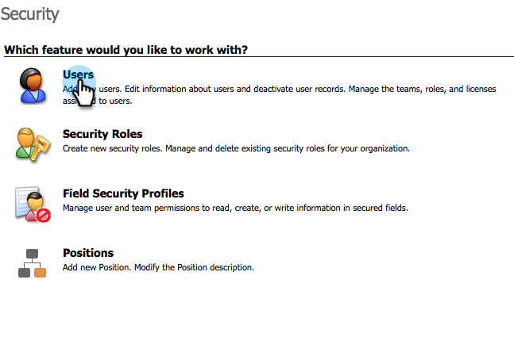
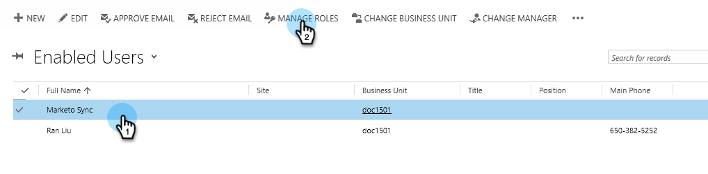
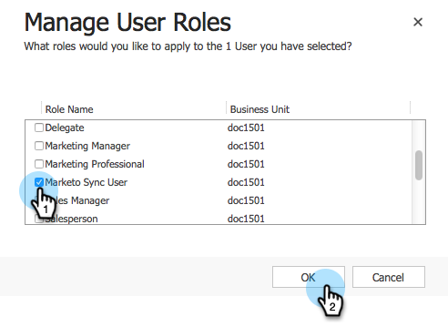
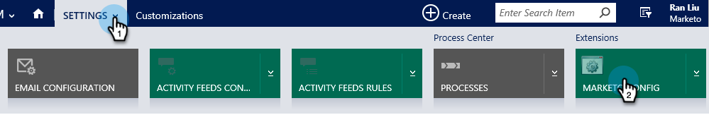

# 2단계/3단계 [!DNL Dynamics]용 Marketo 설정(2016년 온프레미스/[!DNL Dynamics]년 온프레미스 365개){#step-of-set-up-for-marketo-on-premises-2016}

이전 단계가 완료되었습니다.

>[!PREREQUISITES]
>
>[Marketo 설치 [!DNL Microsoft Dynamics] 2016/[!DNL Dynamics] 365 온-프레미스 단계 1/3](/help/marketo/product-docs/crm-sync/microsoft-dynamics-sync/sync-setup/microsoft-dynamics-2016-dynamics-365-on-premises/step-1-of-3-install.md)

## 새 사용자 만들기 {#create-a-new-user}

1. [!DNL Dynamics]에 로그인합니다. 설정 아이콘을 클릭하고 고급 설정을 선택합니다.

   

1. **[!UICONTROL Settings]**&#x200B;을(를) 클릭하고 **[!UICONTROL Security]**&#x200B;을(를) 선택합니다.

   

1. **[!UICONTROL Users]**&#x200B;를 클릭합니다.

   

1. **[!UICONTROL New]**&#x200B;를 클릭합니다.

   

1. **[!UICONTROL Add and License Users]**&#x200B;를 클릭합니다. 새 탭이 열립니다.

   

1. 페이지 맨 위에서 **[!UICONTROL Admin]**&#x200B;을(를) 클릭합니다. 다른 새 탭이 열립니다.

   

1. **[!UICONTROL Add a user]**&#x200B;를 클릭합니다.

   

1. 모든 정보를 입력하십시오. 완료되면 **[!UICONTROL Add]**&#x200B;을(를) 클릭합니다.

   

   >[!NOTE]
   >
   >이 이름은 기존 CRM 사용자의 계정이 아닌 전용 동기화 사용자여야 합니다. 실제 이메일 주소일 필요는 없습니다.

1. 새 사용자 자격 증명을 받을 이메일을 입력하고 이메일 보내기 를 클릭한 다음 닫습니다.

   

## 새 클라이언트 애플리케이션 만들기 {#create-a-new-client-application}

[이 Microsoft 문서](https://docs.microsoft.com/en-us/windows-server/identity/ad-fs/development/enabling-oauth-confidential-clients-with-ad-fs#create-an-application-group-in-ad-fs-2016-or-later)의 단계에 따라 새 클라이언트 응용 프로그램을 만들고 권한을 부여합니다. [!DNL Dynamics] 클라이언트 응용 프로그램의 클라이언트 ID/암호를 기록해 두십시오.

## 동기화 사용자 역할 할당 {#assign-sync-user-role}

Marketo 동기화 사용자 역할만 Marketo 동기화 사용자에게 할당합니다. 다른 사용자에게 할당할 필요가 없습니다.

>[!NOTE]
>
>Marketo 버전 4.0.0.14 이상에 적용됩니다. 이전 버전의 경우 모든 사용자에게 동기화 사용자 역할이 있어야 합니다. Marketo을 업그레이드하려면 [용 Marketo 솔루션 업그레이드 [!DNL Microsoft Dynamics]](/help/marketo/product-docs/crm-sync/microsoft-dynamics-sync/sync-setup/update-the-marketo-solution-for-microsoft-dynamics.md)를 참조하십시오.

>[!IMPORTANT]
>
>동기화 사용자 [의 언어 설정은 영어](https://learn.microsoft.com/en-us/power-platform/admin/enable-languages){target="_blank"}(으)로 설정해야 합니다.

1. **[!UICONTROL Settings]**&#x200B;에서 **[!UICONTROL Security]**&#x200B;을(를) 클릭합니다.

   

1. **[!UICONTROL Users]**&#x200B;를 클릭합니다.

   

1. 여기에 사용자 목록이 표시됩니다. 전용 Marketo 동기화 사용자를 선택하거나 [ADFS(Active Directory Federation Services)](https://msdn.microsoft.com/en-us/library/bb897402.aspx){target="_blank"} 관리자에게 문의하여 Marketo에 대한 전용 사용자를 만드십시오.

   

1. 동기화 사용자를 선택합니다. **[!UICONTROL Manage Roles]**&#x200B;를 클릭합니다.

   

1. Marketo 동기화 사용자를 확인하고 **[!UICONTROL OK]**&#x200B;을(를) 클릭합니다.

   

   >[!TIP]
   >
   >역할이 표시되지 않으면 [3단계 중 1단계](/help/marketo/product-docs/crm-sync/microsoft-dynamics-sync/sync-setup/microsoft-dynamics-2016-dynamics-365-on-premises/step-1-of-3-install.md)(으)로 돌아가서 솔루션을 가져오세요.

   >[!NOTE]
   >
   >동기화 사용자가 CRM에서 업데이트한 내용은 _다시 Marketo에 동기화되지 않습니다_.

## Marketo 솔루션 구성 {#configure-marketo-solution}

다음 문서로 이동하기 전에 몇 가지 최종 구성 부분이 남아 있습니다.

1. **[!UICONTROL Settings]**&#x200B;에서 **[!UICONTROL Marketo Config]**&#x200B;을(를) 클릭합니다.

   

   >[!NOTE]
   >
   >Marketo 구성이 누락된 경우 페이지를 새로 고침해 보십시오. 문제가 지속되면 [Marketo 솔루션을 게시](/help/marketo/product-docs/crm-sync/microsoft-dynamics-sync/sync-setup/microsoft-dynamics-2016-dynamics-365-on-premises/step-1-of-3-install.md){target="_blank"}하거나 로그아웃했다가 다시 로그인하십시오.

1. **[!UICONTROL Default]**&#x200B;를 클릭합니다.

   

1. **[!UICONTROL Marketo User]** 필드를 클릭하고 동기화 사용자를 선택합니다.

   

1. 오른쪽 아래 모서리에 있는 저장 아이콘을 클릭합니다.

   

1. **[!UICONTROL Publish All Customizations]**&#x200B;를 클릭합니다.

   

## 3단계로 진행하기 전에 {#before-proceeding-to-step}

* 동기화하는 레코드 수를 제한하려면 [사용자 지정 동기화 필터를 설정](/help/marketo/product-docs/crm-sync/microsoft-dynamics-sync/create-a-custom-dynamics-sync-filter.md)하세요.
* [유효성 검사 [!DNL Microsoft Dynamics] 동기화](/help/marketo/product-docs/crm-sync/microsoft-dynamics-sync/sync-setup/validate-microsoft-dynamics-sync.md) 프로세스를 실행합니다. 초기 설정이 올바르게 수행되었는지 확인합니다.
* [!DNL Microsoft Dynamics] CRM의 Marketo 동기화 사용자에 로그인합니다.

>[!MORELIKETHIS]
>
>[Marketo 설치 [!DNL Microsoft Dynamics] 2016/[!DNL Dynamics] 온-프레미스 3단계/3단계](/help/marketo/product-docs/crm-sync/microsoft-dynamics-sync/sync-setup/microsoft-dynamics-2016-dynamics-365-on-premises/step-3-of-3-connect.md)
