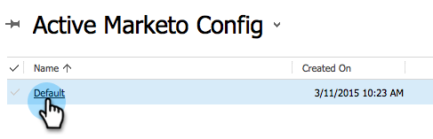

# Dynamics용 Marketo 설정 3단계 중 2단계(2016 On-Prem/Dynamics 365 온-프레미스){#step-of-set-up-for-marketo-on-premises-2016}

이전 단계를 완료하는 데 성공했습니다. 계속 이걸 통과합시다

>[!PREREQUISITES]
>
>[Microsoft Dynamics 2016/Dynamics 365 온-프레미스 3단계용 Marketo 설치](/help/marketo/product-docs/crm-sync/microsoft-dynamics-sync/sync-setup/microsoft-dynamics-2016-dynamics-365-on-premises/step-1-of-3-install.md)

## 동기화 사용자 역할 할당 {#assign-sync-user-role}

Marketo 동기화 사용자 역할만 Marketo 동기화 사용자에게 할당합니다. 다른 사용자에게 할당할 필요가 없습니다.

>[!NOTE]
>
>이는 Marketo 버전 4.0.0.14 이상에 적용됩니다. 이전 버전의 경우 모든 사용자는 동기화 사용자 역할이 있어야 합니다. Marketo을 업그레이드하려면 다음을 참조하십시오 [Microsoft Dynamics용 Marketo 솔루션 업그레이드](/help/marketo/product-docs/crm-sync/microsoft-dynamics-sync/sync-setup/update-the-marketo-solution-for-microsoft-dynamics.md).

>[!IMPORTANT]
>
>동기화 사용자의 언어 설정 [영어로 설정되어야 함](https://portal.dynamics365support.com/knowledgebase/article/KA-01201/en-us).

1. 아래 **설정**&#x200B;를 클릭합니다. **보안**.

   

1. 클릭 **사용자**.

   

1. 여기에 사용자 목록이 표시됩니다. 전용 Marketo 동기화 사용자를 선택하거나 [Active Directory 페더레이션 서비스](https://msdn.microsoft.com/en-us/library/bb897402.aspx)(ADFS) 관리자가 Marketo용 전용 사용자를 만들 수 있습니다.

   

1. 동기화 사용자를 선택합니다. 클릭 **역할 관리**.

   

   Marketo 동기화 사용자를 선택하고 확인을 클릭합니다.

   

   >[!TIP]
   >
   >역할이 표시되지 않으면 로 돌아갑니다 [3단계 중 1단계](/help/marketo/product-docs/crm-sync/microsoft-dynamics-sync/sync-setup/microsoft-dynamics-2016-dynamics-365-on-premises/step-1-of-3-install.md) 솔루션을 가져옵니다.

   >[!NOTE]
   >
   >동기화 사용자가 CRM에서 수행한 모든 업데이트 **not** Marketo에 다시 동기화됩니다.

## Marketo 솔루션 구성 {#configure-marketo-solution}

거의 다 됐어! 다음 문서로 이동하기 전에 몇 가지 구성 만 있습니다.

1. 아래 **설정**&#x200B;를 클릭합니다. **Marketo 구성**.

   

   >[!NOTE]
   >
   >Marketo 구성이 누락된 경우 페이지를 새로 고쳐 보십시오. 문제가 계속되면 [Marketo 솔루션 게시](/help/marketo/product-docs/crm-sync/microsoft-dynamics-sync/sync-setup/microsoft-dynamics-2016-dynamics-365-on-premises/step-1-of-3-install.md) 또는 로그아웃한 후 다시 로그인하십시오.

1. 클릭 **기본값**.

   

1. 을(를) 클릭합니다. **Marketo 사용** 필드를 입력하고 동기화 사용자를 선택합니다.

   

1. 오른쪽 아래 모서리에 있는 저장 아이콘을 클릭합니다.

   

1. 클릭 **모든 사용자 지정 게시**.

   

## 3단계로 진행하기 전 {#before-proceeding-to-step}

* 동기화하는 레코드 수를 제한하려면 [사용자 지정 동기화 필터 설정](/help/marketo/product-docs/crm-sync/microsoft-dynamics-sync/create-a-custom-dynamics-sync-filter.md) 지금
* 를 실행합니다. [Microsoft Dynamics 동기화 유효성 검사](/help/marketo/product-docs/crm-sync/microsoft-dynamics-sync/sync-setup/validate-microsoft-dynamics-sync.md) 프로세스. 초기 설정이 올바르게 수행되었는지 확인합니다.
* Microsoft Dynamics CRM에서 Marketo 동기화 사용자에게 로그인합니다.

>[!MORELIKETHIS]
>
>[Microsoft Dynamics 2016/Dynamics 365 온-프레미스 3단계용 Marketo 설치](/help/marketo/product-docs/crm-sync/microsoft-dynamics-sync/sync-setup/microsoft-dynamics-2016-dynamics-365-on-premises/step-3-of-3-connect.md)
