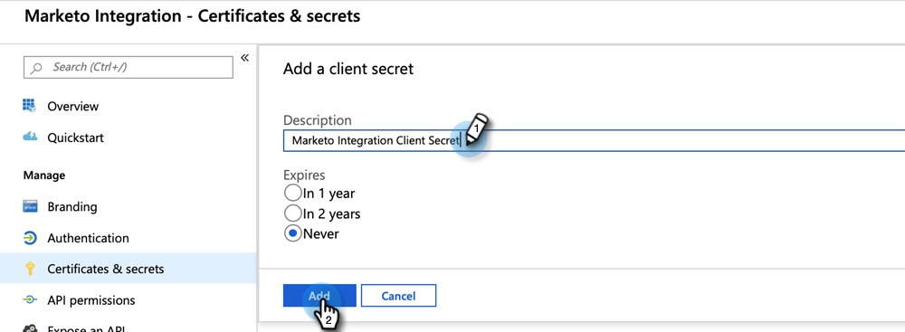
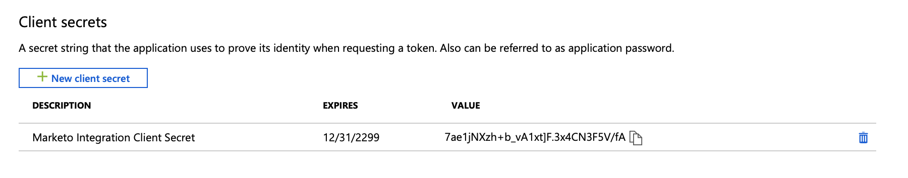

# 3단계/4단계: MS Dynamics에서 클라이언트 앱 설정 {#step-3-of-4-set-up-client-app-ms-dynamics-ropc}

>[!PREREQUISITES]
>
>* [1단계/4단계: 리소스 소유자 암호 제어 연결을 사용하여 Marketo 솔루션 설치](/help/marketo/product-docs/crm-sync/microsoft-dynamics-sync/sync-setup/microsoft-dynamics-365-with-ropc-connection/step-1-of-4-install.md){target="_blank"}
>* [2단계/4단계: 리소스 소유자 암호 제어 연결을 사용하여 Marketo 솔루션 설정](/help/marketo/product-docs/crm-sync/microsoft-dynamics-sync/sync-setup/microsoft-dynamics-365-with-ropc-connection/step-2-of-4-set-up.md){target="_blank"}

1. 다음으로 이동 [Microsoft 문서](https://docs.microsoft.com/en-us/powerapps/developer/common-data-service/walkthrough-register-app-azure-active-directory#create-an-application-registration){target="_blank"}.

1. 모든 단계를 따르십시오. 3단계의 경우 관련 애플리케이션 이름(예: &quot;Marketo 통합&quot;)을 입력합니다. 지원되는 계정 유형에서 이 조직 디렉터리에서만 계정을 선택합니다.

1. 애플리케이션 ID(ClientId)를 기록합니다. 나중에 Marketo에서 입력해야 합니다.

1. 의 단계에 따라 관리자 동의 부여 [이 문서](/help/marketo/product-docs/crm-sync/microsoft-dynamics-sync/sync-setup/grant-consent-for-client-id-and-app-registration.md){target="_blank"}.

1. 다음을 클릭하여 관리 센터에서 클라이언트 암호 생성 **[!UICONTROL 인증서 및 암호]**.

   

1. 클릭 **[!UICONTROL 새 클라이언트 암호]**.

   

1. 클라이언트 암호 설명을 추가하고 **[!UICONTROL 추가]**.

   

   >[!CAUTION]
   >
   >클라이언트 암호 값(아래 스크린샷에 표시됨)은 나중에 필요하므로 기록해 두십시오. 한 번만 표시되며 다시 검색할 수 없습니다.

   

## Azure AD Federated with AD FS On-prem {#azure-ad-federated-with-ad-fs-on-prem}

Federated Azure AD에서 ADFS Onprem으로 전환하려면 특정 응용 프로그램에 대한 홈 영역 검색 정책을 만들어야 합니다. 이 정책을 사용하면 Azure AD는 인증 요청을 페더레이션 서비스로 리디렉션합니다. 이를 위해 AD Connect에서 암호 해시 동기화를 활성화해야 합니다. 자세한 내용은 다음을 참조하십시오. [ROPC가 있는 OAuth](https://docs.microsoft.com/en-us/azure/active-directory/develop/v2-oauth-ropc){target="_blank"} and [Set an hrd policy for an application](https://docs.microsoft.com/en-us/azure/active-directory/manage-apps/configure-authentication-for-federated-users-portal#example-set-an-hrd-policy-for-an-application){target="_blank"}.

추가 참조 [은(는) 여기에서 찾을 수 있음](https://docs.microsoft.com/en-us/azure/active-directory/reports-monitoring/concept-all-sign-ins#:~:text=Interactive%20user%20sign%2Dins%20are,as%20the%20Microsoft%20Authenticator%20app.&amp;text=이%20report%20also%20includes%20federated, are%20federated%20to%20Azure%20AD.){target="_blank"}.

## 4단계로 진행하기 전에 {#before-proceeding-to-step-4}

* 동기화하는 레코드 수를 제한하려면 [사용자 지정 동기화 필터 설정](/help/marketo/product-docs/crm-sync/microsoft-dynamics-sync/create-a-custom-dynamics-sync-filter.md){target="_blank"} 지금.
* 실행 [Microsoft Dynamics 동기화 확인](/help/marketo/product-docs/crm-sync/microsoft-dynamics-sync/sync-setup/validate-microsoft-dynamics-sync.md){target="_blank"} 프로세스. 초기 설정이 올바르게 수행되었는지 확인합니다.
* Microsoft Dynamics CRM에서 Marketo 동기화 사용자에 로그인합니다.

>[!MORELIKETHIS]
>
>* [4단계/4단계: 리소스 소유자 암호 제어 연결과 Marketo 솔루션 연결](/help/marketo/product-docs/crm-sync/microsoft-dynamics-sync/sync-setup/microsoft-dynamics-365-with-ropc-connection/step-4-of-4-connect.md){target="_blank"}
