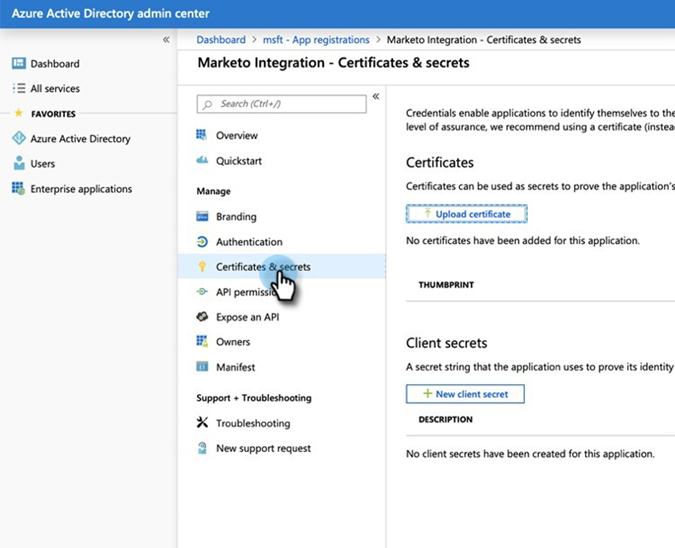
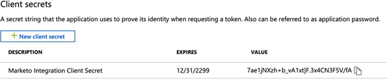

# 2단계/3단계: 서버 간 연결을 통해 Marketo 솔루션 설정 {#step-2-of-3-set-up-marketo-sync-user-in-dynamics-s2s}

>[!PREREQUISITES]
>
>[3단계 중 1단계: 서버 간 연결을 통해 Marketo 솔루션 설치](/help/marketo/product-docs/crm-sync/microsoft-dynamics-sync/sync-setup/microsoft-dynamics-365-with-s2s-connection/step-1-of-3-install.md){target="_blank"}

## [!DNL Azure AD]에서 클라이언트 응용 프로그램 만들기 {#create-client-application-in-azure-ad}

1. [이 Microsoft 문서](https://docs.microsoft.com/en-us/powerapps/developer/common-data-service/walkthrough-register-app-azure-active-directory#create-an-application-registration){target="_blank"}(으)로 이동합니다.

1. 모든 단계를 따르십시오. 3단계의 경우 관련 응용 프로그램 이름(예: &quot;[!DNL Marketo Integration]&quot;)을 입력하십시오. 지원되는 계정 형식에서 **이 조직 디렉터리에서만**&#x200B;계정을 선택합니다.

1. 애플리케이션 ID(ClientId) 및 테넌트 ID를 기록합니다. 나중에 Marketo에서 입력해야 합니다.

1. 이 문서의 [단계](/help/marketo/product-docs/crm-sync/microsoft-dynamics-sync/sync-setup/grant-consent-for-client-id-and-app-registration.md){target="_blank"}에 따라 관리자 동의를 부여합니다.

1. **[!UICONTROL Certificates & secrets]**&#x200B;을(를) 클릭하여 관리 센터에서 클라이언트 암호를 생성합니다.

   

1. **[!UICONTROL New client secret]** 단추를 클릭합니다.

   

1. 클라이언트 암호 설명을 입력하고 **[!UICONTROL Add]**&#x200B;을(를) 클릭합니다.

   

>[!CAUTION]
>
>클라이언트 암호 값(아래 스크린샷에 표시됨)은 나중에 필요하므로 기록해 두십시오. 한 번만 표시되며 다시 검색할 수 없습니다.

## Microsoft에서 애플리케이션 사용자 만들기 {#create-application-user-in-microsoft}

1. [Microsoft에서 응용 프로그램 사용자를 설정](https://docs.microsoft.com/en-us/powerapps/developer/common-data-service/use-single-tenant-server-server-authentication#application-user-creation){target="_blank"}하려면 다음 링크에서 단계를 따르십시오.

   >[!IMPORTANT]
   >
   >* 애플리케이션 사용자에게 권한을 부여하는 동안 &quot;Marketo 동기화 사용자 역할&quot;에 할당해야 합니다.
   >* Power Platform의 [세부 정보 보기 옵션](https://docs.microsoft.com/en-us/power-platform/admin/manage-application-users#view-or-edit-the-details-of-an-application-user)에서 응용 프로그램 사용자의 전자 메일 주소를 확인하세요. 이 전자 메일 주소는 Marketo 내에서 MS [!DNL Dynamics]에 대한 연결을 설정할 때 사용자 이름으로 사용됩니다.

## [!DNL Azure AD]이(가) [!DNL AD FS On-prem]&#x200B;(으)로 연결됨 {#azure-ad-federated-with-ad-fs-on-prem}

[!DNL Azure AD]에서 [!DNL ADFS Onprem]&#x200B;(으)로 페더레이션된 경우 특정 응용 프로그램에 대한 홈 영역 검색 정책을 만들어야 합니다. 이 정책을 사용하면 [!DNL Azure AD]이(가) 인증 요청을 페더레이션 서비스에 리디렉션합니다. 이에 대해 [!DNL AD Connect]에서 암호 해시 동기화를 사용하도록 설정해야 합니다. 자세한 내용은 [[!DNL OAuth] 함께 [!DNL ROPC]](https://docs.microsoft.com/en-us/azure/active-directory/develop/v2-oauth-ropc) 및 [응용 프로그램에 대한 hrd 정책 설정](https://docs.microsoft.com/en-us/azure/active-directory/manage-apps/configure-authentication-for-federated-users-portal#example-set-an-hrd-policy-for-an-application)을 참조하세요.

추가 참조 [이(가) 여기에 있습니다](https://docs.microsoft.com/en-us/azure/active-directory/reports-monitoring/concept-all-sign-ins#:~:text=Interactive%20user%20sign%2Dins%20are,as%20the%20Microsoft%20Authenticator%20app.&text=이%20report%20also%20includes%20federated, are%20federated%20to%20Azure%20AD.){target="_blank"}.

## Marketo 솔루션 구성 {#configure-marketo-solution}

거의 다 됐어! 이제 새로 만든 사용자에 대해 Marketo 솔루션에 알리는 일만 남았습니다.

1. [!UICONTROL Advanced Settings] 섹션으로 돌아가서  옆에 있는 [!UICONTROL Settings] 아이콘을 클릭하고 **[!UICONTROL Marketo Config]**&#x200B;을(를) 선택합니다.

   

   >[!NOTE]
   >
   >설정 메뉴에 &quot;Marketo 구성&quot;이 표시되지 않으면 페이지를 새로 고치십시오. 그래도 작동하지 않으면 [Marketo 솔루션을 다시 게시](/help/marketo/product-docs/crm-sync/microsoft-dynamics-sync/sync-setup/microsoft-dynamics-365-with-s2s-connection/step-1-of-3-install.md){target="_blank"}하거나 로그아웃했다가 다시 로그인하세요.

1. **[!UICONTROL Default]**&#x200B;을(를) 클릭합니다.

   

1. **[!UICONTROL Marketo User]** 필드의 검색 단추를 클릭하고 만든 동기화 사용자를 선택합니다.

   

1. 오른쪽 아래 모서리에 있는  아이콘을 클릭하여 변경 사항을 저장합니다.

   

1. 화면을 닫으려면 오른쪽 상단의 **X**&#x200B;을(를) 클릭합니다.

   

1.  옆에 있는 [!UICONTROL Settings] 아이콘을 클릭하고 **[!UICONTROL Solutions]**&#x200B;을(를) 선택합니다.

   

1. **[!UICONTROL Publish All Customizations]** 단추를 클릭합니다.

   

   >[!NOTE]
   >
   >기본 인증에서 [!DNL OAuth]&#x200B;(으)로 업그레이드하는 경우 [이 문서](/help/marketo/product-docs/crm-sync/microsoft-dynamics-sync/sync-setup/reconfigure-dynamics-authentication-method.md)를 사용하여 인증을 다시 구성할 수 있습니다.

## 3단계로 진행하기 전에 {#before-proceeding-to-step}

* 동기화하는 레코드 수를 제한하려면 [사용자 지정 동기화 필터를 설정](/help/marketo/product-docs/crm-sync/microsoft-dynamics-sync/create-a-custom-dynamics-sync-filter.md)하세요.
* [유효성 검사 [!DNL Microsoft Dynamics] 동기화](/help/marketo/product-docs/crm-sync/microsoft-dynamics-sync/sync-setup/validate-microsoft-dynamics-sync.md) 프로세스를 실행합니다. 초기 설정이 올바르게 수행되었는지 확인합니다.
* [!DNL Microsoft Dynamics] CRM의 Marketo 동기화 사용자에 로그인합니다.

>[!MORELIKETHIS]
>
>* [3단계/3단계: Marketo 솔루션을 서버와 서버 연결](/help/marketo/product-docs/crm-sync/microsoft-dynamics-sync/sync-setup/microsoft-dynamics-365-with-s2s-connection/step-3-of-3-connect.md)
>* [다시 구성 [!DNL Dynamics] 인증 방법](/help/marketo/product-docs/crm-sync/microsoft-dynamics-sync/sync-setup/reconfigure-dynamics-authentication-method.md)
