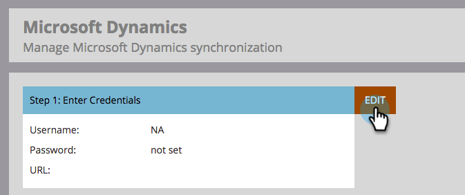

# 3단계/3: Marketo 솔루션을 서버 간 연결에 연결 {#step-3-of-3-connect-microsoft-dynamics-with-marketo-solution-s2s}

동기화의 마지막 단계입니다. 거의 다 왔어!

>[!PREREQUISITES]
>
>* [3단계 중 1단계: 서버 간 연결을 통해 Marketo 솔루션 설치](/help/marketo/product-docs/crm-sync/microsoft-dynamics-sync/sync-setup/microsoft-dynamics-365-with-s2s-connection/step-1-of-3-install.md){target="_blank"}
>* [2단계/3단계: 서버 간 연결을 통해 Marketo 솔루션 설정](/help/marketo/product-docs/crm-sync/microsoft-dynamics-sync/sync-setup/microsoft-dynamics-365-with-s2s-connection/step-2-of-3-set-up.md){target="_blank"}

>[!NOTE]
>
>**관리자 권한 필요**

>[!IMPORTANT]
>
>기본 인증에서 [!DNL OAuth]&#x200B;(으)로 업그레이드하는 경우 [Marketo 지원](https://nation.marketo.com/t5/support/ct-p/Support)에 연락하여 추가 매개 변수를 업데이트해야 합니다. 이 기능을 활성화하면 새 자격 증명을 입력하고 동기화를 다시 활성화할 때까지 동기화가 일시적으로 중지됩니다. 이전 인증 모드로 되돌리려는 경우 기능을 비활성화할 수 있습니다(2022년 4월까지).

>[!NOTE]
>
>새 자격 증명을 입력하기 전에 [여기에서 유효성을 확인](/help/marketo/product-docs/crm-sync/microsoft-dynamics-sync/sync-setup/validate-microsoft-dynamics-sync.md){target="_blank"}할 수 있습니다.

## [!DNL Dynamics] 동기화 사용자 정보 입력 {#enter-dynamics-sync-user-information}

1. Marketo에 로그인하고 **[!UICONTROL Admin]**&#x200B;을(를) 클릭합니다.

   

1. **[!UICONTROL CRM]**&#x200B;을(를) 클릭합니다.

   

1. **[!UICONTROL Microsoft]**&#x200B;를 선택합니다.

   

1. **[!UICONTROL Edit]**&#x200B;에서 **[!UICONTROL Step 1: Enter Credentials]**&#x200B;을(를) 클릭합니다.

   

   >[!CAUTION]
   >
   >제출 후 후속 스키마 변경 사항을 되돌릴 수 없으므로 조직 URL이 올바른지 확인하십시오. 잘못된 조직 URL이 사용되는 경우 새 Marketo 구독을 얻어야 합니다. URL을 모를 경우 [여기에서 찾는 방법을 알아보세요](/help/marketo/product-docs/crm-sync/microsoft-dynamics-sync/sync-setup/view-the-organization-service-url.md){target="_blank"}.

1. [!DNL Dynamics] 동기화 사용자 정보를 입력하고 완료되면 **[!UICONTROL Save]**&#x200B;을(를) 클릭합니다.

   

   >[!NOTE]
   >
   >Marketo의 사용자 이름은 CRM에 있는 응용 프로그램 사용자의 [전자 메일 주소](https://docs.microsoft.com/en-us/power-platform/admin/manage-application-users#view-or-edit-the-details-of-an-application-user){target="_blank"}와 일치해야 합니다. 형식은 `user@domain.com` 또는 DOMAIN\user일 수 있습니다.

## 동기화할 필드 선택 {#select-fields-to-sync}

1. **[!UICONTROL Edit]**&#x200B;에서 **[!UICONTROL Step 2: Select Fields to Sync]**&#x200B;을(를) 클릭합니다.

   

1. Marketo에 동기화할 필드를 선택하면 미리 선택됩니다. **[!UICONTROL Save]**&#x200B;를 클릭합니다.

   

>[!NOTE]
>
>Marketo은 동기화할 필드에 대한 참조를 저장합니다. [!DNL Dynamics]에서 필드를 삭제하는 경우 [동기화가 비활성화됨](/help/marketo/product-docs/crm-sync/salesforce-sync/enable-disable-the-salesforce-sync.md)을(를) 사용하여 삭제하는 것이 좋습니다. 그런 다음 [동기화할 필드 선택](/help/marketo/product-docs/crm-sync/microsoft-dynamics-sync/microsoft-dynamics-sync-details/microsoft-dynamics-sync-field-sync/editing-fields-to-sync-before-deleting-them-in-dynamics.md)을 편집하고 저장하여 Marketo의 스키마를 새로 고치십시오.

## 사용자 정의 필터의 동기화 필드 {#sync-fields-for-a-custom-filter}

사용자 지정 필터를 만든 경우 로 이동하여 Marketo과 동기화할 새 필드를 선택하십시오.

1. [!UICONTROL Admin]&#x200B;(으)로 이동하여 **[!UICONTROL Microsoft Dynamics]**&#x200B;을(를) 선택합니다.

   

1. **[!UICONTROL Edit]**&#x200B;에서 [!UICONTROL Field Sync Details]을(를) 클릭합니다.

   

1. 필드로 스크롤하여 확인합니다. 실제 이름은 new_synctomkto여야 하지만 표시 이름은 무엇이든 될 수 있습니다. **[!UICONTROL Save]**&#x200B;를 클릭합니다.

   

## 동기화 활성화 {#enable-sync}

1. **[!UICONTROL Edit]**&#x200B;에서 **[!UICONTROL Step 3: Enable Sync]**&#x200B;을(를) 클릭합니다.

   

   >[!CAUTION]
   >
   >Marketo은 [!DNL Microsoft Dynamics] 동기화에 대해 또는 사람 또는 잠재 고객을 수동으로 입력하는 경우 자동으로 중복 제거되지 않습니다.

1. 팝업의 모든 내용을 읽고 전자 메일 주소를 입력한 다음 **[!UICONTROL Start Sync]**&#x200B;을(를) 클릭합니다.

   

1. 레코드 수에 따라 초기 동기화는 몇 시간에서 며칠까지 걸릴 수 있습니다. 완료 시 이메일 알림을 받게 됩니다.

   
