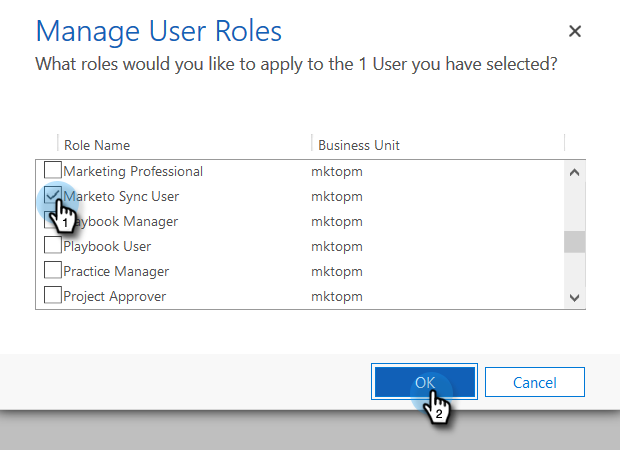

# 3단계 중 2단계:Dynamics {#step-of-set-up-marketo-sync-user-in-dynamics}에서 Marketing to 동기화 사용자 설정

사용자 계정을 만들어 시작합니다.

>[!PREREQUISITES]
>
>[3단계 중 1단계:Marketing To 솔루션(온라인) 설치](step-1-of-3-install.md)

## 새 사용자 {#create-a-new-user} 만들기

1. Dynamics에 로그인합니다. 설정 아이콘을 클릭하고 **고급 설정**&#x200B;을 선택합니다.

   

1. 설정**을 클릭하고 **보안**&#x200B;을 선택합니다.

   

1. **사용자**&#x200B;를 클릭합니다.

   

1. **새로 만들기를 클릭합니다.**

   

1. 새 창에서 **사용자 추가 및 라이센스 사용자**&#x200B;를 클릭합니다.

   

1. 새 탭이 열립니다. 페이지 맨 위에 있는 **관리**&#x200B;를 클릭합니다.

   

1. 다른 새 탭이 열립니다. **사용자**&#x200B;를 클릭합니다.

   

1. 모든 정보를 입력합니다. 완료되면 **추가**&#x200B;를 클릭합니다.

   

   >[!NOTE]
   >
   >이 이름은 기존 CRM 사용자 계정이 아닌 전용 동기화 사용자여야 합니다. 실제 이메일 주소일 필요는 없습니다.

1. 새 사용자 자격 증명을 받을 전자 메일을 입력하고 **전자 메일 보내기를 클릭하고**&#x200B;을(를) 닫습니다.

   

## 동기화 사용자 역할 할당 {#assign-sync-user-role}

Marketing to Sync 사용자 역할을 Marketing Cloud에 할당하여 사용자를 동기화합니다. 다른 사용자에게 할당할 필요는 없습니다.

>[!NOTE]
>
>이것은 Marketing 버전 4.0.0.14 이상에만 적용됩니다. 이전 버전의 경우 모든 사용자는 동기화된 사용자 역할이 있어야 합니다. 마케팅을 업그레이드하려면 [Microsoft Dynamics용 Marketing Solution 업그레이드](../../../../../product-docs/crm-sync/microsoft-dynamics-sync/sync-setup/download-the-marketo-lead-management-solution/upgrade-the-marketo-solution-for-microsoft-dynamics.md)를 참조하십시오.

1. 활성화된 사용자 탭으로 돌아가 사용자 목록을 새로 고칩니다.

   

1. 새로 만든 Marketing To Sync 사용자 옆에 마우스를 두면 확인란이 표시됩니다. 클릭하여 선택합니다.

   

1. **역할 관리**&#x200B;를 클릭합니다.

   

1. **Marketing To Sync 사용자**&#x200B;를 선택하고 **확인**&#x200B;을 클릭합니다.

   

   >[!NOTE]
   >
   >동기화 사용자가 CRM에서 수행한 모든 업데이트는 Marketing To에 다시 동기화되지 **않습니다.**

## 마케팅 솔루션 {#configure-marketo-solution} 구성

거의 다 왔어! 이제 Marketing To Solution에서 새로 만든 사용자에 대해 알리는 일만 남았습니다.

1. 고급 설정 섹션으로 돌아가서 설정 옆에 있는 아이콘을 클릭하고 **마케팅 구성**&#x200B;을 선택합니다.

   

   >[!NOTE]
   >
   >설정 메뉴에 **Marketing Config**&#x200B;가 표시되지 않으면 페이지를 새로 고칩니다. 그래도 해결되지 않으면 [Marketing To Solution](https://docs.marketo.com/pages/viewpage.action?pageId=3571822#publish-customizations) 을(를) 다시 게시하거나 로그아웃했다가 다시 로그인합니다.

1. **기본값**&#x200B;을 클릭합니다.

   

1. **Marketing To User** 필드에서 검색 단추를 클릭하고 만든 동기화 사용자를 선택합니다.

   

1. 오른쪽 하단에 있는 아이콘을 클릭하여 변경 내용을 저장합니다.

   

1. 오른쪽 상단에서 **X**&#x200B;을 클릭하여 화면을 닫습니다.

   

1. 설정 옆에 있는 아이콘을 클릭하고 **솔루션**&#x200B;을 선택합니다.

   

1. **모든 사용자 지정 게시** 단추를 클릭합니다.

   

## 3단계로 진행하기 전 {#before-proceeding-to-step}

    * 동기화하려는 레코드 수를 제한하려면 지금 [사용자 정의 동기화 필터 설정](../../../../../product-docs/crm-sync/microsoft-dynamics-sync/create-a-custom-dynamics-sync-filter.md).
    * [Microsoft Dynamics 동기화 유효성 검사](../../../../../product-docs/crm-sync/microsoft-dynamics-sync/sync-setup/validate-microsoft-dynamics-sync.md) 프로세스를 실행합니다. 초기 설정이 올바르게 수행되었는지 확인합니다.
    * Microsoft Dynamics CRM에서 Marketing to Sync 사용자에 로그인합니다.

>[!NOTE]
>
>**관련 문서**
>
>
>[3단계 중 3단계:Microsoft Dynamics와 Marketing To 연결(온라인)](step-3-of-3-connect.md)
