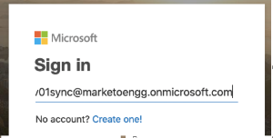

# 클라이언트 ID 및 앱 등록에 대한 동의 부여 {#grant-consent-for-client-id-and-app-registration}

## 동기화 사용자 {#grant-delegated-user-permissions-for-the-sync-user}에 대해 위임된 사용자 권한 부여

1. 깔끔한 텍스트 프로그램(Windows용 메모장, Mac용 텍스트 편집)을 사용하여 아래 텍스트를 붙여 넣고 client_id, redirect_uri 및 상태 값을 대체하여 인증할 수 있는 URI(Uniform Resource Identifier)를 만듭니다.

   ```
   https://login.microsoftonline.com/common/oauth2/authorize?
   client_id='xxxxxx-xxxx-xxxx-xxxx-xxxxxxxx'
   &response_type='code'
   &redirect_uri='https://www.<ourdomain>.com'
   &response_mode='query'
   &state='SOME_UNIQUE_UID'
   client_id value should be the client_id generated in App Registration process
   redirect_uri value should be same as value entered at the time of App registration-> Redirect URIs
   state value can be any ID (e.g.,12345)
   ```

   <table> 
    <colgroup> 
     <col> 
     <col> 
    </colgroup> 
    <tbody> 
     <tr> 
      <td><strong>client_id 값</strong></td> 
      <td>는 앱 등록 프로세스에서 생성된 client_id여야 합니다.</td> 
     </tr> 
     <tr> 
      <td><strong>redirect_uri 값</strong></td> 
      <td>는 앱 등록 &gt; 리디렉션 URI에 입력된 값과 같아야 합니다.</td> 
     </tr> 
     <tr> 
      <td><strong>상태 값</strong></td> 
      <td>모든 ID일 수 있습니다(예: 12345).</td> 
     </tr> 
    </tbody> 
   </table>

   최종 URL은 다음과 같아야 합니다.`https://login.microsoftonline.com/common/oauth2/authorize?client_id=xxxxxx-xxxx-xxxx-xxxx-xxxxxxxx&response_type=code&redirect_uri=https://www.marketo.com&response_mode=query&state=12345`

1. 브라우저에서 만든 URI를 엽니다.

   

1. 권한을 부여하려는 사용자 동기화(Sync User)로 로그인합니다.

   

   >[!NOTE]
   >
   >다른 탭에서 관리자로 Azure에 로그인한 경우 다른 브라우저 또는 Uncognito 모드를 사용하여 동기화 사용자로 로그인해야 합니다.

1. **수락**&#x200B;을 클릭합니다.

   

## 모든 사용자에 대한 동의 허용 {#grant-consent-for-all-users}

관리자는 테넌트에 있는 모든 사용자를 대신하여 애플리케이션의 위임된 권한에 동의할 수도 있습니다. 관리 동의는 테넌트의 모든 사용자에 대해 동의 대화 상자가 표시되지 않도록 하며 관리자 역할을 가진 사용자가 Azure 포털에서 수행할 수 있습니다. [여기에서 위임된 권한에 동의할 수 있는 관리자 역할을 알아봅니다](https://docs.microsoft.com/en-us/azure/active-directory/roles/permissions-reference).

1. Azure 포털에서 응용 프로그램 홈페이지로 이동합니다.

1. 관리에서 **API 권한**&#x200B;을 클릭합니다.

   

1. **관리자 동의 허용**(임차인) 단추를 클릭합니다.

   

1. **예**&#x200B;를 클릭하여 확인합니다.

   

>[!MORELIKETHIS]
>
>[On-Prem용 Microsoft Dynamics CRM 앱 설정](/help/marketo/product-docs/crm-sync/microsoft-dynamics-sync/sync-setup/set-up-oauth-authentication-for-dynamics/set-up-microsoft-dynamics-crm-app-for-on-prem.md)
