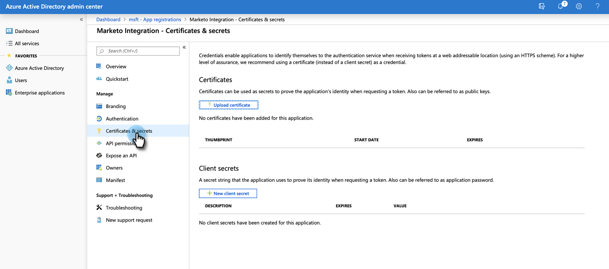

# 온라인 {#set-up-microsoft-dynamics-crm-app-for-online}용 Microsoft Dynamics CRM 앱 설정

## {#set-up} 설정

1. https://docs.microsoft.com/en-us/powerapps/developer/common-data-service/walkthrough-register-app-azure-active-directory#create-an-application-registration으로 이동합니다.

1. 모든 단계를 수행합니다. 3단계의 경우 관련 애플리케이션 이름(예: &quot;Marketo 통합&quot;)을 입력합니다. 지원되는 계정 유형에서 이 조직 디렉터리에서만 계정을 선택합니다.

1. 응용 프로그램 ID(ClientId)를 기록합니다. 나중에 Marketo에 입력해야 합니다.

1. [이 문서](/help/marketo/product-docs/crm-sync/microsoft-dynamics-sync/sync-setup/set-up-oauth-authentication-for-dynamics/grant-consent-for-client-id-and-app-registration.md)의 단계에 따라 관리자 동의를 부여합니다.

1. **Certificates &amp; secrets**&#x200B;를 클릭하여 관리 센터에서 클라이언트 암호를 생성합니다.

   

1. **새 클라이언트 암호**&#x200B;를 클릭합니다.

   

1. 클라이언트 암호 설명을 추가하고 **추가**&#x200B;를 클릭합니다.

   

   >[!CAUTION]
   >
   >나중에 필요하므로 클라이언트 암호 값(아래 스크린샷에 표시됨)을 반드시 기록하십시오. 한 번만 표시되므로 다시 검색할 수 없습니다.

   

Marketo은 grant_type Resource Owner Password Credentials( ROPC)를 사용하여 OAuth를 사용하여 Azure AD에 대해 인증합니다. 이 시나리오에서는 특정 응용 프로그램에 대해 홈 영역 검색 정책을 만들어야 합니다. 이 정책을 사용하면 Azure AD에서 인증 요청을 페더레이션 서비스로 리디렉션합니다. 이를 위해서는 AD Connect에서 암호 해시 동기화를 활성화해야 합니다. 자세한 내용은 [ROPC](https://docs.microsoft.com/en-us/azure/active-directory/develop/v2-oauth-ropc)와 [응용 프로그램에 대한 세 번째 정책 설정](https://docs.microsoft.com/en-us/azure/active-directory/manage-apps/configure-authentication-for-federated-users-portal#example-set-an-hrd-policy-for-an-application)을 참조하십시오.

추가 참조 [은 여기](https://docs.microsoft.com/en-us/azure/active-directory/reports-monitoring/concept-all-sign-ins#:~:text=Interactive%20user%20sign%2Dins%20are,as%20the%20Microsoft%20Authenticator%20app.&amp;text=이%20report%20also%20includes%20federated,are%20federated%20to%20Azure%20AD.)에 있습니다.

작업이 끝나면 **Marketo에 Dynamics CRM 생성 클라이언트 Id 및 암호를 입력합니다**.

## Dynamics CRM에서 생성된 클라이언트 Id 및 암호를 Marketo {#enter-the-dynamics-crm-generated-client-id-and-secret-into-marketo}에 입력합니다.

다음 단계는 Online _및_ On-prem 버전에 적용할 수 있습니다.

1. Marketo에서 **관리**&#x200B;를 클릭합니다.

   

1. **Microsoft Dynamics**&#x200B;를 클릭합니다.

   

1. **동기화 비활성화**&#x200B;를 클릭합니다.

   

1. 자격 증명 옆의 **편집**&#x200B;을 클릭합니다.

   

1. 이전에 검색한 **클라이언트 Id** 및 **클라이언트 암호**&#x200B;를 입력하고 **저장**&#x200B;을 누릅니다.

   

1. **동기화 설정의 유효성 검사**&#x200B;를 클릭합니다.

   

1. **다음**&#x200B;을 클릭합니다.

   

1. 모든 녹색 확인 표시가 표시됩니다. **닫기**&#x200B;를 클릭합니다.

   

   >[!NOTE]
   >
   >녹색 확인 표시 중 빨간색 X가 표시되는 경우 수정 옵션에 대해서는 [이 문서](/help/marketo/product-docs/crm-sync/microsoft-dynamics-sync/sync-setup/validate-microsoft-dynamics-sync/fix-dynamics-validation-sync-issues.md)를 참조하십시오.

1. **동기화 사용**&#x200B;을 클릭합니다.

   

그게 다야!
