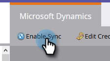

# AD FS On-prem, 테넌트 및 Microsoft Online {#set-up-msd-for-azure-ad-federated-with-ad-fs-on-prem-tenant-and-microsoft-online}을(를) 사용하여 Azure AD Federated에 대한 MSD를 설정합니다.

## Microsoft Dynamics CRM 앱 {#set-up-microsoft-dynamics-crm-app} 설정

1. https://docs.microsoft.com/en-us/powerapps/developer/common-data-service/walkthrough-register-app-azure-active-directory#create-an-application-registration으로 이동합니다.

1. 모든 단계를 따릅니다. 3단계에서 관련 응용 프로그램 이름을 입력합니다(예: &quot;Marketing To Integration&quot;). 지원되는 계정 유형 아래에서 이 조직 디렉토리에서만 계정을 선택합니다.

1. 응용 프로그램 ID(ClientId)를 기록합니다. 나중에 Marketing To에 입력해야 합니다.

1. [이 아티클](/help/marketo/product-docs/crm-sync/microsoft-dynamics-sync/sync-setup/set-up-oauth-authentication-for-dynamics/grant-consent-for-client-id-and-app-registration.md)의 단계에 따라 관리자 동의를 부여합니다.

1. 관리 센터에서 **인증서 및 비밀**&#x200B;을 클릭하여 클라이언트 암호를 생성합니다.

   

1. **새 클라이언트 암호**&#x200B;를 클릭합니다.

   

1. 클라이언트 암호 설명을 추가하고 **추가**&#x200B;를 클릭합니다.

   

   >[!CAUTION]
   >
   >나중에 필요에 따라 클라이언트 암호 값(아래 스크린샷에 표시됨)을 메모해야 합니다. 한 번만 표시되므로 다시 검색할 수 없습니다.

   

ROPC(grant_type Resource Owner Password Credentials)를 사용하여 OAuth를 사용하여 Azure AD를 인증합니다. 이 시나리오에서는 특정 응용 프로그램에 대해 홈 영역 검색 정책을 만들어야 합니다. 이 정책을 사용하면 Azure AD에서 인증 요청을 페더레이션 서비스로 리디렉션합니다. 이를 위해서는 AD Connect에서 암호 해시 동기화를 활성화해야 합니다. 자세한 내용은 ROPC](https://docs.microsoft.com/en-us/azure/active-directory/develop/v2-oauth-ropc)이 있는 [OAuth 및 [응용 프로그램](https://docs.microsoft.com/en-us/azure/active-directory/manage-apps/configure-authentication-for-federated-users-portal#example-set-an-hrd-policy-for-an-application)에 대한 세 번째 정책 설정을 참조하십시오.

추가 참조 [은(는) ](https://docs.microsoft.com/en-us/azure/active-directory/reports-monitoring/concept-all-sign-ins#:~:text=Interactive%20user%20sign%2Dins%20are,as%20the%20Microsoft%20Authenticator%20app.&amp;text=This%20report%20also%20includes%20federated,are%20federated%20to%20Azure%20AD.)에서 찾을 수 있습니다.

완료되면 **Marketing**&#x200B;에 Dynamics CRM 생성 클라이언트 Id 및 암호를 입력하십시오.

## Dynamics CRM에서 생성된 클라이언트 Id와 암호를 Marketing에 {#enter-the-dynamics-crm-generated-client-id-and-secret-into-marketo} 입력

1. Marketing에서 **관리**&#x200B;를 클릭합니다.

   

1. **Microsoft Dynamics**&#x200B;을 클릭합니다.

   

1. **동기화 비활성화**&#x200B;를 클릭합니다.

   

1. 자격 증명 옆에서 **편집**&#x200B;을 클릭합니다.

   

1. 이전에 검색한 **클라이언트 ID** 및 **클라이언트 암호**&#x200B;를 입력하고 **저장**&#x200B;을 누릅니다.

   

1. **동기화 설정 유효성 검사**&#x200B;를 클릭합니다.

   

1. **다음**&#x200B;을 클릭합니다.

   

1. 녹색 체크 표시가 모두 표시되어야 합니다. **닫기**&#x200B;를 클릭합니다.

   

   >[!NOTE]
   >
   >녹색 확인 표시 중 빨간색 X가 표시되면 수정 옵션을 보려면 [이 문서](/help/marketo/product-docs/crm-sync/microsoft-dynamics-sync/sync-setup/validate-microsoft-dynamics-sync/fix-dynamics-validation-sync-issues.md)을 참조하십시오.

1. **동기화 활성화**&#x200B;를 클릭합니다.

   

바로 그거야!
