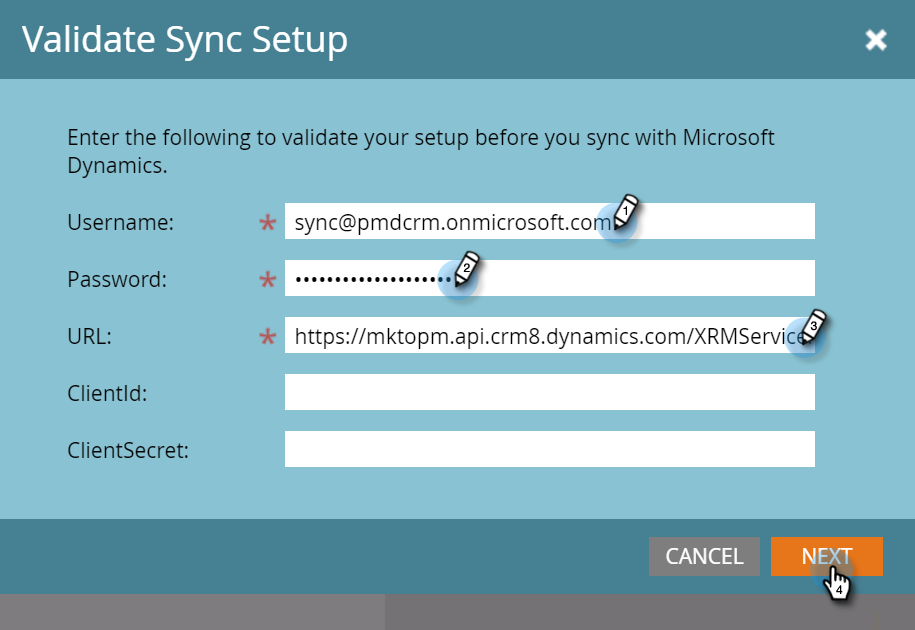

# Microsoft Dynamics 동기화 확인 {#validate-microsoft-dynamics-sync}

>[!CAUTION]
>
>Dynamics Sync에 대해 MFA(Multi-Factor Authentication)가 활성화되어 있으면 Dynamics가 Marketo과 올바르게 동기화하려면 비활성화해야 합니다. 추가 정보는 다음으로 문의하십시오. [Marketo 지원](https://nation.marketo.com/t5/Support/ct-p/Support){target="_blank"}.

## Marketo에서 동기화 유효성 검사 실행 {#run-validate-sync-in-marketo}

동기화 유효성 검사 도구를 실행하여 Marketo과 Microsoft Dynamics Sync가 올바르게 설정되었는지 확인한 후 서로 최종 연결하는 것이 매우 중요합니다. 이 프로세스는 문제가 있는 위치를 정확히 찾아내는 7가지 설정 단계의 체크리스트를 생성합니다. 이러한 작업이 올바르게 수행되었는지 확인하는 것은 나중에 많은 시간을 절약할 수 있습니다.

1. 다음을 클릭합니다. **[!UICONTROL 관리자]** 탭을 클릭한 다음 **[!DNL Microsoft Dynamics]** 통합 영역에 있는 링크입니다.

   

1. 선택 **[!DNL Microsoft]**.

   

1. 다음을 클릭합니다. **[!UICONTROL 동기화 설정 확인]** 탭.

   

1. 사용자 이름, 암호 및 URL을 입력합니다(클라이언트 ID 및 클라이언트 암호는 선택 사항). 클릭 **[!UICONTROL 다음]** 완료 시.

   

   >[!NOTE]
   >
   >이전에 동기화한 적이 있는 경우 **[!UICONTROL CRM]** 왼쪽 트리에서 다음을 읽습니다. **[!DNL Microsoft Dynamics]**&#x200B;을 클릭하고, 위의 형식의 데이터를 미리 채울 수 있습니다.

1. 모든 것이 정상인 경우 동기화 유효성 검사 는 녹색 확인 표시로 가득 찬 체크리스트를 생성합니다 .

   

1. 다음 항목이 표시되면 , 그런 다음 해당 단계에 문제가 있습니다. 다음을 참조하십시오 [Dynamics 유효성 검사 동기화 문제 해결](/help/marketo/product-docs/crm-sync/microsoft-dynamics-sync/sync-setup/validate-microsoft-dynamics-sync/fix-dynamics-validation-sync-issues.md){target="_blank"} 을 클릭하여 문제를 식별하고 해결합니다. 그런 다음 결과가 위의 이미지와 같이 나타날 때까지 동기화 유효성 검사 단계를 다시 실행하십시오.

   >[!CAUTION]
   >
   >현재 Marketo Dynamics Sync에 대한 샌드박스 새로 고침을 지원하지 않습니다. Dynamics CRM 샌드박스를 새로 고쳐야 하는 경우 새 Marketo 샌드박스가 필요합니다. 자세한 내용은 Adobe 계정 팀(계정 관리자)에 문의하십시오.

>[!MORELIKETHIS]
>
>[Dynamics 유효성 검사 동기화 문제 해결](/help/marketo/product-docs/crm-sync/microsoft-dynamics-sync/sync-setup/validate-microsoft-dynamics-sync/fix-dynamics-validation-sync-issues.md){target="_blank"}
