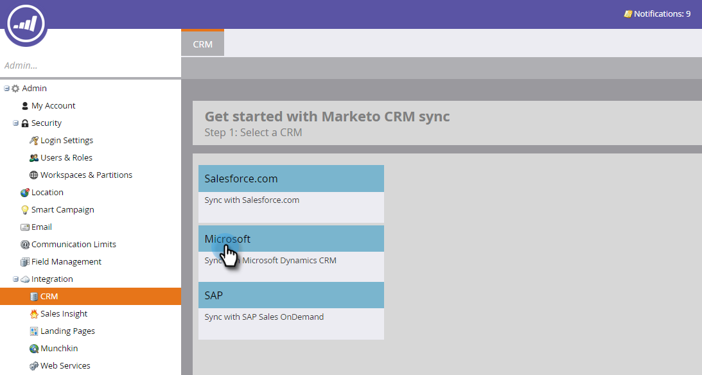

# Microsoft Dynamics 동기화 유효성 검사 {#validate-microsoft-dynamics-sync}

>[!CAUTION]
>
>Dynamics Sync에 대해 MFA(Multi-Factor Authentication)가 활성화된 경우 Dynamics에서 Marketo과 제대로 동기화하려면 MFA 인증을 비활성화해야 합니다. 자세한 내용은 [Marketo 지원](https://nation.marketo.com/t5/Support/ct-p/Support)으로 문의하십시오.

## Marketo {#run-validate-sync-in-marketo}에서 유효성 검사 동기화 실행

동기화 유효성 검사 도구를 실행하여 Marketo과 Microsoft Dynamics Sync가 올바르게 설정되었는지 확인한 후 동기화 간에 최종 연결이 필요합니다. 이 프로세스는 문제가 있는 위치를 정확히 파악하는 7가지 설정 단계의 검사 목록을 생성합니다. 이러한 작업이 제대로 수행되었는지 확인하는 것은 나중에 많은 시간을 절약할 수 있습니다.

1. **관리** 탭을 클릭한 다음 통합 영역에서 **Microsoft Dynamics** 링크를 클릭합니다.

   

1. **Microsoft**&#x200B;를 선택합니다.

   

1. **동기화 설정 유효성 검사** 탭을 클릭합니다.

   

1. 사용자 이름, 암호 및 URL을 입력합니다(클라이언트 ID와 클라이언트 암호는 선택 사항). 완료되면 **다음**&#x200B;을 클릭합니다.

   

   >[!NOTE]
   >
   >이전에 동기화한 경우 왼쪽 트리의 **CRM**&#x200B;에서 **Microsoft Dynamics**&#x200B;을 읽게 되고 위 양식의 데이터가 미리 채워질 수 있습니다.

1. 모든 것이 정상인 경우 동기화 유효성 검사에서는 녹색 확인 표시 가 포함된 검사 목록을 생성합니다.

   

1. 이 표시되면 해당 단계에 문제가 있는 것입니다. 문제를 식별하고 수정하려면 [Fix Dynamics 유효성 검사 동기화 문제](/help/marketo/product-docs/crm-sync/microsoft-dynamics-sync/sync-setup/validate-microsoft-dynamics-sync/fix-dynamics-validation-sync-issues.md)를 참조하십시오. 그런 다음 위의 이미지와 같은 결과가 나타날 때까지 동기화 유효성 검사 단계를 다시 실행합니다.

   >[!CAUTION]
   >
   >현재 Marketo Dynamics Sync에 대한 샌드박스 새로 고침을 지원하지 않습니다. Dynamics CRM 샌드박스를 새로 고쳐야 하는 경우 새 Marketo 샌드박스가 필요합니다. 자세한 내용은 고객 성공 관리자에게 문의하십시오.

>[!MORELIKETHIS]
>
>[Dynamics 유효성 검사 동기화 문제 수정](/help/marketo/product-docs/crm-sync/microsoft-dynamics-sync/sync-setup/validate-microsoft-dynamics-sync/fix-dynamics-validation-sync-issues.md)
