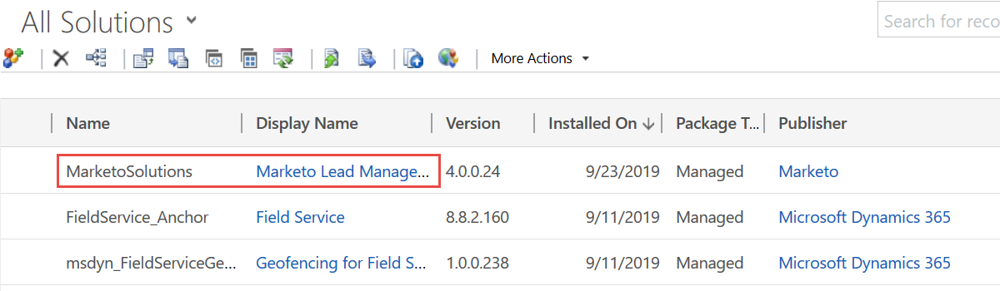
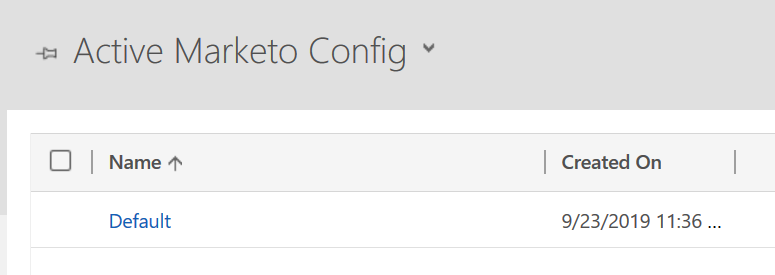

# Dynamics 유효성 검사 동기화 문제 수정 {#fix-dynamics-validation-sync-issues}

## 동기화 도구 결과 유효성 확인 {#validate-sync-tool-results}

Dynamics 유효성 검사 동기화를 실행하면 이 보고서가 생성됩니다. 단계 옆에  기능이 있는 경우 아래 내용을 참조하여 문제를 확인하십시오. 그런 다음 검사 결과가 확인 표시 외에는 아무 것도 표시되지 않을 때까지 동기화 유효성 검사 단계를 다시 실행합니다.

## 유효한 URL {#url-is-valid}

여기에서  한 경우 URL이 올바른지 확인하십시오. 개발자 리소스에서 이 정보를 확인하고 조직 서비스를 살펴보십시오. 여러 가지 이유로 URL이 유효하지 않을 수 있습니다.

1. Dynamics에 로그인합니다. 설정 아이콘을 클릭하고 **고급 설정을 선택합니다**.

   

1. 설정을 클릭하고 사용자 지정을 **선택합니다**.

   

1. 개발자 리소스 **를 클릭합니다**.

   

1. 서비스 끝점에서 조직 서비스 URL을 찾을 수 있습니다.

   

## 사용자 이름 및 암호가 잘못되었습니다. {#username-and-password-are-valid}

Microsoft Dynamics  및 암호가 올바른지 확인하십시오.

## 동기화 사용자가 Marketing to Sync 사용자 역할에 할당되었습니다. {#sync-user-is-assigned-to-the-marketo-sync-user-role}

Microsoft Dynamics  합니다. Microsoft Dynamics 설치 설명서의 2단계를 참조하십시오.

1. Dynamics에서 설정 아이콘을 클릭하고 **고급 설정을 선택합니다**.

   

1. 설정 **을** 클릭하고 **보안을 선택합니다**.

   

1. 사용자를 **클릭합니다.**

   

1. 동기화 사용자의 링크를 클릭합니다.

   

1. 역할 **관리를 클릭합니다**.

   

1. Marketing To Sync 사용자 역할이 선택되어 있는지 확인합니다. 그렇지 않은 경우 확인하고 **확인을 클릭합니다.**

   

## Marketing Solution이 제대로 설치됨 {#marketo-solution-is-properly-installed}

Microsoft Dynamics로  설치가 있는지 확인합니다. Microsoft Dynamics 설정 설명서의 1단계를 참조하십시오.

1. Dynamics에서 설정 아이콘을 클릭하고 **고급 설정을 선택합니다**.

   

1. **설정 **을 클릭하고 **솔루션을 선택합니다.**

   

1. 솔루션이 나열되었는지 확인합니다.

   

## 솔루션의 모든 단계가 활성화됨 {#all-steps-in-the-solution-are-enabled}

여기에  기본 단계가 비활성화되지 않았는지 확인합니다. 모든 단계는 설치 시 자동으로 활성화되지만 사용자 정의 시 비활성화할 수 있습니다.

## 동기화 사용자가 Marketing To 솔루션에 할당되었습니다. {#sync-user-is-assigned-to-the-marketo-solution}

이  동기화 사용자가 Microsoft Dynamics의 Marketing to 기본 페이지에 할당되었는지 확인하십시오.

1. Dynamics에서 설정 아이콘을 클릭하고 **고급 설정을 선택합니다**.

   

1. **설정 **을 클릭하고 마케팅 **구성을 선택합니다**.

   

1. 동기화 사용자가 기본값으로 지정되었는지 확인합니다.

   

## 사용자 이름 및 암호와 일치하는 사용자 동기화 {#sync-user-matches-username-and-password}

Microsoft Dynamics  .

>[!NOTE]
>
>**관련 문서**
>
>[Microsoft Dynamics 동기화 유효성 검사](../../../../../product-docs/crm-sync/microsoft-dynamics-sync/sync-setup/validate-microsoft-dynamics-sync.md)

