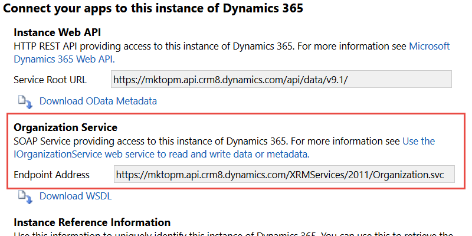

# 조직 서비스 URL {#view-the-organization-service-url} 보기

Dynamics 온-프레미스 인스턴스와 동기화하려면 조직 서비스 URL이 필요합니다. Dynamics에서 찾을 수 있습니다.

1. Dynamics에 로그인합니다. 설정 아이콘을 클릭하고 **고급 설정**&#x200B;을 선택합니다.

   

1. **설정**&#x200B;을 클릭하고 **사용자 지정**&#x200B;을 선택합니다.

   

1. **개발자 리소스**&#x200B;를 클릭합니다.

   

1. 조직 서비스 URL은 **서비스 끝점**&#x200B;에서 찾을 수 있습니다.

   

1. 이 URL을 복사하여 Marketing To에 붙여넣을 수 있고 나머지 동기화 작업을 경험할 수 있습니다.
