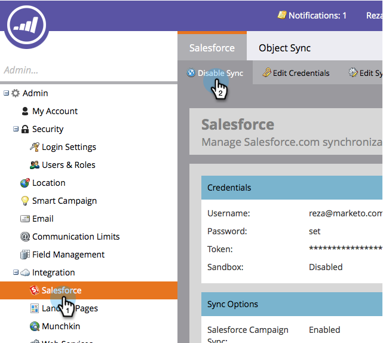

# Salesforce 동기화 활성화/비활성화 {#enable-disable-the-salesforce-sync}

동기화 또는 필드 설정을 변경할 때 구성하는 동안 동기화를 비활성화해야 합니다. 방법은 다음과 같습니다.

1. **관리** 섹션으로 이동합니다.

   ** 

   **

1. **Salesforce**&#x200B;에서 **동기화 비활성화**&#x200B;를 클릭합니다.

   

1. 이제 2방향 동기화가 비활성화되고 다시 활성화할 때까지 비활성화됩니다. Salesforce 흐름 작업이 계속 작동합니다.

   

1. 변경 작업을 수행하고 동기화를 다시 활성화합니다. 같은 버튼입니다.

