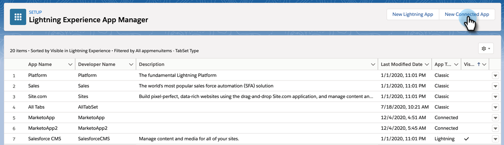
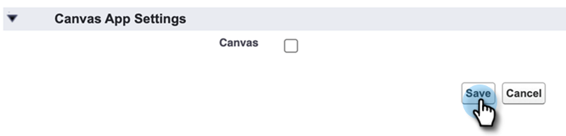

# OAuth 2.0을 사용하여 로그인 {#log-in-using-oauth-2-0}

Salesforce은 OAuth 프로토콜을 사용하여 애플리케이션 사용자가 로그인 자격 증명을 확인하지 않고도 데이터에 안전하게 액세스(OAuth 2.0을 사용하여 애플리케이션 인증)할 수 있도록 합니다. 다음은 Marketo Engage과 Salesforce을 안전하게 연결하고 동기화하기 위해 수행해야 하는 단계입니다.

>[!IMPORTANT]
>
>OAuth를 사용하여 Marketo 및 [!DNL Salesforce]에 연결하려면 개인(시크릿) 브라우저를 통해 Marketo에 로그인하여 잘못된 사용자 이름으로 [!DNL Salesforce]에 연결하지 않도록 하십시오.

## 연결된 앱 설정 {#set-up-connected-app}

1. Salesforce의 설정 아래에 있는 플랫폼 도구 내에서 앱, App Manager로 이동한 다음 **[!UICONTROL New Connected App]**&#x200B;을(를) 클릭합니다.

   

1. 자세한 내용을 입력하고 **[!UICONTROL Save]**&#x200B;을(를) 클릭합니다.

   

1. **[!UICONTROL Enable OAuth Settings]** 확인란을 클릭합니다. Callback URL에 `https://app.marketo.com/salesforce/getSfdcOAuthTokensRedirect`을(를) 입력합니다. 사용 가능한 모든 OAuth 범위를 선택하고 **[!UICONTROL Add]**&#x200B;을(를) 클릭합니다.

   

1. **[!UICONTROL Save]**&#x200B;를 클릭합니다.

   

1. **[!UICONTROL Continue]**&#x200B;를 클릭합니다.

   

1. 소비자 키 및 소비자 암호를 복사합니다. 소비자 키는 나중에 Marketo Engage에서 사용하기 위해 필요합니다.

   

>[!CAUTION]
>
>새 연결된 앱 페이지에서 아래로 스크롤하여 &quot;PKCE(Proof Key for Code Exchange) 필요&quot; 확인란이 설정을 방해하므로 _NOT_ 선택되었는지 확인하십시오.

## Marketo 설정 {#set-up-marketo}

>[!PREREQUISITES]
>
>* Salesforce 동기화 사용자에 대해 API 액세스를 활성화해야 합니다(Salesforce Professional Edition 사용자의 경우 기본적으로 해당 액세스를 사용할 수 없습니다. Salesforce 계정 담당자에게 문의하십시오.).
>* Marketo 동기화 사용자는 Salesforce에서 만들어야 합니다.
>* 기존 고객의 경우 해당 고객의 구독에서 &quot;SFDC 동기화를 위해 OAuth 활성화&quot; 기능이 활성화됩니다.
>* 팝업 차단기가 비활성화되었습니다.
>* 연결된 앱이 만들어졌으며 [!UICONTROL Consumer Key] 및 [!UICONTROL Consumer Secret]을(를) 사용할 수 있습니다.

>[!CAUTION]
>
>**[!UICONTROL Sync Fields]**&#x200B;을(를) 클릭하기 전에 동기화 사용자로부터 Marketo에 필요하지 않은 모든 필드를 숨기십시오. 필드 동기화 를 클릭하면 SFDC에서 볼 수 있는 모든 필드가 Marketo에서 영구적으로 생성되며 삭제할 수 없습니다.

1. Marketo 관리 섹션에서 **[!UICONTROL CRM]**&#x200B;을(를) 클릭한 다음 **[!UICONTROL Sync with Salesforce]**&#x200B;을(를) 클릭합니다.

   

1. 이전에 기록한 소비자 키 및 소비자 암호 정보를 추가하고 및 **[!UICONTROL Save]**&#x200B;을(를) 클릭합니다.

   

1. Marketo Salesforce 동기화 페이지에서 **[!UICONTROL Login with Salesforce]** 단추를 클릭합니다.

   

   >[!CAUTION]
   >
   >사용자 이름/암호/토큰 필드에 &quot;Salesforce으로 로그인&quot; 단추가 표시되지 않는 경우 Marketo 구독이 기본 인증을 사용할 수 있습니다. [기본 인증을 사용하여 Marketo 설정](/help/marketo/product-docs/crm-sync/salesforce-sync/setup/enterprise-unlimited-edition/step-3-of-3-connect-marketo-and-salesforce-enterprise-unlimited.md){target="_blank"}을 참조하세요. 자격 증명 집합을 사용하여 동기화가 시작되면 Salesforce 자격 증명 또는 구독을 전환할 수 없습니다. Salesforce 인증에 Oauth 2.0을 설정하려면 [Marketo 지원 센터](https://nation.marketo.com/t5/support/ct-p/Support)에 문의하십시오.

1. Salesforce 로그인 페이지가 표시되는 팝업이 나타납니다. &quot;Marketo 동기화 사용자&quot; 자격 증명에 키를 누른 다음 로그인합니다.

   

1. 전자 메일로 받은 인증 코드(Salesforce에서 전송)를 입력하고 **[!UICONTROL Verify]**&#x200B;을(를) 클릭합니다.

   

1. 확인이 성공하면 액세스 페이지에 액세스 요청이 표시됩니다. **[!UICONTROL Allow]**&#x200B;를 클릭합니다.

   

1. 몇 분 후에 Marketo에 팝업이 나타납니다. **[!UICONTROL Confirm Credentials]**&#x200B;를 클릭합니다.

   

1. 필드 동기화가 완료되면 **[!UICONTROL Start Salesforce Sync]**&#x200B;을(를) 클릭합니다.

   

1. **[!UICONTROL Start Sync]**&#x200B;를 클릭합니다.

   

Marketo과 [!DNL Salesforce] 간의 동기화가 진행 중입니다.

>[!MORELIKETHIS]
>
>* [3단계 중 1단계: Salesforce(Enterprise/Unlimited)에 Marketo 필드 추가](/help/marketo/product-docs/crm-sync/salesforce-sync/setup/enterprise-unlimited-edition/step-1-of-3-add-marketo-fields-to-salesforce-enterprise-unlimited.md){target="_blank"}
>* [3단계 중 2단계: Marketo(Enterprise/Unlimited)용 Salesforce 사용자 만들기](/help/marketo/product-docs/crm-sync/salesforce-sync/setup/enterprise-unlimited-edition/step-2-of-3-create-a-salesforce-user-for-marketo-enterprise-unlimited.md){target="_blank"}
>* [Salesforce AppExchange에 Marketo Sales Insight 패키지 설치](/help/marketo/product-docs/marketo-sales-insight/msi-for-salesforce/installation/install-marketo-sales-insight-package-in-salesforce-appexchange.md){target="_blank"}
>* [Salesforce Enterprise/Unlimited에서 Marketo Sales Insight 구성](/help/marketo/product-docs/marketo-sales-insight/msi-for-salesforce/configuration/configure-marketo-sales-insight-in-salesforce-enterprise-unlimited.md){target="_blank"}
