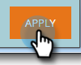

# Salesforce 동기화 상태 {#salesforce-sync-status}

동기화 상태 대시보드를 사용하여 동기화 단계 및 성공 상태의 일부로 동기화 상태를 봅니다.

동기화 단계는 객체 스키마 및 데이터 자체에 대한 각 객체 유형별로 푸시 또는 풀 작업을 반영합니다. 통계 기록에는 동기화 중 새 레코드, 업데이트, 삭제 및 실패한 카운트가 포함됩니다. 날짜, 작업 유형 또는 개체 유형별로 필터링할 수 있습니다. 동기화 상태 대시보드는 지난 5일 동안의 동기화 주기 상태를 표시합니다.

>[!NOTE]
>
>관리자 권한 필요

## 동기화 상태 보기 {#view-sync-status}

1. **관리**&#x200B;를 클릭합니다.

   

1. 통합에서 Salesforce를 클릭한 다음 동기화 상태 탭을 클릭합니다.

   

기본적으로 상태는 가장 최근에 시작된 기준으로 정렬됩니다. 정렬 아이콘을 클릭하여 가장 최근 항목부터 가장 오래된 순으로 시작 위치 또는 종료 지점별로 정렬할 수 있습니다.

## 필터 동기화 상태 {#filter-sync-status}

1. 데이터를 필터링하려면 페이지의 맨 오른쪽에 있는 필터 아이콘을 클릭합니다.

   

1. 날짜 및 시간 범위를 선택한 다음 드롭다운을 클릭하여 객체 유형, 작업 유형 및/또는 상태 유형별로 필터링합니다.

   

1. **적용**&#x200B;을 클릭합니다.

   

**선택적 단계**:동기화 오류를 내보내려면 내보내기를  **클릭합니다**. 데이터는 CSV로 내보내집니다.

## 동기화 상태 필드 {#sync-status-fields}

<table> 
 <colgroup> 
  <col> 
  <col> 
  <col> 
 </colgroup> 
 <tbody> 
  <tr> 
   <th>필드</th> 
   <th>설명</th> 
   <th>열거형 값</th> 
  </tr> 
  <tr> 
   <td colspan="1">시작 위치</td> 
   <td colspan="1">동기화 주기 시작 날짜/시간(사용자의 시간대)</td> 
   <td colspan="1"></td> 
  </tr>  
  <tr> 
   <td colspan="1">종료 위치</td> 
   <td colspan="1">동기화 주기 종료 날짜/시간(사용자의 시간대)</td> 
   <td colspan="1"></td> 
  </tr> 
  <tr> 
   <td colspan="1">개체</td> 
   <td colspan="1">개체 유형</td> 
   <td colspan="1">담당자, 개인, 작업, 기회, 리드 및 기타(아래 참조)</td> 
  </tr>  
  <tr> 
   <td colspan="1">작업</td> 
   <td colspan="1">작업 유형</td> 
   <td colspan="1">다음과 같은 작업 유형</td> 
  </tr>  
  <tr> 
   <td colspan="1">상태</td> 
   <td colspan="1">배치 상태</td> 
   <td colspan="1">성공, 실패, 완료 안 됨, 처리 중, 정리*</td> 
  </tr>
  <tr> 
   <td colspan="1">새로운 기능</td> 
   <td colspan="1">새 레코드 수</td> 
   <td colspan="1"></td> 
  </tr>  
  <tr> 
   <td colspan="1">업데이트됨</td> 
   <td colspan="1">업데이트된 레코드 수</td> 
   <td colspan="1"></td> 
  </tr>  
  <tr> 
   <td colspan="1">삭제됨</td> 
   <td colspan="1">삭제된 레코드 수</td> 
   <td colspan="1"></td> 
  </tr> 
  <tr> 
   <td colspan="1">실패한 항목</td> 
   <td colspan="1">동기화에 실패한 레코드 수</td> 
   <td colspan="1"> </td> 
  </tr>  
  <tr> 
   <td colspan="1">건너뛰었습니다.</td> 
   <td colspan="1">동기화에 대한 관심 필드가 변경되지 않아 건너뛰는 레코드 수</td> 
   <td colspan="1"></td> 
  </tr>  
 </tbody> 
</table>

*동기화 단계 실패 후 데이터가 이전 상태의 무결성으로 되돌려졌습니다.

## 개체 유형 {#object-type}

<table> 
 <colgroup> 
  <col> 
 </colgroup> 
 <tbody> 
  <tr> 
   <td colspan="1">계정</td> 
  </tr>  
  <tr> 
   <td colspan="1">계정 유형</td> 
  </tr> 
  <tr> 
   <td colspan="1">사용자 정의 개체</td> 
  </tr>  
  <tr> 
   <td colspan="1">캠페인</td> 
  </tr>  
  <tr> 
   <td colspan="1">캠페인 구성원 상태</td> 
  </tr>
  <tr> 
   <td colspan="1">연락처</td> 
  </tr>  
  <tr> 
   <td colspan="1">이메일 템플릿</td> 
  </tr>  
  <tr> 
   <td colspan="1">이벤트</td> 
  </tr> 
  <tr> 
   <td colspan="1">개인(리드)</td> 
  </tr>  
  <tr> 
   <td colspan="1">기회</td> 
  </tr>  
  <tr> 
   <td colspan="1">기회 연락처 역할</td> 
  </tr>  
  <tr> 
   <td colspan="1">작업</td> 
  </tr>  
  <tr> 
   <td colspan="1">사용자</td> 
  </tr>  
 </tbody> 
</table>

## 작업 유형 {#operation-type}

<table> 
 <colgroup> 
  <col> 
  <col> 
  <col>
  <col> 
 </colgroup> 
 <tbody> 
  <tr> 
   <th>작업 유형</th> 
   <th>이러한 개체에 대해 있음</th> 
   <th>발언</th> 
   <th>작업 유형</th>
  </tr> 
  <tr> 
   <td colspan="1">프로그램이 있는 링크 초기화</td> 
   <td colspan="1">캠페인</td> 
   <td colspan="1">캠페인을 프로그램에 연결</td> 
   <td colspan="1">업데이트</td>
  </tr>  
  <tr> 
   <td colspan="1">전환 가져오기</td> 
   <td colspan="1">개인(리드)*</td> 
   <td colspan="1">SFDC에서 Marketing으로 액션 변환 판매량(숫자)은 연락처로 전환하는 리드입니다.</td> 
   <td colspan="1">업데이트, 실패한 항목 또는 건너뛴 항목</td>
  </tr> 
  <tr> 
   <td colspan="1">삭제 가져오기</td> 
   <td colspan="1">연락처, 담당자(리드), 기회, 캠페인, 캠페인 구성원, 기회 연락처, 사용자 지정 개체, 캠페인, 캠페인 구성원 상태, 기회 연락처 역할</td> 
   <td colspan="1">Marketing To에 동기화되는 SFDC의 삭제된 레코드</td> 
   <td colspan="1">삭제됨, 실패한 항목 또는 건너뛴 항목</td>
  </tr>  
  <tr> 
   <td colspan="1">업데이트 가져오기</td> 
   <td colspan="1">작업, 개인(리드), 사람(리드) 큐, 연락처, 이벤트, 기회, 계정, 계정 유형, 캠페인 멤버, 사용자 지정 객체, 캠페인, 캠페인 구성원 상태, 이벤트, 개인 상태, 기회, 기회 연락처 역할</td> 
   <td colspan="1">SFDC의 업데이트 또는 새 레코드가 Marketing, 이벤트로 가져오기</td> 
   <td colspan="1">새로 만들기, 업데이트됨, 실패한 항목 또는 건너뛰기</td>
  </tr>  
  <tr> 
   <td colspan="1">새 푸시</td> 
   <td colspan="1">작업, 이메일 템플릿</td> 
   <td colspan="1">푸시 작업(활동)</td> 
   <td colspan="1"></td>
  </tr>
  <tr> 
   <td colspan="1">업데이트 푸시</td> 
   <td colspan="1">작업, 이메일 템플릿, 사람, 연락처, 캠페인</td> 
   <td colspan="1">SFDC에 대한 업데이트 푸시 및 삭제</td> 
   <td colspan="1">업데이트, 실패한 항목 또는 건너뛴 항목</td>
  </tr>  
  <tr> 
   <td colspan="1">스키마 동기화</td> 
   <td colspan="1">캠페인 구성원, 사용자 지정 개체, 캠페인, 캠페인 구성원 상태, 작업, 개인, 기회, 기회 연락처 역할, 사용자</td> 
   <td colspan="1">다른 개체에 대한 메타데이터를 동기화하여 다음 주기에 동기화할 새 필드를 결정합니다.</td> 
   <td colspan="1"></td>
  </tr>  
  <tr> 
   <td colspan="1">프로그램과 동기화</td> 
   <td colspan="1">캠페인</td> 
   <td colspan="1">Marketing 프로그램을 SFDC 캠페인과 동기화</td> 
   <td colspan="1">새로 만들기, 업데이트, 실패 또는 건너뛰기</td>
  </tr> 
  <tr> 
   <td colspan="1">활동 업데이트</td> 
   <td colspan="1">작업</td> 
   <td colspan="1">Salesforce에서 활동 가져오기</td> 
   <td colspan="1"></td>
  </tr>  
  <tr> 
   <td colspan="1">FKS 업데이트</td> 
   <td colspan="1">모두</td> 
   <td colspan="1">모든 개체의 외래 키 업데이트</td> 
   <td colspan="1">해당 없음</td>
  </tr>  
 </tbody> 
</table>

*가입 수준의 브랜딩 구성은 보고서에서 &quot;리드&quot; 또는 &quot;개인&quot; 레이블을 결정합니다.
