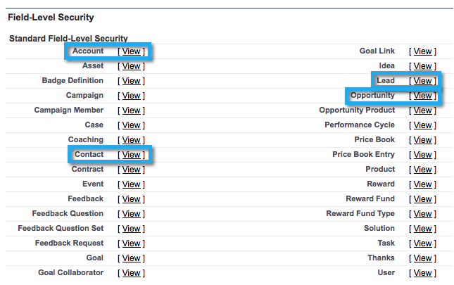

# 3단계 중 2단계:Marketing To용 Salesforce 사용자 만들기(Enterprise/Unlimited) {#step-of-create-a-salesforce-user-for-marketo-enterprise-unlimited}

>[!NOTE]
>
>이러한 단계는 Salesforce 관리자가 완료해야 합니다.

>[!NOTE]
>
>**사전 요구 사항**
>
>* [3단계 중 1단계:Salesforce에 마케팅 필드 추가(Enterprise/Unlimited)](step-1-of-3-add-marketo-fields-to-salesforce-enterprise-unlimited.md)

>

이 문서에서는 Salesforce 프로필에서 사용자 권한을 설정하고 Marketing-Salesforce 통합 계정을 만듭니다.

## 프로필 만들기 {#create-a-profile}

1. 설정을 **클릭합니다**.

   

1. 탐색 도구 모음에 &quot;profiles&quot;를 입력하고 **프로필** 링크를 클릭합니다.

   

1. 새로 만들기를 **클릭합니다**.

   

1. [ **표준 사용자**]를 선택하고 프로필 이름을 &quot;Marketing-Salesforce 동기화&quot;로 지정한 다음 [저장]을 **클릭합니다**.

   

## 프로필 권한 설정 {#set-profile-permissions}

1. 편집 **을** 클릭하여 보안 권한을 설정합니다.

   

1. 관리 **권한** 섹션에서 다음 상자를 선택해야 합니다.

   * API 사용
   * HTML 템플릿 편집
   * 공개 문서 관리
   * 공개 템플릿 관리

   

   >[!TIP]
   >
   >암호 만료되지 않음 **상자를** 확인하십시오.

1. 일반 사용자 권한 섹션에서 다음 상자가 선택되어 있는지 확인합니다.

   * 리드 변환
   * 이벤트 편집
   * 작업 편집

   

1. 표준 개체 권한 섹션에서 읽기, 만들기, 편집 및 삭제 권한이

   * 계정
   * 캠페인
   * 연락처
   * 리드
   * 기회

   >[!NOTE]
   >
   >캠페인 동기화를 사용할 계획인 경우 캠페인에 권한을 부여합니다.

   

1. 완료되면 **페이지** 아래쪽에 있는 저장을 클릭합니다.

   

## 필드 권한 설정 {#set-field-permissions}

1. 마케터와의 교류를 통해 동기화해야 할 사용자 정의 필드를 파악할 수 있습니다.

   >[!NOTE]
   >
   >이 단계에서는 Marketing To에 표시되지 않아도 되는 필드가 나타나지 않으므로 불필요한 요소가 줄고 동기화 속도가 빨라집니다.

1. 프로필 세부 사항 페이지에서 **필드 수준 보안** 섹션으로 이동합니다. 보기 **를** 클릭하여 개체에 대한 액세스 가능성을 편집합니다.

   * `Lead`
   * `Contact`
   * `Account`
   * `Opportunity`

   >[!TIP]
   >
   >조직의 요구에 따라 다른 개체를 구성할 수 있습니다.

   

1. 각 개체에 대해 **편집을 클릭합니다**.

   

1. 필요하지 않은 필드를 찾아 **액세스 읽기 **및** 액세스 편집 **이 선택 취소되어 있는지 확인합니다. 완료되면 **저장을** 클릭합니다.

   >[!NOTE]
   >
   >**미리 알림**
   >
   >
   >사용자 정의 필드의 액세스 가능성만 편집합니다.

   

1. 불필요한 필드를 모두 비활성화한 후 다음 개체 필드에 대해 **액세스 읽기 및 액세스 편집 **을 선택해야 합니다. 완료되면 **저장을** 클릭합니다.

<table> 
 <tbody> 
  <tr> 
   <th colspan="1" rowspan="1">
개체
</th> 
   <th colspan="1" rowspan="1">
필드
</th> 
  </tr> 
  <tr> 
   <td colspan="1" rowspan="1">
계정
</td> 
   <td colspan="1" rowspan="1">
문자 필드
</td> 
  </tr> 
  <tr> 
   <td colspan="1" rowspan="1">
이벤트
</td> 
   <td colspan="1" rowspan="1">
모든 필드
</td> 
  </tr> 
  <tr> 
   <td colspan="1" rowspan="1">
작업
</td> 
   <td colspan="1" rowspan="1">
모든 필드
</td> 
  </tr> 
 </tbody> 
</table>

## Marketing-Salesforce 동기화 계정 만들기 {#create-marketo-salesforce-sync-account}

>[!TIP]
>
>전용 Salesforce 계정 만들기(예: [`[email protected]`](http://docs.marketo.com/cdn-cgi/l/email-protection#89e4e8fbe2ecfde6c9f0e6fcfbeae6e4f9e8e7f0a7eae6e4))을 클릭하여 Marketing To와 다른 Salesforce 사용자의 변경 사항을 구별합니다.

1. 탐색 도구 모음에 &quot;사용자 관리&quot;를 입력한 다음 사용자를 **클릭합니다**. 새 사용자 **를 클릭합니다**.

   

1. 필요한 필드를 채웁니다. 그런 다음 **사용자 라이센스를 선택합니다.Salesforce** 및 이전에 만든 프로필 완료되면 **저장을** 클릭합니다.

   

2단계 중 2단계가 완료되었습니다.

>[!NOTE]
>
>**관련 문서**
>
>* [3단계 중 3단계:Connect Marketing 및 Salesforce(Enterprise/Unlimited)](step-3-of-3-connect-marketo-and-salesforce-enterprise-unlimited.md)

>

