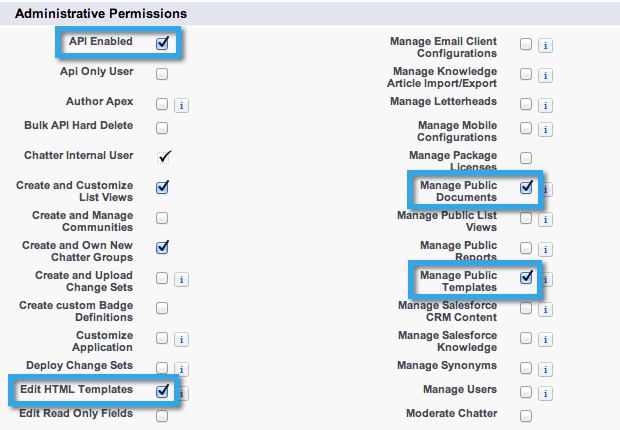

# 3단계 중 2단계: Marketo용 Salesforce 사용자 만들기(Enterprise/Unlimited) {#step-of-create-a-salesforce-user-for-marketo-enterprise-unlimited}

>[!NOTE]
>
>Salesforce 관리자가 이러한 단계를 완료해야 합니다

>[!PREREQUISITES]
>
>[3단계 중 1단계: Salesforce에 Marketo 필드 추가(Enterprise/Unlimited)](/help/marketo/product-docs/crm-sync/salesforce-sync/setup/enterprise-unlimited-edition/step-1-of-3-add-marketo-fields-to-salesforce-enterprise-unlimited.md)

이 문서에서는 Salesforce 프로필에서 사용자 권한을 설정하고 Marketo-Salesforce 통합 계정을 만듭니다.

## 프로필 만들기 {#create-a-profile}

1. 클릭 **설정**.

   

1. 탐색 검색 모음에 &quot;profiles&quot;를 입력하고 **프로필** 링크를 클릭합니다.

   

1. 클릭 **새로 만들기**.

   

1. 선택 **표준 사용자**, 프로필 이름을 &quot;Marketo-Salesforce 동기화&quot;로 지정하고 **저장**.

   

## 프로필 권한 설정 {#set-profile-permissions}

1. 클릭 **편집** 보안 권한을 설정하려면 다음을 수행하십시오.

   

1. 아래에 **관리 권한** 섹션에서 다음 상자를 선택해야 합니다.

   * API 활성화
   * HTML 템플릿 편집
   * 공개 문서 관리
   * 공개 템플릿 관리

   

   >[!TIP]
   >
   >을(를) 확인합니다. **암호가 만료되지 않음** 상자.

1. 일반 사용자 권한 섹션에서 다음 상자를 선택해야 합니다.

   * 리드 변환
   * 이벤트 편집
   * 작업 편집

   

1. 표준 객체 권한 섹션에서 읽기, 만들기, 편집 및 삭제 권한이 선택되어 있는지 확인합니다.

   * 계정
   * 캠페인
   * 연락처
   * 리드
   * 기회

   >[!NOTE]
   >
   >캠페인 동기화를 사용할 계획이라면 캠페인에 권한을 부여합니다.

   

1. 완료되면 를 클릭합니다 **저장** 를 클릭합니다.

   

## 필드 권한 설정 {#set-field-permissions}

1. 동기화하는 데 필요한 사용자 지정 필드를 확인하려면 마케터와 상의하십시오.

   >[!NOTE]
   >
   >이 단계에서는 Marketo에 표시되지 않아도 되는 필드를 차단하므로 불필요한 것들을 줄이고 동기화 속도를 높일 수 있습니다.

1. 프로필 세부 사항 페이지에서 **필드 수준 보안** 섹션을 참조하십시오. 클릭 **보기** 객체에 대한 액세스 가능성을 편집하려면

   * 리드
   * 연락처
   * 계정
   * 기회

   >[!TIP]
   >
   >조직의 요구 사항에 따라 다른 객체를 구성할 수 있습니다.

   

1. 각 개체에 대해 **편집**.

   

1. 필요하지 않은 필드를 찾아 확인합니다. **읽기 액세스** 및 **액세스 편집** 을 선택하지 않습니다. 클릭 **저장** 다 되면

   >[!NOTE]
   >
   >사용자 지정 필드에 대한 액세스 가능성만 편집합니다.

   

1. 필요하지 않은 모든 필드를 비활성화한 후 다음을 확인해야 합니다 **읽기 액세스 및 편집 액세스** 다음 개체 필드에 대해 설명합니다. 클릭 **저장** 다 되면

<table> 
 <tbody> 
  <tr> 
   <th colspan="1" rowspan="1">
오브젝트
</th> 
   <th colspan="1" rowspan="1">
필드
</th> 
  </tr> 
  <tr> 
   <td colspan="1" rowspan="1">
계정
</td> 
   <td colspan="1" rowspan="1">
유형 필드
</td> 
  </tr> 
  <tr> 
   <td colspan="1" rowspan="1">
Event
</td> 
   <td colspan="1" rowspan="1">
모든 필드
</td> 
  </tr> 
  <tr> 
   <td colspan="1" rowspan="1">
작업
</td> 
   <td colspan="1" rowspan="1">
모든 필드
</td> 
  </tr> 
 </tbody> 
</table>

## Marketo-Salesforce 동기화 계정 만들기 {#create-marketo-salesforce-sync-account}

>[!TIP]
>
>전용 Salesforce 계정(예: marketo@yourcompany.com)을 만들어 Marketo과 다른 Salesforce 사용자가 수행한 변경 사항을 구분합니다.

1. 탐색 검색 모음에 &quot;Manage users&quot;를 입력하고 **사용자**. 클릭 **새 사용자**.

   

1. 필요한 필드를 채웁니다. 그런 다음 **사용자 라이센스: Salesforce** 및 이전에 만든 프로필입니다. 클릭 **저장** 다 되면

   

2단계 중 2단계가 완료되었습니다.

>[!NOTE]
>
>[3단계 중 3단계: Marketo 및 Salesforce 연결(Enterprise/Unlimited)](/help/marketo/product-docs/crm-sync/salesforce-sync/setup/enterprise-unlimited-edition/step-3-of-3-connect-marketo-and-salesforce-enterprise-unlimited.md)
