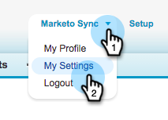
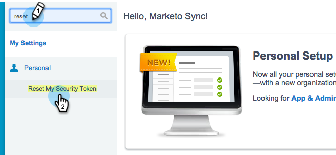

# 3단계/3단계: Marketo 및 [!DNL Salesforce] 연결(Enterprise/Unlimited) {#step-of-connect-marketo-and-salesforce-enterprise-unlimited}

이 문서에서는 구성된 [!DNL Salesforce] 인스턴스와 동기화하도록 Marketo을 구성합니다.

>[!PREREQUISITES]
>
>* [3단계 중 1단계:  [!DNL Salesforce] (Enterprise/Unlimited)에 Marketo 필드 추가](/help/marketo/product-docs/crm-sync/salesforce-sync/setup/enterprise-unlimited-edition/step-1-of-3-add-marketo-fields-to-salesforce-enterprise-unlimited.md)
>* [3단계 중 2단계:  [!DNL Salesforce] Marketo용 사용자 만들기(Enterprise/Unlimited)](/help/marketo/product-docs/crm-sync/salesforce-sync/setup/enterprise-unlimited-edition/step-2-of-3-create-a-salesforce-user-for-marketo-enterprise-unlimited.md)

## 동기화 사용자 보안 토큰 검색 {#retrieve-sync-user-security-token}

>[!TIP]
>
>이미 보안 토큰이 있는 경우 준비하려면 [동기화 사용자 자격 증명 및 쿠도 설정]으로 바로 진행하십시오.

1. Marketo 동기화 사용자로 [!DNL Salesforce]에 로그인하고 동기화 사용자 이름을 클릭한 다음 **[!UICONTROL My Settings]**&#x200B;을(를) 클릭합니다.

   

1. 빠른 찾기에서 &quot;reset&quot;을 입력하고 **[!UICONTROL Reset My Security Token]**&#x200B;을(를) 클릭합니다.

   

1. **[!UICONTROL Reset Security Token]**&#x200B;를 클릭합니다.

   

   보안 토큰이 이메일로 전송됩니다.

## 동기화 사용자 자격 증명 설정 {#set-sync-user-credentials}

1. Marketo에서 **[!UICONTROL Admin]**(으)로 이동하여 **CRM**&#x200B;을 선택하고 **[!UICONTROL Sync with Salesforce.com]**&#x200B;을(를) 클릭합니다.

   

   >[!NOTE]
   >
   >Marketo [을(를) 클릭하기 전에 동기화 사용자로부터 &#x200B;](/help/marketo/product-docs/crm-sync/salesforce-sync/sfdc-sync-details/hide-a-salesforce-field-from-the-marketo-sync.md)필요하지 않은 모든 필드 숨기기&#x200B;**[!UICONTROL Sync Fields]**&#x200B;를 확인하십시오. [!UICONTROL Sync Fields]을(를) 클릭하면 사용자가 볼 수 있는 모든 필드가 Marketo에 영구적으로 만들어지며 삭제할 수 없습니다.

1. [!DNL Salesforce] 구성의 2부에서 만든 [!DNL Salesforce] 동기화 사용자 자격 증명([Professional](/help/marketo/product-docs/crm-sync/salesforce-sync/setup/professional-edition/step-2-of-3-create-a-salesforce-user-for-marketo-professional.md) 또는 [Enterprise](/help/marketo/product-docs/crm-sync/salesforce-sync/setup/enterprise-unlimited-edition/step-2-of-3-create-a-salesforce-user-for-marketo-enterprise-unlimited.md))을 입력하고 **[!UICONTROL Sync Fields]**&#x200B;을(를) 클릭합니다(**[!UICONTROL Sandbox]** 샌드박스와 Marketo 샌드박스를 동기화하는 경우에만 [!DNL Salesforce] 선택).

   

   >[!CAUTION]
   >
   >사용자 이름/암호/토큰 필드 대신 &quot;[!DNL Salesforce]에 로그인&quot; 단추가 표시되면 Marketo 구독이 OAuth에 대해 활성화됩니다. [이 문서를 참조하십시오](/help/marketo/product-docs/crm-sync/salesforce-sync/log-in-using-oauth-2-0.md). 자격 증명 집합을 사용하여 동기화가 시작되면 **[!DNL Salesforce] 자격 증명 또는 구독을 전환하지 않습니다**. 기본 인증을 사용하려면 계정 관리자에게 문의하십시오.

1. 경고를 읽은 다음 **[!UICONTROL Confirm Credentials]**&#x200B;을(를) 클릭합니다.

   

   >[!CAUTION]
   >
   >[매핑을 확인하고 맞춤화](/help/marketo/product-docs/crm-sync/salesforce-sync/setup/optional-steps/edit-initial-field-mappings.md)하려면 지금이 유일한 기회입니다! [!UICONTROL Start  Salesforce Sync]을(를) 클릭하면 완료됩니다.

## [!DNL Salesforce] 동기화 시작 {#start-salesforce-sync}

1. 영구 Marketo-**[!UICONTROL Start  Salesforce Sync]** 동기화를 시작하려면 [!DNL Salesforce]을(를) 클릭하십시오.

   

   >[!CAUTION]
   >
   >Marketo은 [!DNL Salesforce] 동기화에 대해 자동으로 중복 제거되지 않습니다. 또는 잠재 고객을 수동으로 입력하는 경우.

1. **[!UICONTROL Start Sync]**&#x200B;를 클릭합니다.

   

   >[!NOTE]
   >
   >초기 동기화를 완료하는 시간은 데이터베이스의 크기와 복잡성에 따라 다릅니다.

## 동기화 확인 {#verify-sync}

Marketo은 관리 영역에서 [!DNL Salesforce] 동기화에 대한 상태 메시지를 제공합니다. 다음 단계에 따라 동기화가 올바르게 작동하는지 확인할 수 있습니다.

1. Marketo에서 **[!UICONTROL Admin]**&#x200B;을(를) 클릭한 다음 **[!UICONTROL Salesforce]**&#x200B;을(를) 클릭합니다.

   

1. 동기화 상태가 오른쪽 상단 모서리에 표시됩니다. 세 개의 메시지 중 하나(**[!UICONTROL Last Synced]**, **[!UICONTROL Sync in Progress]** 또는 **[!UICONTROL Failed]**)가 표시됩니다.

   

   

   

Marketo의 가장 강력한 기능 중 하나를 구성했습니다. 바로 여기에서 확인하십시오.

>[!MORELIKETHIS]
>
>* [3단계 중 1단계:  [!DNL Salesforce] (Enterprise/Unlimited)에 Marketo 필드 추가](/help/marketo/product-docs/crm-sync/salesforce-sync/setup/enterprise-unlimited-edition/step-1-of-3-add-marketo-fields-to-salesforce-enterprise-unlimited.md)
>* [3단계 중 2단계:  [!DNL Salesforce] Marketo용 사용자 만들기(Enterprise/Unlimited)](/help/marketo/product-docs/crm-sync/salesforce-sync/setup/enterprise-unlimited-edition/step-2-of-3-create-a-salesforce-user-for-marketo-enterprise-unlimited.md)
>* [Marketo Sales Insight 패키지 설치 [!DNL Salesforce] AppExchange](/help/marketo/product-docs/marketo-sales-insight/msi-for-salesforce/installation/install-marketo-sales-insight-package-in-salesforce-appexchange.md)
>* [Enterprise/Unlimited에서 Marketo Sales Insight 구성 [!DNL Salesforce] 2&rbrace;](/help/marketo/product-docs/marketo-sales-insight/msi-for-salesforce/configuration/configure-marketo-sales-insight-in-salesforce-enterprise-unlimited.md)
