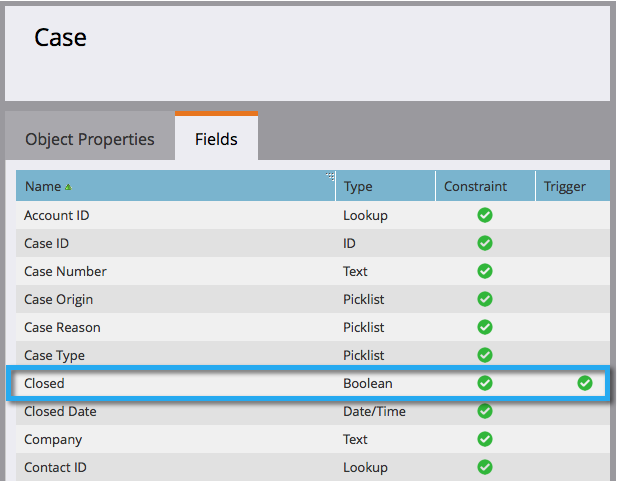

# 사용자 지정 개체 필드를 스마트 목록/트리거 제약 조건으로 추가/제거 {#add-remove-custom-object-field-as-smart-list-trigger-constraints}

Marketing에서는 Salesforce 사용자 정의 개체 동기화를 세부적으로 제어할 수 있습니다. 이를 통해 사용자 지정 개체 필터에 제약 조건으로 사용할 수 있는 필드를 선택하고 스마트 캠페인에서 이를 트리거로 사용할 수 있습니다.

>[!NOTE]
>
>**관리자 권한 필요**

1. 관리를 **클릭합니다.**

   

1. 관리 **를** 클릭한 다음 **Salesforce 개체 동기화를 클릭합니다.**

   

1. **Salesforce 개체 동기화가** 왼쪽 열에 나타납니다.

   

1. 수정할 개체를 선택합니다.

   

1. 표시되는 필드 **편집을 클릭합니다**.

   >[!TIP]
   >
   >표시되는 필드 **편집** 단추가 회색으로 표시되면 개체가 현재 스마트 목록 또는 스마트 캠페인에서 사용되고 있습니다. 계속하려면 모든 연결을 제거하십시오.

   

1. 전역 동기화가 활성화되어 있으면 [전역 동기화 **비활성화]를 클릭합니다**.

   

1. 필요한 필터/트리거 제한 옆의 상자를 선택하고 저장을 **클릭합니다**.

   

   >[!NOTE]
   >
   >모든 필드는 필터에 대한 제약 조건으로 기본적으로 선택됩니다.

1. 필드 **탭을** 클릭하여 변경 사항을 확인합니다.

   

   >[!NOTE]
   >
   >**미리 알림**
   >
   >
   >글로벌 동기화를 다시 활성화하는 것을 잊지 마십시오!

와! 스마트한 목록 및 스마트한 캠페인의 강력한 기능

>[!NOTE]
>
>**관련 문서**
>
>* [사용자 지정 개체 동기화 활성화/비활성화](enable-disable-custom-object-sync.md)

>

