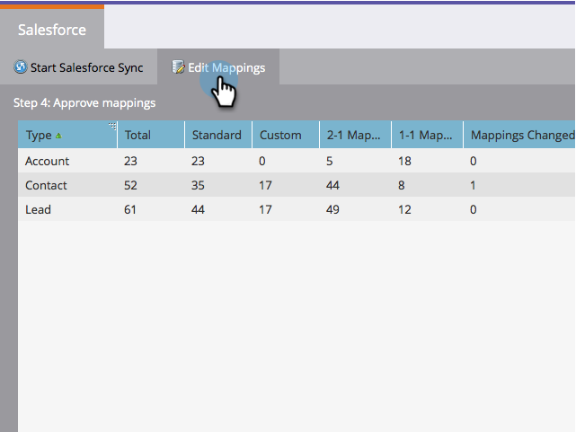

# 초기 필드 매핑 편집 {#edit-initial-field-mappings}

>[!NOTE]
>
>**미리 알림**
>
>이 기능은 Salesforce에 처음 동기화하기 전에만 액세스할 수 있습니다. **지금 동기화** 단추를 누르면 더 이상 이 작업을 수행할 수 없습니다.

Salesforce에 처음 동기화하면 Marketing은 유사한 이름의 사용자 정의 필드를 Marketing To의 단일 필드에 자동으로 결합하여 CRM의 리드 및 연락처 개체 모두와 데이터를 교환할 수 있도록 합니다. 이 문서에서는 이러한 매핑을 사용자 지정하는 방법에 대해 설명합니다.

## 매핑되지 않은 필드 매핑 {#map-unmapped-fields}

매핑되지 않은 필드 폴더에 필드가 표시되면 Salesforce의 리드 또는 연락처에 있는 유사한 필드에 매핑되지 않음을 의미합니다. 네가 고칠 수 있어

1. 매핑 편집을 클릭합니다.

1. **매핑되지 않은 사용자 지정 필드** 폴더를 엽니다.

   

1. 매핑되지 않은 사용자 정의 필드 하나를 다른 필드에 드래그하여 함께 매핑합니다.

   >[!NOTE]
   >
   >사용자 정의 필드 매핑만 편집할 수 있습니다. 표준 필드 매핑을 수정할 수 없습니다.

   

1. 완료되면 **매핑 완료**&#x200B;를 클릭합니다.

   

## 기존 매핑 중단 {#break-existing-mapping}

리드 및 연락처 개체에 유사한 이름의 필드가 있는 경우 Marketing에서 필드를 자동으로 매핑합니다. 서로 다른 데이터라고 간주할 수 있습니다. 이렇게 매핑을 해제합니다.

1. **매핑 편집**&#x200B;을 클릭합니다.

   

1. 매핑된 필드를 강조 표시하고 **매핑 끊기**&#x200B;를 클릭하여 필드를 구분합니다.

   

1. 완료되면 **매핑 완료**&#x200B;를 클릭합니다.

   

   좋아! 초기 동기화를 거의 완료했습니다.

## 스키마 재설정 {#reset-schema}

1. 매핑을 작업하는 동안 Salesforce에서 스키마를 변경하는 경우 **스키마 재설정**&#x200B;을 클릭하여 변경 내용을 가져올 수 있습니다.

   * 모든 매핑 변경 사항이 재설정됩니다!
   * 스키마를 재설정하면 필드가 제거되지는 않고 추가만 됩니다(동기화 사용자에서 숨기더라도).

   

