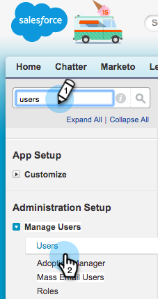
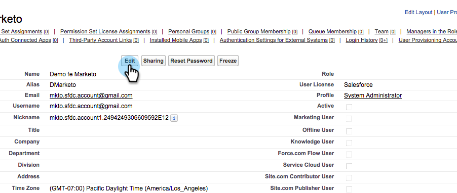

# Marketing To Sync 사용자를 마케팅 사용자 {#make-marketo-sync-user-a-marketing-user}

[Marketing to sync 사용자](/help/marketo/product-docs/crm-sync/salesforce-sync/setup/enterprise-unlimited-edition/step-2-of-3-create-a-salesforce-user-for-marketo-enterprise-unlimited.md)가 제대로 작동하려면 Salesforce 캠페인 동기화에 대한 마케팅 사용자여야 합니다. 사용자를 Salesforce의 마케팅 사용자로 만드는 방법은 다음과 같습니다.

>[!NOTE]
>
>**관리자 권한 필요**

1. Salesforce에 로그인합니다. 왼쪽 검색 막대에서 사용자를 검색하고 **사용자 관리**&#x200B;에서 **사용자**&#x200B;를 클릭합니다.

   

1. 동기화 사용자를 찾아 이름을 클릭합니다.

   

1. **편집**&#x200B;을 클릭합니다.

   

1. **마케팅 사용자** 확인란을 선택하고 **저장**&#x200B;을 클릭합니다.

   

   좋아요! 이 Marketing To 동기화 사용자는 이제 마케팅 사용자입니다.
