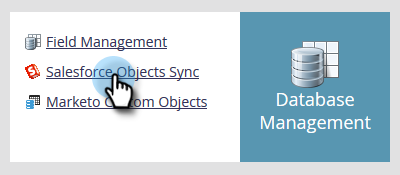
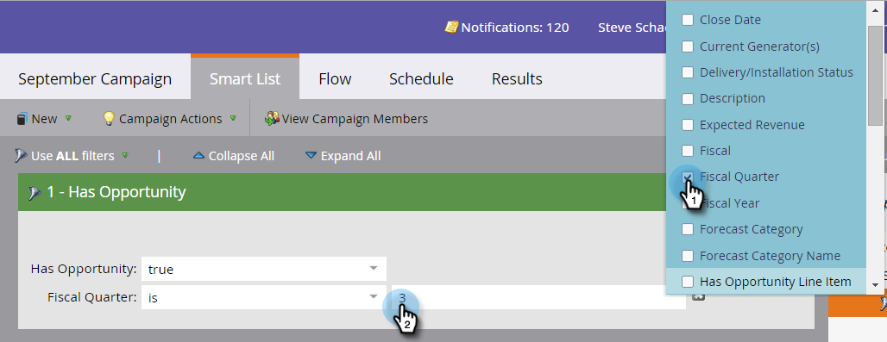

# 사용자 정의 오브젝트 동기화 활성화/비활성화 {#enable-disable-custom-object-sync}

Salesforce 인스턴스에서 만든 사용자 지정 개체도 Marketo Engage의 일부일 수 있습니다. 설정 방법은 다음과 같습니다.

## 사용자 정의 오브젝트 동기화 활성화/비활성화 {#enable-disable-custom-object-sync-1}

>[!NOTE]
>
>**관리자 권한 필요**

1. **[!UICONTROL Admin]** 영역으로 이동합니다.

   

1. 데이터베이스 관리 메뉴에서 **[!UICONTROL Salesforce Objects Sync]**&#x200B;을(를) 클릭합니다.

   

1. 첫 번째 사용자 지정 개체인 경우 **[!UICONTROL Sync schema]**&#x200B;을(를) 클릭합니다. 그렇지 않으면 **[!UICONTROL Refresh Schema]**&#x200B;을(를) 클릭하여 최신 버전을 보유하고 있는지 확인하십시오.

   

1. 전역 동기화가 실행 중인 경우 **[!UICONTROL Disable Global Sync]**&#x200B;을(를) 클릭하여 사용하지 않도록 설정해야 합니다.

   

   >[!NOTE]
   >
   >[!DNL Salesforce] 사용자 지정 개체 스키마의 동기화에 몇 분 정도 걸릴 수 있습니다.

1. **[!UICONTROL Refresh Schema]**&#x200B;를 클릭합니다.

   

1. 동기화할 개체를 선택하고 **[!UICONTROL Enable Sync]**&#x200B;을(를) 클릭합니다.

   >[!TIP]
   >
   >Marketo은 [!DNL Salesforce]의 잠재 고객, 연락처 또는 계정 개체와 직접 관계가 있는 경우에만 사용자 지정 개체를 동기화할 수 있습니다.

   

1. **[!UICONTROL Enable Sync]**&#x200B;을(를) 다시 클릭합니다.

   

1. **[!DNL Salesforce]** 탭으로 돌아가서 **[!UICONTROL Enable Sync]**&#x200B;을(를) 클릭합니다.

   

## 사용자 지정 개체 사용 {#using-your-custom-objects}

>[!NOTE]
>
>트리거가 있는 스마트 캠페인에서는 사용자 지정 개체를 사용할 수 없습니다.

1. 스마트 목록에서 **[!UICONTROL Has Opportunity]** 필터 위로 끌어서 **[!UICONTROL true]**(으)로 설정합니다.

   

1. 그런 다음 필터 제약 조건을 사용하여 포커스를 좁힙니다.

   

   훌륭합니다! 이제 스마트 캠페인 및 스마트 목록에서 이 사용자 지정 개체의 데이터를 사용할 수 있습니다.

>[!MORELIKETHIS]
>
>[사용자 지정 개체 필드를 스마트 목록/트리거 제약 조건으로 추가/제거](/help/marketo/product-docs/crm-sync/salesforce-sync/setup/optional-steps/add-remove-custom-object-field-as-smart-list-trigger-constraints.md){target="_blank"}
