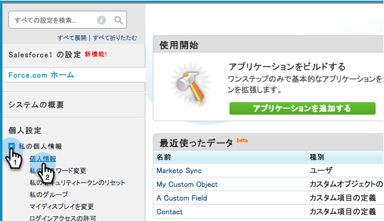
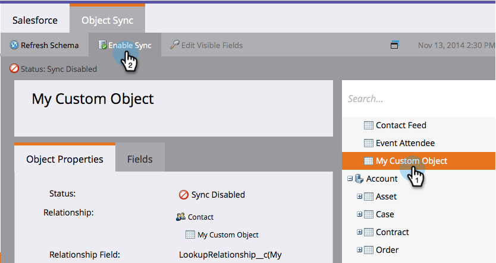

# 영어 이외의 사용자 정의 오브젝트 동기화 활성화 {#enable-non-english-custom-object-sync}

Marketo 동기화 사용자가 영어 이외의 언어로 설정된 경우 사용자 지정 개체 동기화를 활성화하려고 하면 오류가 발생할 수 있습니다.

## 해결 방법 {#how-to-fix}

1. Marketo 동기화 사용자를 사용하여 [!DNL Salesforce]에 로그인합니다.

   

1. 사용자 이름 드롭다운을 클릭하고 **[!UICONTROL Setup]**&#x200B;을(를) 선택합니다.

   

1. **[!UICONTROL Personal Information]**&#x200B;에서 **[!UICONTROL My Personal Information]**&#x200B;을(를) 클릭합니다.

   

1. **[!UICONTROL Edit]**&#x200B;를 클릭합니다.

   

1. **[!UICONTROL Language]**&#x200B;을(를) **[!UICONTROL English]**(으)로 변경합니다.

   

1. **[!UICONTROL Save]**&#x200B;를 클릭합니다.

   

1. [Adobe 계정 프로필](https://account.adobe.com/kr/profile){target="_blank"}에서 **[!UICONTROL Preferred languages]**(으)로 스크롤하고 첫 번째 언어가 영어로 설정되어 있는지 확인하십시오.

   

1. Marketo Engage에서 **[!UICONTROL Admin]** > **[!UICONTROL Salesforce]** > **[!UICONTROL Objects]**(으)로 이동합니다. **[!UICONTROL Refresh Schema]**&#x200B;를 클릭합니다.

   

1. 이렇게 하면 오브젝트 목록이 영어로 가져옵니다. 선택한 개체를 선택하고 **[!UICONTROL Enable Sync]**&#x200B;을(를) 클릭합니다.

   

1. 이제 사용자 지정 개체가 활성화되고 동기화됩니다.

   

1. [!DNL Salesforce]&#x200B;(으)로 돌아가서 위의 단계에 따라 동기화 사용자를 기본 언어로 다시 변경합니다.

>[!NOTE]
>
>마지막으로 스키마를 새로 고쳐 언어로 개체를 다시 가져옵니다.
